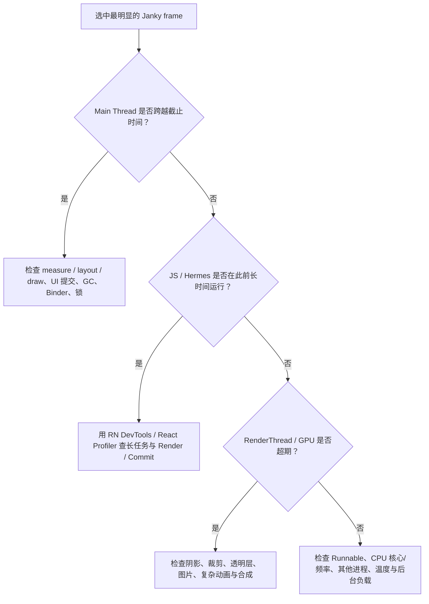

# React Native Android Trace 抓取与分析指南

> Android Studio System Trace + Perfetto 实战流程

> 文档版本：2026-07（根据原始 Word 文档整理）。本页保留原文的流程、命令、表格、检查清单和官方资料链接，并将关键流程补充为 Mermaid 图，方便网页端阅读。


## 文档定位

用于排查 React Native Android 中的掉帧、卡顿、页面跳转慢、列表滑动不流畅、动画抖动，以及主线程、RenderThread、GPU 或 JavaScript 线程异常占用。

| 项目 | 内容 |
| --- | --- |
| 适用环境 | Windows / Android Studio / ADB / RN Android |
| 建议设备 | 优先真机；模拟器可用于熟悉流程 |
| 文档版本 | 2026-07（依据官方文档整理） |

> **核心原则：短时间、单场景、可复现、先定线程，再定代码。**

---

## 目录 文档结构

- **1** · 先认识 Android Trace

- **2** · 抓取前准备

- **3** · 方案一：Android Studio 抓 System Trace

- **4** · 方案二：ADB + Perfetto 命令行抓取

- **5** · 如何看 Trace：从掉帧到根因

- **6** · React Native 专项分析

- **7** · 添加自定义 Trace 标记

- **8** · 完整实战：ScrollView 卡顿

- **9** · 常见问题与故障排查

- **10** · 结论模板与检查清单

- **附录** · 常用命令、术语与官方资料

> **推荐阅读路径：** 第一次使用：依次阅读第 2、3、5、8 节；已有 Trace 文件：直接从第 5 节开始；怀疑是 JS/React 重渲染：重点看第 6、7 节。

---

## 1 先认识 Android Trace

Trace 的价值不只是“看哪个函数慢”，而是把用户操作、帧渲染、线程状态、CPU 调度和系统事件放在同一条时间线上进行关联。

### 1.1 本文主要分析哪种 Trace

本文以 System Trace（系统跟踪）为核心。它可以观察应用和系统进程如何在线程与 CPU 核心上运行、界面是否平滑，以及主线程、RenderThread、GPU 完成时间之间的关系。

| 类型 | 主要回答的问题 | 适用场景 |
| --- | --- | --- |
| System Trace | 卡顿发生时，哪个线程或系统资源在阻塞？ | 掉帧、启动慢、页面切换、动画、输入延迟 |
| 方法/函数 Trace | 具体调用链中，哪个 Java/Kotlin 方法耗时？ | 原生代码热点、函数级调用分析 |
| RN DevTools Performance | 哪个 JS 任务、React 渲染或 Commit 占用时间？ | JS 长任务、组件重渲染、网络与 User Timing |
| 内存分析 | 对象为何增长、是否泄漏？ | Java/Kotlin 堆、JS Heap、Native Allocations |

> **不要混淆：** System Trace 用于建立“系统级时间关系”；它通常不能直接告诉你某一行 TypeScript 代码慢。发现 JS 线程异常后，再使用 RN DevTools Performance 或 React Profiler 深挖。

### 1.2 一帧有多少时间预算

| 屏幕刷新率 | 单帧理论预算 | 理解方式 |
| --- | --- | --- |
| 60 Hz | 约 16.67 ms | 主线程与渲染链路需要及时完成一帧 |
| 90 Hz | 约 11.11 ms | 同样的 15 ms 工作在 60 Hz 可能勉强，在 90 Hz 已可能掉帧 |
| 120 Hz | 约 8.33 ms | 高刷设备对线程阻塞更敏感 |

实际是否判定为卡顿还会受帧调度、缓冲、刷新率和渲染流水线影响，因此不要只按某个 Slice 是否超过 16.67 ms 下结论，应优先观察 Janky frames / Frame Timeline 与对应线程。

### 1.3 RN Android 常见线程

| 线程/轨道 | 主要职责 | 异常时常见表现 |
| --- | --- | --- |
| main / UI Thread | Android View 测量、布局、绘制、输入分发、生命周期、部分 RN 原生更新 | 页面冻结、点击延迟、measure/layout/draw 过长 |
| RenderThread | 处理显示列表并向 GPU 提交渲染工作 | 阴影、裁剪、透明叠层、复杂绘制时变长 |
| GPU completion | GPU 完成当前帧的时间 | GPU 负载高、过度绘制、复杂图层 |
| JS / Hermes 相关线程 | 执行 JS、状态更新、业务计算、事件回调 | JS 长任务、React 大量渲染、onScroll 计算过重 |
| Binder / I/O / Worker | 跨进程调用、磁盘、数据库、后台任务 | Blocked、Uninterruptible Sleep、等待系统服务 |

> **线程名称会变化：** RN 版本、旧/新架构、Hermes 版本和厂商系统会影响线程显示名称。不要只找固定的“mqt_js”，应结合进程、线程活动和事件内容识别。

---

## 2 抓取前准备

好的 Trace 首先来自可控的复现场景。抓取前准备比录制按钮本身更重要。

### 2.1 基础环境检查

**PowerShell：确认设备连接与系统版本**

```powershell
adb devices
adb shell getprop ro.build.version.sdk
adb shell getprop ro.product.model
```

adb devices 应显示设备序列号且状态为 device。若显示 unauthorized，需要在手机上确认 USB 调试授权。

### 2.2 查找应用包名

优先查看 android/app/build.gradle 或 build.gradle.kts 中的 applicationId。也可以在应用运行后使用下面的命令搜索进程：

```powershell
adb shell pidof com.example.app
adb shell ps -A | findstr your_keyword
```

### 2.3 使用接近真实性能的构建

用于判断真实性能时，优先使用 release + profileable，而不是普通 Debug。Debug 构建和开发模式会引入额外开销，可能改变线程、日志和渲染表现。

```powershell
# React Native CLI（以项目实际脚本为准）
yarn android --mode release

# 或
npm run android -- --mode release
```

Android Studio 官方推荐使用 release 变体并启用 profileable。多数现代 Android Gradle Plugin 项目会自动支持；若 Android Studio 无法以低开销模式分析，可以在 &lt;application&gt; 内检查：

**AndroidManifest.xml（仅在项目未自动配置时）**

```xml
<profileable android:shell="true" />
```

> **何时仍用 Debug：** 需要 Java/Kotlin Allocation、Heap Dump 或某些 Interaction 轨道时，可使用 debuggable 构建；但分析卡顿结论时必须意识到 Debug 的性能成本。

### 2.4 设计复现场景

1. 提前进入问题页面，避免把应用启动、网络加载和目标操作混在一起。

1. 预热一次：先执行一遍操作，让图片、代码和缓存进入稳定状态；除非你就是要分析冷启动。

1. 每条 Trace 只复现一个问题，例如只滑动一次、只打开一次 Modal、只完成一次页面跳转。

1. 录制时长建议 5～15 秒。过短可能错过问题，过长会造成 Trace 体积大、定位困难。

1. 记录开始与操作时间，例如“开始录制后第 3 秒点击按钮”。更好的方式是添加自定义标记。

> **真机优先：** 模拟器适合学习工具与验证流程，但宿主机负载、虚拟 GPU 和调度会影响结果。最终性能结论建议在目标档位真机上复测。

---

## 3 方案一：Android Studio 抓 System Trace

这是最适合第一次使用的方案：无需编写配置，录制、保存和初步分析都在 Android Studio 内完成。

### 3.1 启动 Profileable 应用

1. 使用 Android Studio 打开 RN 工程中的 android 目录。

1. 进入 Build > Select Build Variant，将 app 选择为 release。

1. 在运行配置旁的 More actions 中选择 Profile "app" with low overhead。

1. 选择已连接的真机或模拟器，等待应用启动，同时 Profiler 面板打开。

### 3.2 开始录制

1. 打开 View > Tool Windows > Profiler。

1. 选择你的应用进程；通常是包名对应的主进程。

1. 进入 CPU/System Trace 相关任务，选择 System Trace 并点击 Record / Start profiler task。

1. 回到设备，只执行一次目标操作。

1. 操作结束后立即停止录制，等待 Android Studio 解析。

| 阶段 | 你应该做什么 | 避免做什么 |
| --- | --- | --- |
| 录制前 | 停在问题页面，保持 1～2 秒静止 | 一边启动应用一边抓普通滑动问题 |
| 录制中 | 只做一次点击/滑动/跳转 | 连续乱点、反复滚动、切换多个页面 |
| 录制后 | 立即 Stop，给 Trace 命名并记录场景 | 忘记当前 Trace 对应什么操作 |

### 3.3 导出与重新打开

录制结束后，Android Studio 会把结果保存在 Past Recordings。需要长期保存或发给他人时，使用 Export recording 导出；也可以通过 Import recording 或拖入 Android Studio 编辑区重新打开。

> **命名建议：** 采用“日期_包名_页面_操作_构建_设备”格式，例如：20260729_com.demo_list_scroll_release_Pixel8.perfetto-trace。

### 3.4 Android 版本差异

| 设备版本 | 优先查看的帧轨道 | 说明 |
| --- | --- | --- |
| Android 12 / API 31 及以上 | Display &gt; Janky frames | 红色部分表示超过渲染截止时间的部分；点击后会关联高亮主线程、RenderThread 和 GPU completion |
| Android 11 / API 30 | Frame Lifecycle | 观察帧渲染流水线的各阶段 |
| 更低版本 | Frames / SurfaceFlinger / Choreographer 等 | 轨道展示可能较少，需更多结合主线程与 RenderThread 判断 |

---

## 4 方案二：ADB + Perfetto 命令行抓取

命令行方式适合固定场景重复抓取、脚本化、远程协作，或 Android Studio Profiler 不方便使用的情况。

### 4.1 先查看设备支持的 ATrace 分类

```powershell
adb shell atrace --list_categories
```

不同 Android 版本、内核和厂商设备支持的分类可能不同。命令报“不支持某分类”时，从抓取命令中删除该分类。

### 4.2 直接使用 adb shell perfetto（轻量模式）

把 com.example.app 替换为真实 applicationId。下面命令录制 10 秒、使用 64 MB 缓冲区，并包含常见的调度、频率、View、窗口、Activity、图形和输入事件。

**PowerShell 多行命令**

```powershell
adb shell perfetto `
  -o /data/misc/perfetto-traces/rn_trace.perfetto-trace `
  -t 10s `
  -b 64mb `
  -a com.example.app `
  sched freq view wm am gfx input
```

录制期间执行一次目标操作。命令结束后把文件拉到当前目录：

```powershell
adb pull /data/misc/perfetto-traces/rn_trace.perfetto-trace .
```

> **PowerShell 注意：** 反引号 `` ` `` 必须位于行尾，后面不能有空格。也可以把命令写成一行，避免续行符问题。

### 4.3 使用 Perfetto 官方辅助脚本

Perfetto 官方提供 record\_android\_trace 脚本，可自动录制、拉取并在 Perfetto UI 中打开。Windows 可在 PowerShell 中使用 curl.exe 和 Python：

```powershell
curl.exe -O https://raw.githubusercontent.com/google/perfetto/main/tools/record_android_trace

python record_android_trace `
  -o rn_trace.perfetto-trace `
  -t 10s `
  -b 32mb `
  -a com.example.app `
  sched freq view ss input
```

如不希望自动打开浏览器，可根据脚本帮助使用 --no-open。执行 python record\_android\_trace --help 查看当前版本支持的参数。

### 4.4 在 Perfetto UI 打开

1. 使用浏览器打开 Perfetto UI。

1. 选择 Open trace file，或直接把 .perfetto-trace 文件拖入页面。

1. Perfetto UI 默认在浏览器本地通过 JavaScript/WebAssembly 解析文件；除非主动使用分享功能，Trace 不会默认上传。

> **Trace 文件可能包含敏感信息：** 线程名、包名、进程、日志或自定义业务标记可能暴露项目细节。对外发送前先确认采集项并按团队规范处理。

---

## 5 如何看 Trace：从掉帧到根因

推荐按照“找到异常帧 → 看关键线程 → 看线程状态 → 对照 CPU/系统事件 → 缩小到业务代码”的顺序分析。

### 5.1 第一步：定位问题发生的时间窗口

1. 先找到用户操作：输入事件、Activity/Navigation 变化、自定义标记，或你记录的操作时间。

1. 在时间轴上只框选问题前后约 100～500 ms，避免被整条 Trace 干扰。

1. Perfetto 中可使用 W/S 或鼠标缩放，A/D 左右移动；Android Studio 中选中帧后可使用 M 聚焦。

> **先看时间窗口，不要先看总 CPU：** 平均 CPU 使用率可能很低，但某一帧的主线程仍可能被 30 ms 的任务阻塞。性能问题通常需要在局部时间窗口内判断。

### 5.2 第二步：点击 Janky frame

Android 12 及以上设备中，优先查看 Display &gt; Janky frames。找到带红色超期部分的帧并点击。Android Studio 会突出显示与该帧相关的主线程、RenderThread 和 GPU completion。

| 观察结果 | 更可能的方向 | 下一步 |
| --- | --- | --- |
| Main Thread 明显跨越截止时间 | UI 线程执行、布局、绘制、同步调用或等待 | 展开 main，查看 Choreographer/doFrame、performTraversals、measure/layout/draw 及阻塞状态 |
| RenderThread 明显变长 | 复杂绘制、图层、阴影、裁剪、透明、图片缩放 | 检查 DrawFrame、queue/dequeue buffer、图层与 GPU 轨道 |
| GPU completion 很晚 | GPU 压力或 Surface/合成问题 | 检查 FrameTimeline、GPU/SurfaceFlinger、过度绘制和大面积效果 |
| 三者不明显但交互仍延迟 | JS、Binder、I/O、锁、调度或输入链路 | 查看 JS/Hermes、Binder、线程状态与 CPU 核心 |

### 5.3 第三步：分析 Main / UI Thread

主线程长时间处于 Running，且在同一掉帧窗口出现较长的 measure、layout、draw、performTraversals、Choreographer#doFrame，通常意味着该帧中 UI 工作量过大。

| 主线程现象 | 常见含义 |
| --- | --- |
| 大量 measure/layout | 组件层级复杂、尺寸反复变化、一次提交大量原生 View 更新 |
| draw / dispatchDraw 较长 | 绘制复杂、图片/文本/自定义 View 工作量大 |
| Binder 调用中等待 | 同步调用系统服务或跨进程服务 |
| Blocked / Waiting | 锁竞争、等待其他线程、条件变量或同步结果 |
| Runnable 很久但未 Running | 线程想执行却未得到 CPU，可能被其他高优先级工作抢占或设备负载过高 |
| GC 与卡顿重叠 | 短期大量对象创建或内存压力导致回收影响关键线程 |

### 5.4 第四步：分析 RenderThread 与 GPU

如果 Main Thread 较空闲，而 RenderThread 或 GPU completion 明显拖长，问题更偏向渲染复杂度而不是 JS 业务计算。

- 检查大面积阴影、模糊、透明叠层、圆角裁剪、蒙层和过度绘制。

- 检查大图是否在滚动中缩放、解码或频繁更换。

- 检查动画是否同时改变大量 View 的布局属性。

- 检查 SurfaceView/TextureView、视频、地图等独立 Surface 的合成关系。

### 5.5 第五步：看线程状态与 CPU 调度

| 状态 | 解释 | 分析提示 |
| --- | --- | --- |
| Running | 正在某个 CPU 核心执行 | 查看当前 Slice/调用，以及是否跨越帧截止时间 |
| Runnable | 可运行但尚未获得 CPU | 查看同一 CPU 上是谁在运行，是否系统负载、抢占或降频 |
| Sleeping / Waiting | 主动等待事件、消息或条件 | 找到唤醒点和等待对象，不等同于 CPU 计算过重 |
| Blocked | 被锁、同步或资源阻塞 | 查看锁竞争、Binder、I/O 或其他线程依赖 |
| Uninterruptible Sleep | 通常在内核/I/O 路径等待 | 检查磁盘、文件、驱动或设备相关事件 |

### 5.6 常见 Trace 模式速查

| Trace 模式 | 高概率原因 | 优先验证 |
| --- | --- | --- |
| JS 线程连续忙，UI 随后集中更新 | JS 计算、大量状态更新、React 渲染 | RN DevTools Performance、React Profiler、拆分/缓存计算 |
| main 中 measure/layout 长 | 大量原生节点更新或布局抖动 | 组件树、FlatList/ScrollView 使用、布局属性变化 |
| RenderThread/GPU 过长 | 绘制与合成压力 | 阴影、裁剪、透明层、图片、地图/视频 |
| main Runnable 但得不到 CPU | CPU 竞争、后台负载、温控降频 | CPU cores、频率、其他进程和设备温度 |
| Binder 与卡顿重叠 | 同步系统调用 | Binder transaction 对端和调用频率 |
| GC 与滚动重叠 | 对象分配过多 | 日志、临时数组、闭包、图片对象和列表渲染 |
| 磁盘 I/O 与页面打开重叠 | 同步文件/数据库/资源读取 | 移到后台、缓存、延迟加载 |

---

## 6 React Native 专项分析

System Trace 用于确定“哪一层有问题”；RN DevTools 和 React Profiler 用于进一步确定“哪段 JS 或哪个组件有问题”。

### 6.1 识别 JS / Hermes 线程

在应用进程下展开线程列表，搜索 JavaScript、Hermes、js、React 等相关名称，并结合其活动判断。旧架构与新架构、不同 RN 版本可能显示不同线程名称。

当 JS 线程在用户操作后连续运行几十毫秒，并且随后触发主线程集中提交 UI 更新时，通常需要检查 JS 长任务、状态更新批次和组件渲染。

### 6.2 RN 常见 JS 性能问题

- onScroll、onTouchMove 等高频回调中执行过滤、排序、JSON 解析或大量日志。

- 一次 setState 导致大组件树重渲染，或 Context 值变化影响大量消费者。

- ScrollView 一次性渲染大量子项，而不是使用 FlatList/SectionList 虚拟化。

- 列表 renderItem、keyExtractor、事件函数和对象样式频繁创建，导致不必要更新。

- 在交互关键路径同步处理数据库、文件、图片或大数组。

- 动画依赖 JS 每帧驱动，JS 忙时动画停止或掉帧。

### 6.3 RN DevTools Performance（RN 0.83+）

React Native 0.83 起，React Native DevTools 提供 Performance 面板，可在同一时间线中查看 JavaScript 执行、React Performance、网络事件和自定义 User Timings。

1. 使用 Debug 环境启动 RN 应用和 Metro。

1. 打开开发菜单，选择 Open DevTools。

1. 进入 Performance，开始录制。

1. 执行一次问题操作后停止录制。

1. 查看长任务、React Render/Commit、Network 与自定义标记的时间关系。

> **两个工具各司其职：** RN DevTools 更适合定位具体 JS/React 问题；最终性能是否改善，仍应回到 release/profileable + System Trace 进行验证。

### 6.4 React Profiler 应看什么

| 现象 | 解释 | 优化方向 |
| --- | --- | --- |
| 单个组件 Render 很长 | 组件自身计算或子树复杂 | 拆分组件、memo、缓存派生数据、减少同步计算 |
| 大量组件同时 Render | 状态/Context 影响范围过大 | 缩小状态作用域、拆分 Context、稳定 props |
| Commit 很长 | 大量原生更新或布局工作 | 减少同一提交中的节点变化，检查布局和列表 |
| 短时间重复多次 Commit | 状态更新链或副作用反复触发 | 合并更新、检查 useEffect 依赖和反馈循环 |

---

## 7 添加自定义 Trace 标记

自定义标记能把“用户点击”“业务计算”“原生模块调用”直接写入 Trace，显著降低定位成本。

### 7.1 Kotlin：androidx.tracing

```kotlin
import androidx.tracing.trace

fun loadDetail() = trace("Detail#load") {
    val data = repository.query()
    renderData(data)
}
```

Kotlin trace { } 会在代码块结束时自动关闭 Trace 区间，能够避免遗漏 endSection。抓取时需要包含应用 ATrace 标记，例如命令行使用 -a 包名。

### 7.2 Java / Kotlin：android.os.Trace

```kotlin
import android.os.Trace

Trace.beginSection("NativeModule#doWork")
try {
    doWork()
} finally {
    Trace.endSection()
}
```

> **命名规则：** 推荐“模块#动作”或“页面/阶段”格式，例如 List#buildData、Navigation#commit、Image#decode。名称应稳定、可搜索，避免写入用户隐私。

### 7.3 JavaScript：User Timing（RN 0.83+）

```javascript
performance.mark('list-update-start');

const result = items
  .filter(item => item.enabled)
  .map(transformItem);

performance.mark('list-update-end');
performance.measure(
  'list-update',
  'list-update-start',
  'list-update-end',
);
```

这些 User Timings 主要显示在 RN DevTools Performance 时间线中，用于把 JS 业务阶段与 React、网络事件关联。它们不能替代 Android System Trace。

### 7.4 最有价值的标记位置

- 用户动作入口：点击、手势结束、页面跳转请求。

- 大数据处理：过滤、排序、反序列化、图表数据转换。

- Native Module / TurboModule：调用开始、原生处理、回调返回。

- 页面生命周期：开始构建、首屏数据就绪、首帧完成。

- 列表更新：数据接收、计算、setState、Commit 完成。

---

## 8 完整实战：ScrollView 卡顿

下面是一条可直接照做的首次实操流程，目标是判断卡顿属于 JS、主线程、RenderThread 还是 GPU。

### 8.1 场景定义

| 项目 | 填写示例 |
| --- | --- |
| 问题 | 快速向下滑动 ScrollView 时偶发卡顿 |
| 设备 | Pixel 8 / Android 15 / 120 Hz |
| 构建 | release + profileable |
| 录制动作 | 静止 2 秒 → 快速滑动一次 → 等待停止 → Stop |
| Trace 时长 | 约 8～10 秒 |

### 8.2 抓取步骤

1. 提前打开 ScrollView 页面，确保数据已加载。

1. 先滑动一次进行预热，然后回到起点。

1. 在 Android Studio 中开始 System Trace。

1. 静止约 2 秒，快速向下滑动一次，不要进行其他操作。

1. 列表停止后等待约 1 秒，立即 Stop。

1. 给 Trace 命名，并记录滑动大约发生在第几秒。

### 8.3 分析决策树



| 步骤 | 观察 | 行动 |
| --- | --- | --- |
| A | 存在 Janky frame | 点击最明显的红色帧，聚焦 main / RenderThread / GPU completion |
| B | main 跨越截止时间 | 看 measure/layout/draw、RN UI 提交、GC、Binder 和锁 |
| C | JS/Hermes 在此前长时间运行 | 使用 RN DevTools Performance 查 JS 长任务和 React Render/Commit |
| D | RenderThread/GPU 过长 | 检查阴影、裁剪、透明层、图片和复杂动画 |
| E | 关键线程 Runnable 但没 CPU | 看 CPU core、频率、其他进程、设备温度与后台负载 |

### 8.4 四类典型结论示例

| 结论类型 | 可写成这样的结论 |
| --- | --- |
| JS 问题 | 滑动事件后 JS 线程连续运行约 35 ms，主要为列表过滤与日志；随后 React Commit 触发批量 UI 更新。 |
| UI 主线程问题 | 掉帧窗口中 main 的 performTraversals / layout 持续约 24 ms，ScrollView 一次性包含大量子 View。 |
| 渲染/GPU 问题 | main 较空闲，但 RenderThread 与 GPU completion 超期；页面存在多层透明蒙层和大面积阴影。 |
| 调度/设备问题 | 主线程长时间 Runnable 而非 Running，同期其他进程占用大核且 CPU 频率下降；清理后台并降温后复测正常。 |

> **不要只写“Trace 显示卡顿”：** 完整结论应包含：问题时间窗口、异常帧、关键线程、线程状态、最长事件、与用户操作的因果关系，以及下一步验证方式。

---

## 9 常见问题与故障排查

多数抓取失败并不是 RN 问题，而是构建类型、设备权限、Android 版本或 Trace 配置不匹配。

| 问题 | 可能原因 | 处理方法 |
| --- | --- | --- |
| Profiler 看不到应用进程 | 应用未运行、选择了错误设备、ADB 授权异常 | adb devices；重新启动应用；确认包名和主进程 |
| 没有 Profile with low overhead | 未选择 release、profileable 未启用、AGP/Android Studio 较旧 | 切换 release；检查 &lt;profileable&gt;；升级工具链 |
| 没有 Janky frames | 设备低于 Android 12、设备/图形栈不提供相应数据 | 查看 Frame Lifecycle、Frames、主线程、RenderThread 和 SurfaceFlinger |
| 命令提示 category 不存在 | 厂商系统不支持该 atrace 分类 | 先运行 adb shell atrace --list_categories，再删掉不支持项 |
| adb pull 权限或路径失败 | 系统版本、文件路径或权限限制 | 确认输出完整路径；Android 10+ 优先使用 /data/misc/perfetto-traces |
| Trace 太大，解析很慢 | 录制过长、分类过多、缓冲区过大 | 缩短到 5～15 秒，只采集必要类别 |
| Trace 中找不到业务代码 | 未添加自定义标记，或抓取未包含应用 atrace | 加入 androidx.tracing/Trace 标记；命令中使用 -a 包名 |
| Debug 很卡但 Release 正常 | 开发模式、日志、Metro、调试器开销 | 以 release/profileable 结果作为真实性能依据 |
| 模拟器与真机差异大 | 虚拟 CPU/GPU、宿主机调度与后台负载 | 在目标真机复测，并记录刷新率和温度 |
| JS 线程名称找不到 | RN 架构/版本/运行时差异 | 展开应用全部线程，结合 Hermes/React 事件和活动时间识别 |

### 9.1 抓不到应用自定义 Slice 的检查顺序

1. 确认代码路径确实执行。

1. 确认标记名称不超过工具可接受范围且未被异常提前退出。

1. 确认使用 -a com.example.app 或在 Perfetto 配置中启用目标应用 ATrace。

1. 确认抓取的是安装后实际运行的包名，而不是 namespace 或测试包名。

1. 在 Perfetto UI 中搜索标记名称，并展开正确的应用进程。

---

## 10 结论模板与检查清单

把分析过程固定成模板，可以避免“看了很多轨道但没有形成可验证结论”。

### 10.1 Trace 分析记录模板

```text
【基本信息】
应用/版本：
包名：
设备/Android：
刷新率：
构建类型：release/profileable 或 debug
Trace 文件：

【复现步骤】
1.
2.
3.

【问题时间窗口】
用户操作：
异常帧时间：
是否 Janky frame：

【关键观察】
Main Thread：
RenderThread：
GPU completion：
JS/Hermes：
CPU/频率：
Binder / I/O / GC：

【初步结论】

【下一步验证】
1.
2.

【优化后对比】
优化前：
优化后：
```

### 10.2 抓取前检查清单

- [ ] 设备已通过 adb devices 正常连接

- [ ] 已记录设备型号、Android 版本和刷新率

- [ ] 已确认真实 applicationId / 包名

- [ ] 真实性能测试使用 release + profileable

- [ ] 问题页面已提前打开并完成预热

- [ ] 每次只复现一个操作

- [ ] 预计录制 5～15 秒

- [ ] 已决定如何标记用户操作时间

### 10.3 分析完成检查清单

- [ ] 已定位到明确时间窗口或异常帧

- [ ] 已比较 Main、RenderThread、GPU 和 JS/Hermes

- [ ] 已区分 Running、Runnable、Waiting/Blocked

- [ ] 已检查 CPU core / 频率和系统竞争

- [ ] 结论包含具体事件和持续时间，而不是只看总 CPU

- [ ] 已提出可验证的代码或 UI 优化方向

- [ ] 优化后使用相同设备、场景和构建重新抓取对比

> **最终目标：** Trace 分析不是为了找到“看起来很长的条块”，而是建立一条可验证的因果链：用户操作 → 异常帧 → 关键线程/资源 → 具体任务 → 修改方案 → 同场景复测。

---

## 附录 常用命令、术语与官方资料

### A. 常用命令速查

```powershell
# 设备
adb devices
adb shell getprop ro.build.version.sdk
adb shell getprop ro.product.model

# 包名/进程
adb shell pidof com.example.app
adb shell ps -A | findstr keyword

# ATrace 分类
adb shell atrace --list_categories

# 10 秒 System Trace
adb shell perfetto -o /data/misc/perfetto-traces/rn_trace.perfetto-trace -t 10s -b 64mb -a com.example.app sched freq view wm am gfx input

# 拉取 Trace
adb pull /data/misc/perfetto-traces/rn_trace.perfetto-trace .

# Release 运行（按项目实际脚本）
yarn android --mode release
npm run android -- --mode release
```

### B. 术语速查

| 术语 | 说明 |
| --- | --- |
| Slice / Trace Event | 某段代码或系统工作的起止区间 |
| Jank | 帧未按预测显示时间完成，造成不稳定帧率或延迟 |
| Frame deadline | 当前帧需要完成的调度截止时间 |
| Choreographer#doFrame | Android UI 每帧调度入口之一 |
| performTraversals | View 树 measure/layout/draw 流程入口之一 |
| RenderThread | 负责硬件加速渲染相关工作的线程 |
| SurfaceFlinger | Android 系统显示合成服务 |
| Binder | Android 跨进程通信机制 |
| ATrace | Android 用户态 Trace 标注机制 |
| ftrace | Linux 内核级跟踪机制，常用于调度和内核事件 |
| Perfetto | Android/Linux 系统跟踪、可视化与 SQL 分析工具套件 |

### C. 官方资料

1. [Android Developers：Profile your app performance](https://developer.android.com/studio/profile)

2. [Android Developers：Record a system trace](https://developer.android.com/studio/profile/cpu-profiler)

3. [Android Developers：UI jank detection](https://developer.android.com/studio/profile/jank-detection)

4. [Android Developers：Overview of system tracing](https://developer.android.com/topic/performance/tracing)

5. [Android Developers：perfetto command-line tool](https://developer.android.com/tools/perfetto)

6. [Android Developers：Define custom trace events](https://developer.android.com/topic/performance/tracing/custom-events)

7. [Perfetto Docs：Recording system traces with Perfetto](https://perfetto.dev/docs/getting-started/system-tracing)

8. [React Native：Profiling](https://reactnative.dev/docs/profiling)

9. [React Native：React Native DevTools](https://reactnative.dev/docs/react-native-devtools)

10. [React Native：Running On Device](https://reactnative.dev/docs/running-on-device)

> **版本说明：** Android Studio、Perfetto 和 React Native DevTools 会持续更新，菜单名称和可用轨道可能随版本变化。遇到差异时，以当前工具界面和对应版本官方文档为准。
