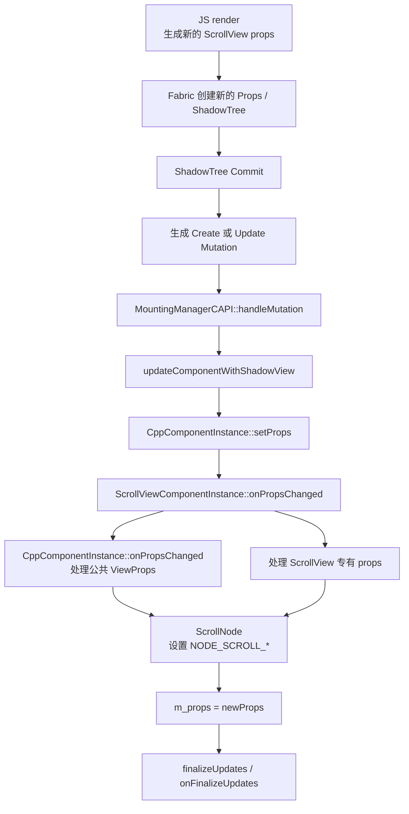
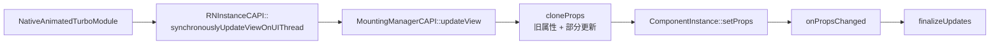
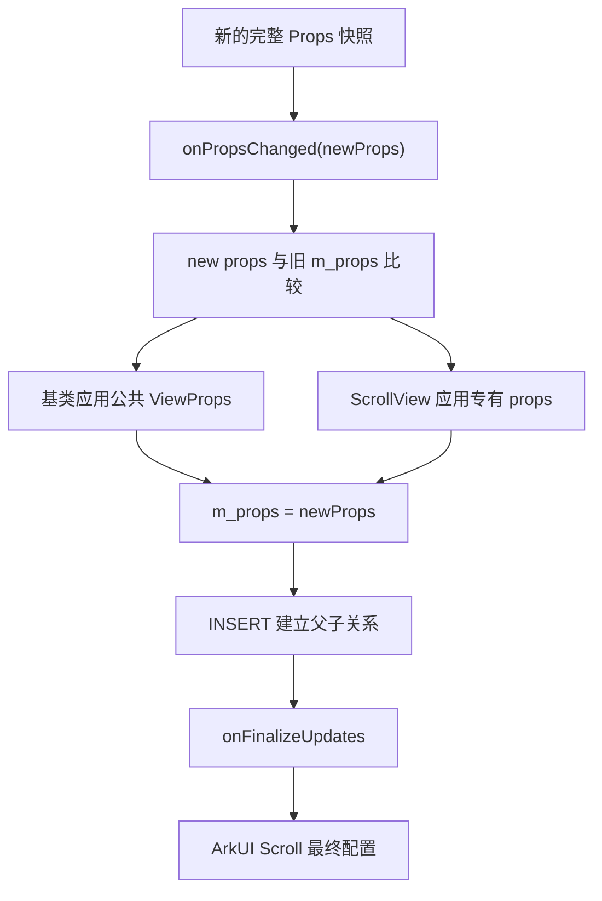

# `onPropsChanged` 属性更新调用链

[返回《RN 0.72 鸿蒙 ScrollView 完整控制流程》](./rn72滚动组件逻辑.md)

> 本文基于当前 `D:\rn72_0610\r` 工作树源码，专门解释 `onPropsChanged` 是谁调用的、什么时候调用，以及 ScrollView 如何通过它把 RN props 下发到 ArkUI。

## 1. 先记住结论

`onPropsChanged` 是原生 `ComponentInstance` 的 **Props 应用入口**：

> Fabric 把一份新的组件属性快照交给原生组件，`onPropsChanged` 比较新旧属性，并把需要生效的配置设置到 ArkUI 节点。

它不是：

- JS 直接调用的函数；
- DOWN、MOVE、UP 等触摸回调；
- ScrollView 每滚动一帧都会执行的函数；
- “某一个具体 prop 肯定改变了”的通知。

---

## 2. 正常 Fabric 更新的完整调用链



普通声明式更新可以概括为：

```text
JS props 变化
-> Fabric 生成新的 Props
-> ShadowTree commit
-> Create / Update Mutation
-> MountingManagerCAPI
-> ComponentInstance::setProps()
-> onPropsChanged()
-> ScrollNode / ArkUI 属性
```

### 2.1 首次创建也会调用

`MountingManagerCAPI::handleMutation()` 处理 `Create` 时：

```cpp
case facebook::react::ShadowViewMutation::Create: {
  // 创建 ComponentInstance
  updateComponentWithShadowView(componentInstance, newChild);
  break;
}
```

所以首次挂载不是绕过 `onPropsChanged`，而是同样经过：

```text
Create
-> updateComponentWithShadowView
-> setProps
-> onPropsChanged
```

此时组件还没有旧属性，通常表现为：

```cpp
m_props == nullptr
```

### 2.2 后续 Update 也会调用

处理 `Update Mutation` 时：

```cpp
case facebook::react::ShadowViewMutation::Update: {
  auto componentInstance =
      m_componentInstanceRegistry->findByTag(
          mutation.newChildShadowView.tag);

  if (componentInstance != nullptr) {
    updateComponentWithShadowView(
        componentInstance,
        mutation.newChildShadowView);
  }
  break;
}
```

`Create` 和 `Update` 最终汇入同一个更新函数。

---

## 3. Mounting 阶段的实际更新顺序

`MountingManagerCAPI::updateComponentWithShadowView()` 当前顺序是：

```cpp
componentInstance->setShadowView(shadowView);
componentInstance->setLayout(shadowView.layoutMetrics);
componentInstance->setEventEmitter(shadowView.eventEmitter);
componentInstance->setState(shadowView.state);
componentInstance->setProps(shadowView.props);
```

也就是：

```text
setShadowView
-> setLayout
-> setEventEmitter
-> setState
-> setProps
```

`setProps()` 才是 `onPropsChanged()` 的直接调用者。

这个顺序意味着进入 `onPropsChanged` 时：

- 新的 layout 已经执行过 `onLayoutChanged`；
- 新的 state 已经执行过 `onStateChanged`；
- 新的 event emitter 已经设置；
- 父子 INSERT 关系不一定已经全部建立。

最后一点解释了为什么部分依赖父子结构的逻辑不能立即放在 `onPropsChanged` 中。

---

## 4. 为什么回调里可以比较新旧 props

关键代码位于 `CppComponentInstance::setProps()`：

```cpp
void setProps(facebook::react::Props::Shared props) final {
  auto newProps =
      std::dynamic_pointer_cast<const ConcreteProps>(props);

  if (!newProps) {
    return;
  }

  this->onPropsChanged(newProps);
  m_props = newProps;
}
```

调用顺序是：

```text
onPropsChanged(newProps)
        ↓
m_props = newProps
```

因此在回调执行期间：

```text
props   = 本次传入的新属性
m_props = 上一次已经保存的旧属性
```

这是一种有意设计，而不是赋值遗漏。

ScrollView 因此可以这样判断：

```cpp
if (!m_props ||
    props->contentOffset != m_props->contentOffset) {
  // 首次挂载，或者 contentOffset 确实改变
}
```

回调结束后，`setProps()` 才把 `m_props` 更新为本次的 `newProps`。

---

## 5. ScrollView 的 `onPropsChanged` 分成两层

ScrollView 重写方法后，首先调用基类：

```cpp
void ScrollViewComponentInstance::onPropsChanged(
    SharedConcreteProps const& props) {
  CppComponentInstance::onPropsChanged(props);

  // ScrollView 专有属性
}
```

### 5.1 基类处理公共 ViewProps

```cpp
CppComponentInstance::onPropsChanged(props);
```

这一层负责 View 通用能力，例如：

- backgroundColor；
- border；
- transform；
- opacity；
- accessibility；
- pointerEvents；
- 阴影和圆角等。

如果派生组件重写 `onPropsChanged()` 却漏掉基类调用，这些公共 View 属性可能无法下发。

### 5.2 ScrollView 处理滚动专有属性

随后 `ScrollViewComponentInstance` 把滚动属性设置到 `m_scrollNode`：

```cpp
m_scrollNode.setHorizontal(isHorizontal(props))
    .setFriction(
        getFrictionFromDecelerationRate(
            props->decelerationRate))
    .setScrollBarDisplayMode(...)
    .setScrollBarColor(...)
    .setEnablePaging(props->pagingEnabled);
```

主要包括：

| RN prop / 配置 | 原生处理 |
| --- | --- |
| `horizontal` | 设置滚动方向 |
| `decelerationRate` | 转换成 ArkUI friction |
| `shows*ScrollIndicator` | 设置滚动条显示模式 |
| `indicatorStyle` | 设置滚动条颜色 |
| `pagingEnabled` | 设置 ArkUI paging |
| `bounces` / `alwaysBounce*` | 设置 edge effect |
| `overScrollMode` | 覆盖默认回弹策略 |
| `nestedScrollEnabled` | 保存嵌套滚动配置 |
| `flingSpeedLimit` | 设置最大 fling 速度 |
| `contentOffset` | 变化时调用一次非动画 `scrollTo` |
| `snapToOffsets` / `snapToInterval` | 更新 ArkUI snap |
| `centerContent` | 更新内容对齐方式 |
| `scrollEventThrottle` | 保存 JS scroll 事件限流值 |

最终多数配置经由：

```text
ScrollViewComponentInstance
-> ScrollNode
-> NativeNodeApi
-> NODE_SCROLL_* 属性
-> ArkUI Scroll
```

---

## 6. `onPropsChanged` 不代表 props 一定真的变了

名字容易让人产生下面的理解：

```text
进入 onPropsChanged
= 某个 prop 肯定变化
```

这个理解不够准确。

Fabric 的 `Update Mutation` 可能由以下内容变化引起：

- props；
- layout；
- state；
- event emitter；
- ShadowView 的其他信息。

而 `updateComponentWithShadowView()` 对 Update 会统一执行：

```cpp
componentInstance->setProps(shadowView.props);
```

所以即使本次 Update 的主要原因是 layout 或 state，`onPropsChanged` 仍可能被调用。

判断某个属性是否真正变化，应显式比较：

```cpp
if (!m_props || props->xxx != m_props->xxx) {
  // 首次挂载，或者 xxx 的值确实发生变化
}
```

同时也要注意，当前 ScrollView 对部分 ArkUI setter 是无条件调用，对部分属性才做新旧值比较。因此不能用 `onPropsChanged` 的调用次数直接推断某个具体属性变化了多少次。

---

## 7. `onFinalizeUpdates` 为什么不能完全省掉

处理完一个 mutation 批次后，MountingManager 还会调用：

```text
finalizeUpdates()
-> onFinalizeUpdates()
```

ScrollView 的 `scrollEnabled` 最终状态还依赖：

- `scrollEnabled` prop；
- Native Responder 是否阻塞；
- 是否处于嵌套 ScrollView；
- `nestedScrollEnabled`；
- INSERT 后建立的真实父子关系。

因此它在 `onFinalizeUpdates()` 中计算：

```cpp
auto newEnableScrollInteraction =
    isEnableScrollInteraction(
        m_props && m_props->scrollEnabled);

if (newEnableScrollInteraction !=
    m_enableScrollInteraction) {
  m_enableScrollInteraction =
      newEnableScrollInteraction;

  m_scrollNode.setEnableScrollInteraction(
      m_enableScrollInteraction);
}
```

两者可以这样区分：

```text
onPropsChanged
负责读取、比较和下发属性

onFinalizeUpdates
等本批 Mutation 和父子结构处理完成后，
再执行依赖完整组件树的最终决策
```

---

## 8. Native Animated 还有一条同步入口

除正常 Fabric commit 外，Native Animated 可以在主线程同步更新 View：



`updateView()` 会用原有 props 和本次局部更新生成一份新的完整 props：

```cpp
auto oldProps = componentInstance->getProps();
auto newProps = componentDescriptor.cloneProps(
    parserContext,
    oldProps,
    std::move(props));

componentInstance->setProps(newProps);
componentInstance->finalizeUpdates();
```

因此 Native Animated 修改属性时，也可能高频进入 `onPropsChanged`。

---

## 9. 它与触摸、滚动事件的关系

用户手指滚动的直接链路是：

```text
DOWN / MOVE / UP
-> ArkUI Scroll 内部处理
-> ScrollNode 回调
-> ScrollViewComponentInstance::onScroll()
-> RN scroll 事件
```

这条链不会因为滚动位置逐帧变化而直接调用 `onPropsChanged`。

但是可能出现间接调用：

```text
onScroll
-> JS setState
-> 重新 render
-> ScrollView props 变化
-> Fabric Update
-> onPropsChanged
```

几个常见入口应当分开理解：

| 操作 | 对应原生入口 |
| --- | --- |
| `<ScrollView scrollEnabled={false}>` | `onPropsChanged`，最终在 `onFinalizeUpdates` 生效 |
| 修改 `contentOffset` prop | `onPropsChanged` |
| `scrollViewRef.scrollTo()` | `onCommandReceived` |
| 用户手指拖动 | ArkUI touch / scroll 回调 |
| ArkUI 回传滚动位置 | `onScroll` 等事件处理 |
| Native Animated 更新属性 | 同步 `updateView -> onPropsChanged` |

所以：

> `onPropsChanged` 处理的是声明式属性快照更新，而不是用户正在触摸或滚动。

---

## 10. 调试时怎样判断为什么进入

不要只打一条“进入 onPropsChanged”的日志。更有效的是同时记录：

```text
component tag
是否首次调用：m_props == nullptr
怀疑属性的新值
怀疑属性的旧值
当前 mutation 类型
是否来自 Native Animated 同步 updateView
```

例如排查 `scrollEnabled`：

```cpp
LOG(INFO) << "ScrollView props"
          << " tag=" << getTag()
          << " first=" << (m_props == nullptr)
          << " newScrollEnabled=" << props->scrollEnabled
          << " oldScrollEnabled="
          << (m_props ? m_props->scrollEnabled : false);
```

如果问题与嵌套关系有关，还应在 `onFinalizeUpdates()` 同时记录：

```text
m_props->scrollEnabled
m_isNativeResponderBlocked
nestedScrollEnabled
isNestedScroll()
m_enableScrollInteraction
```

这样才能区分：

```text
prop 没下发
prop 已下发但没变化
prop 已变化但被 responder 禁用
prop 已变化但被 nested scroll 条件禁用
```

---

## 11. 一张记忆图



最简记忆：

```text
新的 props 快照进来
-> onPropsChanged 用旧 m_props 做比较
-> 公共属性和滚动属性下发
-> 保存成新的 m_props
-> mutation 完成后 finalize
```

---

## 12. 关键源码索引

- `D:\rn72_0610\r\tester\harmony\react_native_openharmony\src\main\cpp\RNOH\CppComponentInstance.h`
  - `setProps()` 调用 `onPropsChanged()` 后才更新 `m_props`：123-130
  - 基类公共 `onPropsChanged()`：289 起
- `D:\rn72_0610\r\tester\harmony\react_native_openharmony\src\main\cpp\RNOH\MountingManagerCAPI.cpp`
  - Native Animated/同步局部 props 更新：186-217
  - `updateComponentWithShadowView()` 的 layout/state/props 顺序：219-230
  - Create 和 Update Mutation：262-338
  - mutation 批次最终调用 `finalizeUpdates()`：341-379
- `D:\rn72_0610\r\tester\harmony\react_native_openharmony\src\main\cpp\RNOHCorePackage\ComponentInstances\ScrollViewComponentInstance.cpp`
  - `onPropsChanged()`：146-271
  - `onFinalizeUpdates()`：644 起
- `D:\rn72_0610\r\tester\harmony\react_native_openharmony\src\main\cpp\RNOH\RNInstanceCAPI.cpp`
  - `synchronouslyUpdateViewOnUIThread()`：267-301
- `D:\rn72_0610\r\tester\harmony\react_native_openharmony\src\main\cpp\RNOHCorePackage\TurboModules\Animated\NativeAnimatedTurboModule.cpp`
  - Native Animated 调用同步更新入口：573、584

[返回《RN 0.72 鸿蒙 ScrollView 完整控制流程》](./rn72滚动组件逻辑.md)
