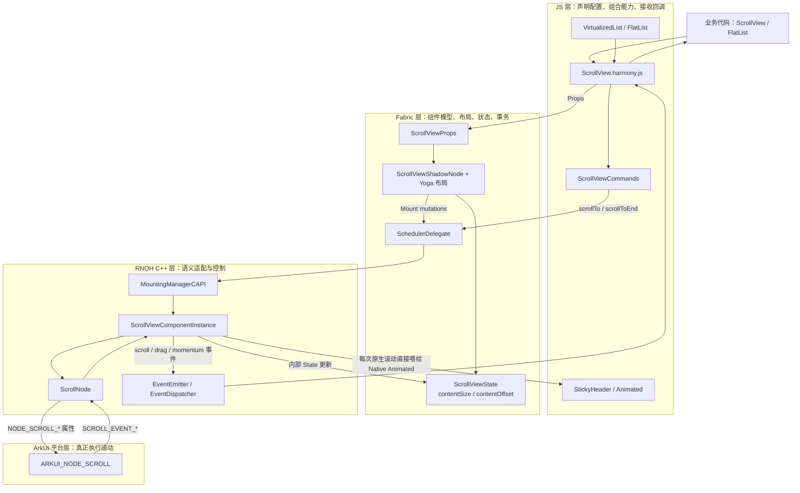
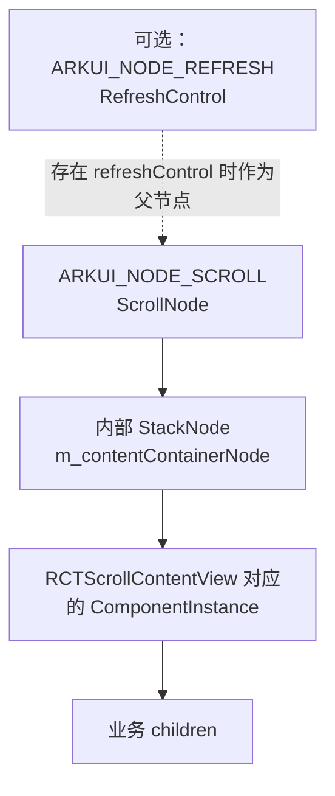
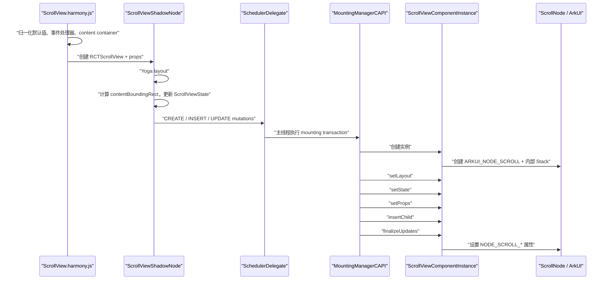
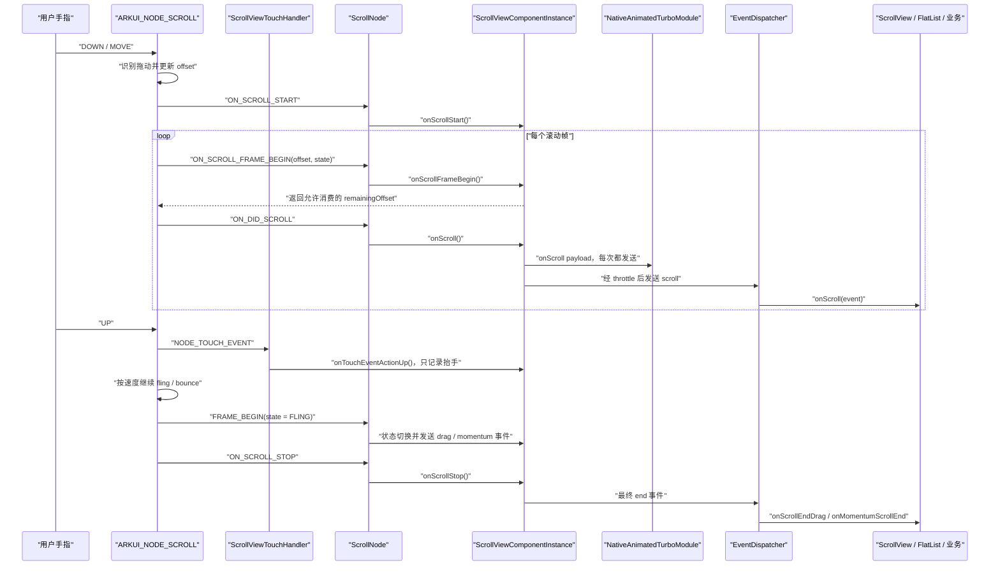
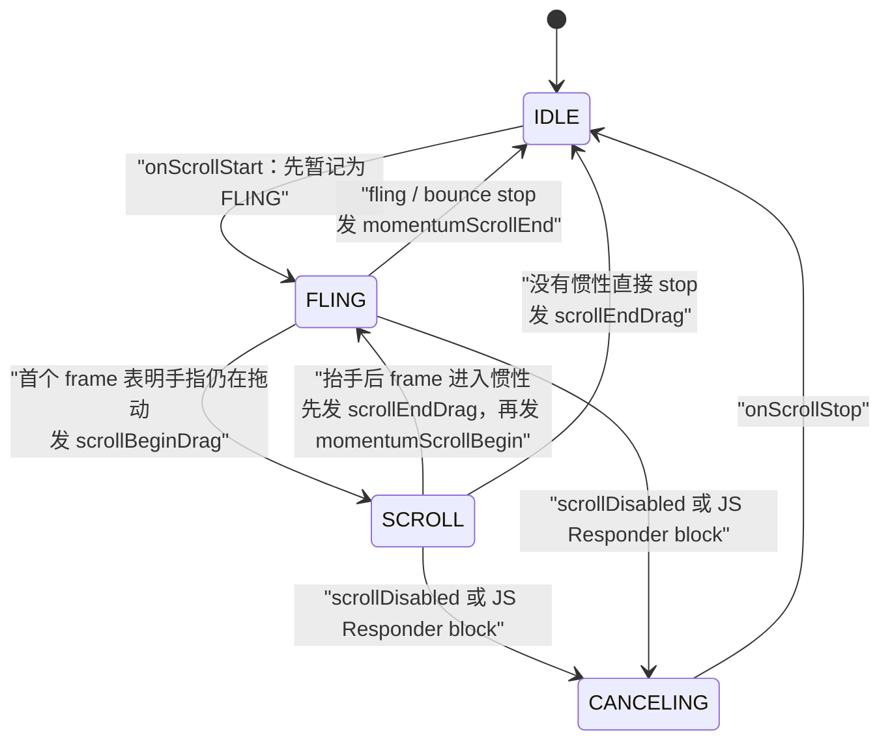
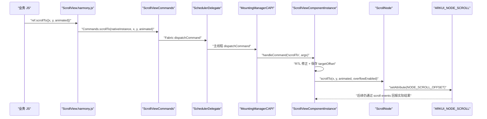
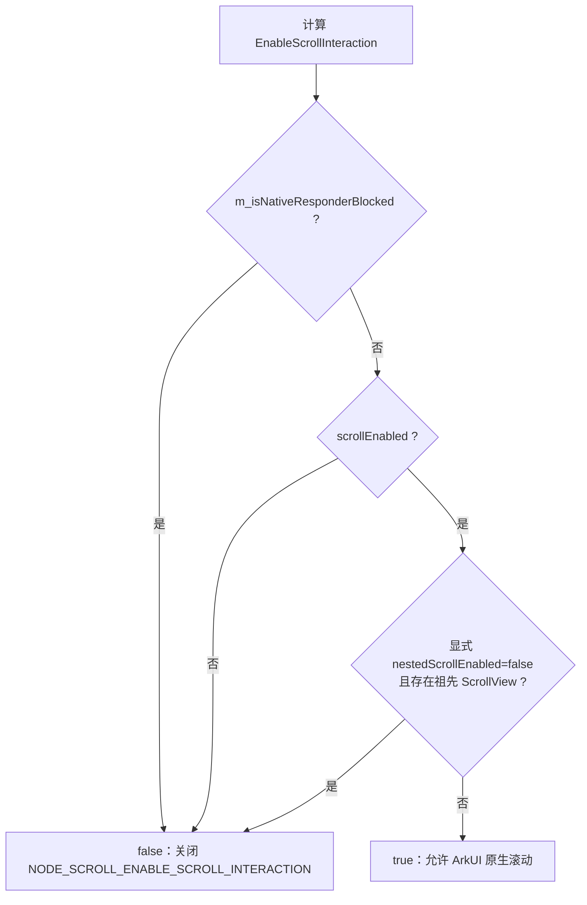

# RN 0.72 鸿蒙 ScrollView 完整控制流程

> 本文基于当前工作区 `D:\rn72_0610\r` 的实际源码整理。  
> 源码快照：`0.72-main` / `3718509b4`，`react-native 0.72.5`，`react-native-harmony 0.72.141`。  
> 当前工作区存在未提交修改，因此本文描述的是“当前工作树实际生效的代码”，不是抽象的社区 RN 实现。

## 阅读导航

- **先建立全貌**：第 0-3 节
- **理解 props、创建和更新**：第 4 节
- **深入理解 `onPropsChanged` 属性更新入口**：[`onPropsChanged` 专题](./onPropsChanged属性更新调用链.md)
- **理解手指拖动与事件回传**：第 5-7 节
- **深入理解 DOWN、UP、CANCEL 与点击/滚动关系**：[触摸序列专题](./触摸序列与点击滚动关系.md)
- **理解 `scrollTo`、物理参数和吸附**：第 8-9 节
- **理解 responder、嵌套滚动和手势竞争**：第 10 节
- **理解 FlatList、StickyHeader、RefreshControl 等联动**：第 11 节
- **按职责或问题现象反查**：第 12-16 节

## 0. 先记住这五句话

1. **真正把手指位移变成滚动位置、并执行惯性和回弹的是 ArkUI 的 `ARKUI_NODE_SCROLL`。**
2. JS `ScrollView` 决定的是“配置和策略”，例如横竖方向、是否可滚、摩擦、吸附、回调和程序化滚动目标。
3. Fabric 负责把 JS 描述转换成 `Props`、布局结果和 `State`，再产生挂载事务。
4. `ScrollViewComponentInstance` 是 RN 语义与 ArkUI 语义之间的控制器；`ScrollNode` 是很薄的 ArkUI C API 封装。
5. `scrollTo()` 是“主动设置目标位置”，`onScroll()` 是“滚动结果回报”，二者方向相反，也都不是手指滚动本身。

如果只想先建立整体认识，依次阅读第 1、2、5、6、13 节即可。

---

## 1. 一张总图：滚动控制权怎样流动



这张图里有两条最重要的方向：

- **向下控制流**：JS 配置或命令 → Fabric → RNOH → ArkUI。
- **向上反馈流**：ArkUI 已经滚动 → RNOH 读取结果 → Fabric State / JS 事件。

---

## 2. 建立正确心智模型：三种输入、两种输出

很多理解混乱，都是因为把下面五条通道混成了一条。

| 通道 | 例子 | 方向 | 本质 |
| --- | --- | --- | --- |
| 声明式属性 | `scrollEnabled`、`horizontal`、`snapToOffsets` | JS → ArkUI | 持续生效的配置 |
| 命令 | `scrollTo()`、`scrollToEnd()` | JS → ArkUI | 一次性动作 |
| 原始触摸 | DOWN / MOVE / UP | 系统输入 → ArkUI | 平台直接驱动滚动 |
| Fabric State | `contentSize`、当前 `contentOffset` | Native ↔ Fabric | 框架内部一致性数据 |
| JS 事件 | `onScroll`、drag、momentum | ArkUI → JS | 通知业务“发生了什么” |

### 2.1 声明式属性不是命令

```tsx
<ScrollView horizontal scrollEnabled={true} contentOffset={{x: 100, y: 0}} />
```

这些属性随 React render 和 Fabric transaction 下发。`contentOffset` 比较特殊：它虽然是 prop，但 native 收到变化后会执行一次非动画 `scrollTo`。

### 2.2 命令不需要等待下一次 render

```tsx
scrollViewRef.current?.scrollTo({x: 0, y: 500, animated: true});
```

它通过 Fabric command 通道直接到 native 组件实例，不是先变成新的 prop。

### 2.3 手指滚动不经过 JS 逐帧计算

用户移动手指时，不是 JS 计算 `dy` 再不断调用 `scrollTo()`。ArkUI Scroll 节点直接消费系统触摸流，完成：

- 拖动距离计算；
- 当前 offset 更新；
- 速度与惯性；
- 边界、回弹和 edge effect；
- paging、snap 和 nested scroll 的平台执行。

RNOH 主要监听滚动结果并补齐 RN 的状态与事件语义。

### 2.4 State 不是事件

`updateStateWithContentOffset()` 更新 Fabric 内部的 `ScrollViewState`，用于让 ShadowTree 知道 native 当前 offset；`emitScrollEvent()` 才会通知 JS 回调。

两者可能在同一处发生，但用途不同：

```text
State：框架内部保持一致
Event：通知 JS 业务代码
```

---

## 3. 一个 ScrollView 实际由哪些对象组成

### 3.1 名称对应

| 看到的名称 | 所属层 | 含义 |
| --- | --- | --- |
| `<ScrollView>` | JS | 对外组件，处理 props 默认值、Responder、键盘、StickyHeader 等 |
| `RCTScrollView` | JS NativeComponent 名 | Host Component 注册名 |
| `ScrollView` | Fabric ComponentName | 去掉 `RCT` 后的 Fabric 标准名 |
| `ScrollViewShadowNode` | Fabric | 布局、内容包围盒和 State |
| `ScrollViewComponentInstance` | RNOH C++ | RN ScrollView 业务控制器 |
| `ScrollNode` | RNOH C++ | ArkUI Scroll C API 包装 |
| `ARKUI_NODE_SCROLL` | ArkUI | 真正执行原生滚动的节点 |

`componentNameByReactViewName()` 会把 `RCTScrollView` 归一化为 `ScrollView`，所以 JS 注册名和 C++ instance factory 判断的名字不同，但它们指向同一个组件。

### 3.2 JS 与 ArkUI 节点树

JS 侧会自动插入一个内容容器：

```text
ScrollView
└── ScrollContentView
    ├── child 0
    ├── child 1
    └── ...
```

RNOH C++ 又为 ArkUI Scroll 准备了一个只能有一个直接子节点的内部 `StackNode`：



`ScrollViewComponentInstance` 构造时就执行：

```cpp
m_scrollNode.insertChild(m_contentContainerNode);
m_scrollNode.setScrollNodeDelegate(this);
m_scrollNode.setNestedScroll(ARKUI_SCROLL_NESTED_MODE_SELF_FIRST);
```

之后 Fabric 插入的 `ScrollContentView` 被放进内部 Stack，业务 children 再位于 `ScrollContentView` 下。

---

## 4. 首次渲染与 props 更新怎样生效

> 配套专题：[从 Fabric Mutation 到 ArkUI——`onPropsChanged` 属性更新调用链](./onPropsChanged属性更新调用链.md)



### 4.1 JS 层先做一次策略归一化

`ScrollView.harmony.js` 不是简单透传组件。它会：

- 横向和纵向都选择同一个 `ScrollViewNativeComponent`，用 `horizontal` prop 区分方向；
- 自动创建 `ScrollContentView`；
- 给 `alwaysBounceHorizontal/Vertical`、indicator、snap、paging 设置默认或互斥关系；
- 当存在 StickyHeader 时，把 `scrollEventThrottle` 强制为 `1`；
- 仅当 `decelerationRate` 显式传入时，调用 Harmony 的 `processDecelerationRate()`；
- 安装 `onScroll`、drag、momentum、Responder、touch、keyboard 处理器；
- 有 `refreshControl` 时，把 native ScrollView 包到 RefreshControl 中。

一个容易忽略的策略是：

```text
设置 snapToInterval 或 snapToOffsets
    -> JS 层把 pagingEnabled 置为 false
    -> 避免 paging 和显式 snap 同时控制位置
```

### 4.2 Fabric 如何得到内容大小

`ScrollViewShadowNode::layout()` 在 Yoga 完成后：

1. 遍历 layoutable children；
2. 合并每个 child 的 `frame`；
3. 得到 `contentBoundingRect`；
4. 写入 `ScrollViewState`；
5. `ScrollViewState::getContentSize()` 返回这个包围盒的 size。

因此 native 使用的 `contentSize` 不是 `onContentSizeChange` JS 回调算出来的。两条路径是：

```text
Fabric ShadowNode 计算 contentBoundingRect
    -> ScrollViewState
    -> ScrollViewComponentInstance::onStateChanged()
    -> 设置 native 内容容器大小

ScrollContentView onLayout
    -> ScrollView.harmony.js::_handleContentOnLayout()
    -> 只调用业务 onContentSizeChange(width, height)
```

### 4.3 Mounting 时的关键更新顺序

`MountingManagerCAPI::updateComponentWithShadowView()` 当前顺序是：

```text
setShadowView
-> setLayout
-> setEventEmitter
-> setState
-> setProps
```

插入关系处理完后，`finalizeMutationUpdates()` 再调用 `finalizeUpdates()`。

这解释了为什么部分逻辑必须放在 `onFinalizeUpdates()`：例如判断“自己是不是嵌套 ScrollView”，必须等 INSERT mutation 已经建立父子关系后才可靠。

### 4.4 props 最终映射到什么

| RN prop / 状态 | `ScrollViewComponentInstance` 处理 | `ScrollNode` / ArkUI 结果 |
| --- | --- | --- |
| `horizontal` | `setHorizontal()` | `NODE_SCROLL_SCROLL_DIRECTION` |
| `scrollEnabled` | 与 responder、nested 条件一起计算 | `NODE_SCROLL_ENABLE_SCROLL_INTERACTION` |
| `decelerationRate` | 转换为 friction | `NODE_SCROLL_FRICTION` |
| `flingSpeedLimit` | API 18+ 才设置 | `NODE_SCROLL_FLING_SPEED_LIMIT` |
| `bounces` + `alwaysBounce*` | 未设置 `overScrollMode` 时使用 | `NODE_SCROLL_EDGE_EFFECT` |
| `overScrollMode` | 优先于 bounces 分支 | NONE 或 SPRING edge effect |
| `pagingEnabled` | `setEnablePaging()` | `NODE_SCROLL_ENABLE_PAGING` |
| `snapToOffsets/Interval/...` | 清洗、排序、构造 snap points | `NODE_SCROLL_SNAP` |
| `shows*ScrollIndicator` | 计算显示模式 | `NODE_SCROLL_BAR_DISPLAY_MODE` |
| `persistentScrollbar` | 参与显示模式计算 | ON / AUTO |
| `indicatorStyle` | 转为黑/白半透明色 | `NODE_SCROLL_BAR_COLOR` |
| `contentOffset` | prop 变化时非动画 `scrollTo` | `NODE_SCROLL_OFFSET` |
| `scrollToOverflowEnabled` | 传入 `scrollTo` | offset 属性的 overflow 标志 |
| `centerContent` | 调整内容对齐方式 | center / top-start |
| `fadingEdgeLength` | API 14+ 设置 | `NODE_SCROLL_FADING_EDGE` |
| `endFillColor` | 设置节点背景色 | `NODE_BACKGROUND_COLOR` |
| `removeClippedSubviews` | 滚动时触发内容容器裁剪更新 | 不直接对应 Scroll 属性 |
| `maintainVisibleContentPosition` | 内容变化后补偿 offset | 内部调用 `scrollTo` |
| `scrollEventThrottle` | C++ 记录毫秒间隔 | 控制普通 JS `scroll` 事件频率 |

不是所有 RN 通用 ScrollView prop 都在当前 Harmony C++ 中有落地。例如 zoom 相关 API 仍属于 iOS 路径，不能只因为 Flow 类型中存在就认为 Harmony 已实现。

---

## 5. 手指拖动：真正的原生滚动流程

> 配套专题：[触摸序列与点击、滚动的关系——DOWN、MOVE、UP、CANCEL 是否成对](./触摸序列与点击滚动关系.md)

### 5.1 完整时序



### 5.2 为什么 `ScrollViewComponentInstance::onTouchEvent()` 不是滚动入口

当前 `ScrollViewTouchHandler` 只观察：

```cpp
if (action == UI_TOUCH_EVENT_ACTION_UP) {
  m_scrollViewComponentInstance->onTouchEventActionUp();
}
```

它没有：

- 读取每个 MOVE 的坐标差；
- 计算 offset；
- 计算 fling；
- 调用 `scrollTo()` 模拟手指拖动。

它的作用只是把 `m_isPointerLikelyUp` 设为 `true`，帮助修正 ArkUI 在 overscroll bounce 阶段把状态报成 `SCROLL`、而 RN 语义希望它仍属于 `FLING` 的差异。

所以要严格区分：

```text
ArkUI Scroll 处理触摸：滚动执行者
ScrollViewTouchHandler：辅助观察触摸状态
```

### 5.3 `onScrollFrameBegin()` 是每帧的“闸门”

每个 native 滚动帧开始前，ArkUI 给出：

- 本帧 offset；
- ArkUI 当前 scroll state。

RNOH 可以返回一个新的 remaining offset。当前代码在以下情况返回 `0`：

1. `scrollEnabled={false}`；
2. 自己或祖先的 JS Responder 正在要求阻止 native responder；
3. `disableIntervalMomentum` + snap 已进入 FLING，需要阻止 native 惯性位移，改由 RNOH 选择 snap target。

正常情况返回原始 `offset`，让 ArkUI 继续执行本帧滚动。

---

## 6. drag / fling 事件状态机

RNOH 自己维护：

```cpp
enum ScrollState { IDLE, SCROLL, FLING, CANCELING };
```



### 6.1 为什么 `onScrollStart()` 先设置成 FLING

ArkUI 的 start 回调本身还不足以判断是：

- 手指开始拖动；
- 程序化动画；
- 惯性或回弹。

当前实现先暂记 `FLING`，再等待 `onScrollFrameBegin()` 给出的 frame state 修正。`m_scrollStartFling` 用来避免第一次从这个临时 FLING 切到 SCROLL 时错误发送一次 momentum end。

### 6.2 常见手指滚动事件顺序

有惯性时：

```text
scrollBeginDrag
-> 多个 scroll
-> scrollEndDrag
-> momentumScrollBegin
-> 多个 scroll
-> momentumScrollEnd
```

没有惯性时：

```text
scrollBeginDrag
-> 多个 scroll
-> scrollEndDrag
```

边界回弹时，抬手后的 bounce 仍应属于 momentum。`m_isPointerLikelyUp + isOutOfBound()` 就是为这一语义修正服务。

---

## 7. `onScroll` 怎样从 ArkUI 回到 JS

### 7.1 native 回调链

```text
ArkUI NODE_SCROLL_EVENT_ON_DID_SCROLL
-> ScrollNode::onNodeEvent()
-> ScrollNodeDelegate::onScroll()
-> ScrollViewComponentInstance::onScroll()
```

`ScrollNode` 只做事件类型到 delegate 方法的转换；实际 RN 逻辑在 `ScrollViewComponentInstance`。

### 7.2 `ScrollViewComponentInstance::onScroll()` 做了什么

按当前源码顺序：

1. 读取 `contentOffset`、`contentSize`、`containerSize`；
2. 无条件把本次 metrics 送给 Native Animated；
3. 必要时调整 nested scroll mode；
4. 判断是否应该派发普通 JS `scroll` 事件；
5. 派发后更新 Fabric `contentOffset` State；
6. 更新 `m_currentOffset`；
7. 触发 `removeClippedSubviews` 的裁剪更新。

### 7.3 JS `scroll` 事件的三个限流层次

第一层：时间间隔。

```text
scrollEventThrottle == 0
或
now - lastDispatchTime > scrollEventThrottle
```

第二层：位移至少变化 `0.01`。

```text
abs(newOffset - currentOffset) >= 0.01
```

第三层：Fabric continuous event 合并。

普通 `scroll` 用 `dispatchUniqueEvent()`，进入 asynchronous batched queue；同类型连续事件可以被合并。drag 和 momentum 的 begin/end 用普通 `dispatchEvent()`，不能按 continuous scroll 的方式丢掉边界事件。

以下情况会强制允许一次 scroll：

- `m_allowNextScrollEvent`；
- 当前 offset 已到 `scrollTo` 目标附近；
- 滚动停止且处于边界，代码主动补发最终 scroll。

### 7.4 为什么 Native Animated 与 JS `onScroll` 频率不同

`sendEventForNativeAnimations()` 在 throttle 判断之前调用。因此：

```text
每次 ArkUI did-scroll
    -> Native Animated 都能收到 metrics

普通 JS onScroll
    -> 还要经过 scrollEventThrottle、位移阈值和 event coalescing
```

StickyHeader 正是通过 `Animated.attachNativeEvent(..., "onScroll", ...)` 订阅 `contentOffset.y`。这让 sticky transform 不需要等待普通业务 JS 回调逐帧驱动。

### 7.5 JS 事件 payload

当前 RNOH 发给 JS 的 payload 包括：

```text
contentOffset: {x, y}
velocity: {x, y}
contentInset: {top, left, bottom, right}
contentSize: {width, height}
layoutMeasurement: {width, height}
zoomScale
responderIgnoreScroll
```

velocity 不是直接取 ArkUI 的触摸速度，而是 `VelocityTracker` 对连续 `contentOffset + timestamp` 样本做拟合；进入 `SCROLL` 时会 reset。

---

## 8. `scrollTo()` 和 `scrollToEnd()` 怎样生效

### 8.1 `scrollTo()` 完整命令链



`ScrollNode::scrollTo()` 当前写入的参数包含：

```text
x
y
duration = animated ? 250ms : 0
curve = LINEAR
smooth = 0
scrollToOverflowEnabled
```

因此当前 Harmony 的 `animated: true` 是固定 250ms 的线性动画，不是 JS 自己逐帧插值。

### 8.2 为什么要保存 `m_targetOffsetOfScrollToCommand`

调用命令时，`ScrollViewComponentInstance` 保存目标 offset。后续 `onScroll()` 如果发现实际 offset 已非常接近目标，会强制派发一次 scroll 并清空目标。

这是为 `VirtualizedList onEndReachedThreshold={0}` 等边界场景服务：即使回弹或节流造成最后一次普通 scroll 容易缺失，也尽量让列表收到“到达目标”的最终位置。

### 8.3 `scrollToEnd()`

```text
JS Commands.scrollToEnd(animated)
-> ScrollViewComponentInstance::scrollToEnd()
-> 根据横向/纵向选择 contentSize.width 或 contentSize.height
-> ScrollNode::scrollTo()
-> ArkUI 将超出合法范围的目标夹到末端
```

横向 RTL 会选择相反的 x 方向；普通横向 LTR 使用 `contentSize.width`，纵向使用 `contentSize.height`。代码依赖 ArkUI 做合法边界 clamp，而不是自己先减去 container size。

### 8.4 还有哪些逻辑会内部调用 `scrollTo`

| 触发点 | 目的 | 动画 |
| --- | --- | --- |
| `contentOffset` prop 变化 | 同步声明的初始/新位置 | 否 |
| JS `scrollTo` | 执行业务目标 | 由参数决定 |
| JS `scrollToEnd` | 到内容末端 | 由参数决定 |
| 内容变小导致当前 offset 越界 | 拉回合法范围 | 否 |
| `maintainVisibleContentPosition` | 插入内容后保持首个可见项不跳 | 先否，满足阈值时再动画到顶部 |
| KeyboardAvoidingView 变化 | 避免目标输入框被键盘挡住 | 是 |
| `disableIntervalMomentum` | 抬手后移动到选定 snap target | 是 |

这再次说明：`scrollTo` 是主动位置控制工具，不是手指拖动实现。

---

## 9. 摩擦、惯性、回弹、分页和吸附

### 9.1 decelerationRate → ArkUI friction

JS 显式传字符串时：

```text
"normal" -> 0.997
"fast"   -> 0.992
```

RNOH C++ 再映射：

```text
0.997 -> ArkUI friction 0.75
0.992 -> ArkUI friction 2.0
其他合法数值 -> max(0.1, 250 * (1 - rate))
非法、非有限、< 0 或 >= 1 -> 0.75
```

当前源码还有一个需要特别知道的“路径差异”：

```text
显式 decelerationRate="normal"
    -> JS helper 生成 0.997
    -> 命中 Harmony normal

完全省略 decelerationRate
    -> JS 不调用 helper
    -> Fabric ScrollViewProps 当前默认值为 0.998
    -> 走数值公式，约得到 0.5
```

所以在当前工作树里，“省略”与“显式 normal”不是同一条控制路径。理解摩擦问题时必须先区分字符串、显式数值和省略三类输入。

### 9.2 flingSpeedLimit

Harmony 自定义 prop `flingSpeedLimit` 最终设置 `NODE_SCROLL_FLING_SPEED_LIMIT`，但仅在系统 API 18+ 生效。它限制最大 fling 速度，不替代 friction。

### 9.3 bounces 与 overScrollMode

优先级：

```text
显式 overScrollMode
    -> never: NONE
    -> always: SPRING
    -> auto: 内容小于容器时 NONE，否则 SPRING

没有 overScrollMode
    -> bounces 决定 NONE / SPRING
    -> alwaysBounceHorizontal/Vertical 决定内容不足时是否仍允许边缘效果
```

回弹仍会产生 offset 变化。上层 StickyHeader、`Animated.diffClamp`、方向判断等看到的是 ArkUI 实际回报的 `contentOffset`，因此边界语义可能与 Android 不完全一致。

### 9.4 paging 与 snap

JS 层先避免 `pagingEnabled` 与显式 snap 同时开启。C++ 层：

- `pagingEnabled` → ArkUI paging 属性；
- `snapToOffsets`：删除 NaN、排序；只有一个 offset 时追加 `infinity`；
- `snapToInterval`：把 interval 作为 snap point；
- `snapToAlignment`：转换为 ArkUI start / center / end；
- 没有 snap 配置时 reset `NODE_SCROLL_SNAP`。

`disableIntervalMomentum=true` 时：

1. frame 从拖动进入 FLING；
2. `onScrollFrameBegin()` 返回 `0`，阻止 native 惯性继续移动；
3. `emitOnScrollEndDragEvent()` 调用 `disableIntervalMomentum()`；
4. 根据最近一帧方向和当前 offset 选择上一个/下一个 snap target；
5. 动画 `scrollTo` 目标。

---

## 10. 谁可以禁止 ScrollView 滚动

最终是否允许 ArkUI 响应触摸，由：

```cpp
isEnableScrollInteraction(scrollEnabled)
```

统一判断。



### 10.1 JS Responder

Fabric 设置 JS Responder 时：

```text
SchedulerDelegate::schedulerDidSetIsJSResponder
-> MountingManagerCAPI::setIsJsResponder
-> 标记目标 ComponentInstance
-> 沿祖先链 setNativeResponderBlocked(blockNativeResponder)
-> ScrollViewComponentInstance::onNativeResponderBlockChange
-> 重新计算 NODE_SCROLL_ENABLE_SCROLL_INTERACTION
```

此外，每帧 `onScrollFrameBegin()` 还会向上检查祖先 `isJSResponder()`；若命中，就把本帧 offset 置 0、进入 `CANCELING` 并暂时关闭原生滚动。`onScrollStop()` 再恢复已计算好的 `m_enableScrollInteraction`。

### 10.2 nested scroll

构造时默认：

```text
SELF_FIRST
```

当前自动策略大致是：

- 内容内部仍可滚动时，切成 `SELF_ONLY`，优先让自己消费；
- 到开始或结束边界并停止后，恢复 `SELF_FIRST`，允许把剩余滚动交给父级；
- 第三方调用 `setNestedScrollMode(forward, backward)` 后，设置 `m_scrollNestedModeFromOutside=true`，自动切换逻辑不再覆盖外部模式；
- 嵌套 ScrollView 显式 `nestedScrollEnabled={false}` 时，直接关闭其 scroll interaction。

### 10.3 第三方手势库怎样插入

RNGH（React Native Gesture Handler）不是 ArkUI 滚动物理执行者。当前 RNOH 适配中：

```text
ArkUI 原始触摸
├── ARKUI_NODE_SCROLL：真正滚动
└── RNGH Root Touch Handler：手势状态机

RNGH 手势竞争结果
-> NativeResponderBlock / Scroll Lock
-> ScrollViewComponentInstance
-> NODE_SCROLL_ENABLE_SCROLL_INTERACTION
```

它与 Android `NativeViewGestureHandler -> view.onTouchEvent()` 的机制不同。鸿蒙当前主要通过“是否允许 ScrollNode 继续消费原始触摸”达到行为适配，而不是把事件重新注入 ScrollView。

这部分的专项背景可继续阅读：

```text
D:\rn72_0610\手势问题\Android与RNOH_NativeViewGestureHandler_ScrollView调用链.md
```

---

## 11. 内容变化、列表、StickyHeader、下拉刷新和键盘

### 11.1 内容尺寸变化

```text
children layout 变化
-> ScrollViewShadowNode 重新计算 contentBoundingRect
-> ScrollViewState contentSize 变化
-> ScrollViewComponentInstance::onStateChanged
-> 设置内部内容 Stack 大小
-> m_contentSizeChanged = true
```

事务结束时 `updateOffsetAfterChildChange()` 只在 `IDLE` 状态处理：

- 若内容变小导致当前 offset 超出新范围；
- 把横向或纵向 offset clamp 到 `[0, contentSize - containerSize]`；
- 非动画 `scrollTo` 合法位置。

这样可以避免滚动过程中内容变化立刻抢走 ArkUI 的控制权。

### 11.2 maintainVisibleContentPosition

每次 finalize：

1. 记录 `minIndexForVisible` 之后第一个可见 child 的 tag 和位置；
2. 下一次内容变化后，用相同 tag 找到它的新位置；
3. 计算 `deltaX/deltaY`；
4. 当前 offset 加上 delta，保持该 child 的视觉位置；
5. 如果之前离顶部不超过 `autoscrollToTopThreshold`，再动画到顶部。

它只按 `contentOffset` 和 child `frame.origin` 判断可见，不考虑遮挡和复杂 transform。

### 11.3 FlatList / VirtualizedList 与 ScrollView

默认情况下，VirtualizedList 最终仍渲染 `<ScrollView {...props} />`。它不是另一套 native 滚动器：

```text
FlatList / VirtualizedList
-> 默认 ScrollView
-> 同一套 RNOH ScrollViewComponentInstance
-> 同一个 ArkUI ScrollNode
```

VirtualizedList 在 JS `_onScroll()` 中读取：

- `layoutMeasurement`；
- `contentSize`；
- `contentOffset`；
- timestamp。

随后计算可见长度、内容长度、offset、速度，驱动：

- 渲染窗口；
- viewability；
- blankness；
- `onEndReached`；
- nested child list metrics。

`scrollToIndex`、`scrollToOffset` 最后也会换算成 offset，调用底层 ScrollView 的 `scrollTo()`。

同方向嵌套 VirtualizedList 会让内层默认渲染普通 `View`，复用父级的实际滚动容器；这与 native ScrollView 的 nested scroll 是两个不同层面的“嵌套”概念。

### 11.4 removeClippedSubviews

native `onScroll()` 在实际派发并接受本次 offset 后调用 `updateContentClippedSubviews()`；滚动结束也会再更新一次。

有 StickyHeader 时，Harmony JS 与 Android 一样会强制内容容器的 `removeClippedSubviews=false`，避免 sticky child 被错误裁掉。

### 11.5 StickyHeader

```text
stickyHeaderIndices
-> ScrollView.harmony.js 包装指定 child 为 ScrollViewStickyHeader
-> attachNativeEvent 绑定 native onScroll.contentOffset.y
-> ScrollViewComponentInstance 每次 did-scroll 通知 Native Animated
-> ScrollViewStickyHeader 用 interpolate / diffClamp 计算 translateY
```

因此 StickyHeader 问题要同时检查：

- ArkUI 回报的边界/回弹 offset；
- RNOH `sendEventForNativeAnimations()`；
- `ScrollViewStickyHeader` 的 `interpolate` 和 `Animated.diffClamp`；
- `stickyHeaderHiddenOnScroll` 是否改变 offset 计算。

不能只看普通业务 `onScroll` 是否触发。

### 11.6 RefreshControl

Harmony JS 复用 Android 风格的包裹结构，让 RefreshControl 成为 ScrollView 父节点。native 侧：

```text
ARKUI_NODE_REFRESH offset change
-> PullToRefreshViewComponentInstance::onRefreshNodeOffsetChange
-> 找到第一个 child ScrollViewComponentInstance
-> onPullToRefreshOffsetChange(offset)
-> 主动调用 ScrollView onScroll()
```

这是因为 PullToRefresh 拉动期间 ScrollNode 本身可能不发普通 scroll 事件，而 StickyHeader 仍需要得到连续 offset。

`getScrollOffset()` 会扣除 refresh offset；`onScrollStop()` 延迟清理该值，以避免松手后的第一帧导致 sticky 闪动。

### 11.7 键盘避让

`KeyboardAvoidingView` 通过私有 raw prop `__keyboardAvoidingViewBottomHeight` 标记由键盘引起的 mutation。ScrollView 直接位于它内部时：

1. props 变化标记下次 render 需要调整；
2. `onFinalizeUpdates()` 通过 `KeyboardAvoider` 找到输入框底边；
3. 若输入框会被遮挡，动画 `scrollTo` 新位置。

这是平台自动避让不足时的 RNOH 补偿逻辑，不属于普通手指滚动。

### 11.8 RTL

ArkUI 横向 RTL offset 从右侧计算，而 RN 始终希望从左侧表达。RNOH 用同一个对称转换处理输入和输出：

```text
RN x <-> contentWidth - containerWidth - ArkUI x
```

因此排查横向 RTL 时，要分别看：

- JS 传入的 RN x；
- `adjustOffsetToRTL()` 后写给 ArkUI 的 x；
- `getScrollOffset()` 转回 RN 语义后的 x。

---

## 12. 各层到底负责什么

| 层 | 拥有的控制权 | 不负责什么 |
| --- | --- | --- |
| 业务 JS | 传 props、调用命令、响应事件 | 不实现 MOVE、fling 和回弹 |
| `ScrollView.harmony.js` | 默认值、组合内容容器、Responder、键盘、StickyHeader、RefreshControl | 不直接操作 ArkUI 节点 |
| Fabric Props / ShadowNode / State | 类型化 props、Yoga 布局、内容尺寸、offset 状态、事务 | 不执行平台滚动物理 |
| Scheduler / MountingManager | 把 mutation、command、responder 切到 native 主线程并路由到实例 | 不决定 ScrollView 业务策略 |
| `ScrollViewComponentInstance` | RN ↔ ArkUI 语义转换、状态机、限流、snap、nested、事件和内部补偿 | 不逐 MOVE 实现原生滚动物理 |
| `ScrollNode` | 把方法变成 `NODE_SCROLL_*` 属性和事件 delegate | 不决定何时 scrollTo、何时发 RN 事件 |
| `ARKUI_NODE_SCROLL` | 真实拖动、offset、惯性、回弹、paging、snap、nested 执行 | 不知道 JS 业务回调的含义 |
| EventEmitter / Native Animated | 把 native 结果送回 RN 消费者 | 不改变已经发生的 native 滚动 |

一句话总结：

> JS 决策，Fabric 运输和建模，RNOH 翻译与协调，ArkUI 执行，EventEmitter 回报。

---

## 13. 用一个例子串完整流程

```tsx
<ScrollView
  horizontal={false}
  scrollEnabled={true}
  decelerationRate="fast"
  snapToInterval={200}
  scrollEventThrottle={16}
  onScroll={handleScroll}
>
  {children}
</ScrollView>
```

### 13.1 首次 render

```text
1. ScrollView.harmony.js
   - 选择纵向 host component
   - 创建 ScrollContentView
   - "fast" 转为 0.992
   - snapToInterval 存在，所以 pagingEnabled=false

2. Fabric
   - 解析 ScrollViewProps
   - Yoga 布局
   - children 包围盒写入 ScrollViewState.contentBoundingRect

3. MountingManager
   - 创建 ScrollViewComponentInstance
   - 建立 ScrollNode -> Stack -> ScrollContentView 层级
   - 下发 layout / state / props

4. ScrollViewComponentInstance
   - vertical
   - friction=2.0
   - snap interval=200
   - scroll interaction=true

5. ScrollNode
   - 写 NODE_SCROLL_SCROLL_DIRECTION
   - 写 NODE_SCROLL_FRICTION
   - 写 NODE_SCROLL_SNAP
   - 写 NODE_SCROLL_ENABLE_SCROLL_INTERACTION
```

### 13.2 用户手指滚动

```text
1. ArkUI 直接消费 MOVE，更新 offset
2. frame begin 进入 SCROLL
3. RNOH 发 scrollBeginDrag
4. 每个 did-scroll：
   - Native Animated 先收到
   - 普通 onScroll 经 16ms throttle + 0.01 位移阈值 + coalescing
   - Fabric State 同步当前 contentOffset
5. 手指抬起：
   - TouchHandler 记录 pointer likely up
   - ArkUI 进入 fling
   - RNOH 发 scrollEndDrag、momentumScrollBegin
6. ArkUI 执行摩擦和 snap
7. stop 后 RNOH 发 momentumScrollEnd
```

### 13.3 业务调用 scrollTo

```text
ref.scrollTo({y: 600, animated: true})
-> Fabric command
-> ScrollViewComponentInstance
-> NODE_SCROLL_OFFSET(y=600, duration=250ms, LINEAR)
-> ArkUI 动画
-> 同一套 scroll event 链回报实际 offset
```

---

## 14. 排查问题时从哪里下手

| 现象 | 第一组检查点 | 关键变量 / 方法 |
| --- | --- | --- |
| 手指完全滚不动 | interaction gate | `scrollEnabled`、`m_isNativeResponderBlocked`、`isNestedScroll()`、`NODE_SCROLL_ENABLE_SCROLL_INTERACTION` |
| 节点在动但 JS `onScroll` 少或没有 | 回调与限流 | ArkUI DID_SCROLL、`onScroll()`、`m_scrollEventThrottle`、`m_lastScrollDispatchTime`、`dispatchUniqueEvent` |
| `scrollTo` 没生效 | command 链 | `Commands.scrollTo`、`schedulerDidDispatchCommand`、Component tag、`onCommandReceived`、`NODE_SCROLL_OFFSET` |
| `scrollTo` 横向 RTL 位置反了 | 坐标转换 | `adjustOffsetToRTL()` 输入和 `getScrollOffset()` 输出 |
| drag / momentum 顺序不对 | 状态机 | `m_scrollState`、ArkUI frame state、`m_scrollStartFling`、`m_isPointerLikelyUp` |
| 松手后 snap 不对 | snap 决策 | `m_recentScrollFrameOffset`、`m_snapToOffsets`、`getNextSnapTarget()`、frame begin 返回值 |
| 内容增删后跳动 | State 与补偿 | `m_contentSizeChanged`、`updateOffsetAfterChildChange()`、`maintainVisibleContentPosition` |
| 嵌套列表争抢 | 两类 nested + responder | VirtualizedList 同方向嵌套、ArkUI nested mode、JS Responder、RNGH Scroll Lock |
| StickyHeader 抖动/回弹重现 | Native Animated 路径 | 实际 `contentOffset`、`sendEventForNativeAnimations()`、`Animated.diffClamp` |
| 下拉刷新时 sticky 闪动 | Refresh offset 联动 | `onPullToRefreshOffsetChange()`、`m_onPullToRefreshOffsetY`、`onScrollStop()` |

### 14.1 推荐的最小日志顺序

不要一开始打印所有事件。按问题类型选择一条链：

手指滚动/状态问题：

```text
onTouchEventActionUp
-> onScrollFrameBegin(offset, arkUIScrollState, oldState, newState)
-> onScroll(contentOffset)
-> onScrollStop(finalState, finalOffset)
```

程序化滚动问题：

```text
JS x/y/animated
-> onCommandReceived args
-> RTL 后 target
-> ScrollNode::scrollTo 写入值
-> ArkUI 回报的实际 contentOffset
```

滚动被禁止：

```text
scrollEnabled
m_isNativeResponderBlocked
ancestor isJSResponder
nestedScrollEnabled
isNestedScroll
最终 m_enableScrollInteraction
```

snap 问题：

```text
contentSize / containerSize
currentOffset
recentScrollFrameOffset
snap points
nextSnapTarget
frame begin 返回值
```

---

## 15. 关键源码索引

### JS 层

- `D:\rn72_0610\r\react-native-harmony\Libraries\Components\ScrollView\ScrollView.harmony.js`
  - native component 选择：63-81
  - `scrollTo`：890-936
  - `scrollToEnd`：946-955
  - Native Animated 绑定：1123-1137
  - JS `onScroll` 包装：1177-1195
  - drag / momentum 处理：1312-1364
  - StickyHeader 包装：1719-1753
  - props 归一化：1803-1898
  - native 结构 render：1901-1964
- `D:\rn72_0610\r\react-native-harmony\Libraries\Components\ScrollView\processDecelerationRate.harmony.js`
- `D:\rn72_0610\r\tester\node_modules\react-native\Libraries\Components\ScrollView\ScrollViewCommands.js`
- `D:\rn72_0610\r\tester\node_modules\react-native\Libraries\Components\ScrollView\ScrollViewNativeComponent.js`
- `D:\rn72_0610\r\tester\node_modules\react-native\Libraries\Components\ScrollView\ScrollViewStickyHeader.js`

### Fabric 层

- `D:\rn72_0610\r\tester\harmony\react_native_openharmony\src\main\cpp\third-party\rn\ReactCommon\react\renderer\components\scrollview\ScrollViewProps.cpp`
- `D:\rn72_0610\r\tester\harmony\react_native_openharmony\src\main\cpp\third-party\rn\ReactCommon\react\renderer\components\scrollview\ScrollViewShadowNode.cpp`
  - content bounding rect / State：17-31
  - layout：53-57
  - content origin offset：59-63
- `D:\rn72_0610\r\tester\harmony\react_native_openharmony\src\main\cpp\third-party\rn\ReactCommon\react\renderer\components\scrollview\ScrollViewState.h`
- `D:\rn72_0610\r\tester\harmony\react_native_openharmony\src\main\cpp\third-party\rn\ReactCommon\react\renderer\componentregistry\componentNameByReactViewName.cpp`

### RNOH 挂载与命令路由

- `D:\rn72_0610\r\tester\harmony\react_native_openharmony\src\main\cpp\RNOHCorePackage\RNOHCorePackage.h`
  - 创建 `ScrollViewComponentInstance`：182-184
  - 注册 descriptor：220-221
  - `RCTScrollView` binder：239
- `D:\rn72_0610\r\tester\harmony\react_native_openharmony\src\main\cpp\RNOH\SchedulerDelegate.cpp`
  - command 路由：1149-1156
  - JS Responder 路由：1168-1176
- `D:\rn72_0610\r\tester\harmony\react_native_openharmony\src\main\cpp\RNOH\MountingManagerCAPI.cpp`
  - command 到 ComponentInstance：146-163
  - JS Responder 与祖先阻塞：165-183
  - ShadowView 更新顺序：219-230
  - mutation 处理：262-339
  - finalize：341-379

### ScrollView native 控制层

- `D:\rn72_0610\r\tester\harmony\react_native_openharmony\src\main\cpp\RNOHCorePackage\ComponentInstances\ScrollViewComponentInstance.h`
  - 状态和核心字段：36-85
- `D:\rn72_0610\r\tester\harmony\react_native_openharmony\src\main\cpp\RNOHCorePackage\ComponentInstances\ScrollViewComponentInstance.cpp`
  - touch 辅助监听与构造：20-57
  - content size / props：132-271
  - commands：273-289
  - responder / interaction gate：291-347
  - ArkUI 滚动回调：402-535
  - friction：547-573
  - `scrollToEnd`：575-586
  - snap：602-637
  - finalize 与内部补偿：644-703
  - throttle / boundary：763-854
  - maintain visible：892-978
  - RTL / offset：990-1008
  - event payload / dispatch：1011-1084
- `D:\rn72_0610\r\tester\harmony\react_native_openharmony\src\main\cpp\RNOHCorePackage\ComponentInstances\ScrollView\VelocityTracker.h`

### ArkUI 节点封装

- `D:\rn72_0610\r\tester\harmony\react_native_openharmony\src\main\cpp\RNOH\arkui\ScrollNode.h`
- `D:\rn72_0610\r\tester\harmony\react_native_openharmony\src\main\cpp\RNOH\arkui\ScrollNode.cpp`
  - 创建 `ARKUI_NODE_SCROLL` 与注册事件：15-30
  - ArkUI event → delegate：38-69
  - 读取 offset：71-77
  - interaction / friction / edge effect：146-188
  - 写入 `NODE_SCROLL_OFFSET`：190-201
  - snap / paging：216-235

### 上层列表与附属能力

- `D:\rn72_0610\r\tester\node_modules\@react-native\virtualized-lists\Lists\VirtualizedList.js`
  - 默认渲染 ScrollView：1289-1324
  - 消费 scroll metrics：1689-1745
- `D:\rn72_0610\r\tester\harmony\react_native_openharmony\src\main\cpp\RNOHCorePackage\ComponentInstances\PullToRefreshViewComponentInstance.cpp`
- `D:\rn72_0610\r\tester\harmony\react_native_openharmony\src\main\cpp\RNOH\arkui\RefreshNode.cpp`
- `D:\rn72_0610\r\tester\harmony\react_native_openharmony\src\main\cpp\third-party\rn\ReactCommon\react\renderer\core\EventEmitter.cpp`
- `D:\rn72_0610\r\tester\harmony\react_native_openharmony\src\main\cpp\third-party\rn\ReactCommon\react\renderer\core\EventDispatcher.cpp`

---

## 16. 最终心智模型

看到一个滚动问题时，先问它属于哪条通道：

```text
配置没生效？
    -> JS props -> Fabric Props -> onPropsChanged/onFinalizeUpdates -> NODE_SCROLL_*

scrollTo 没生效？
    -> JS command -> Scheduler -> MountingManager -> onCommandReceived -> NODE_SCROLL_OFFSET

手指滚不动？
    -> ArkUI 原始触摸 + EnableScrollInteraction + frame begin 闸门

滚动了但回调不对？
    -> ArkUI scroll events -> ComponentInstance 状态机/限流 -> EventDispatcher -> JS

布局或内容变化后跳动？
    -> ShadowNode contentBoundingRect -> ScrollViewState -> native contentSize/offset 补偿
```

只要先把问题放进正确通道，再沿这一条链逐层检查，ScrollView 就不再是一团互相调用的代码，而是五条职责清楚、在 `ScrollViewComponentInstance` 汇合的控制流。
