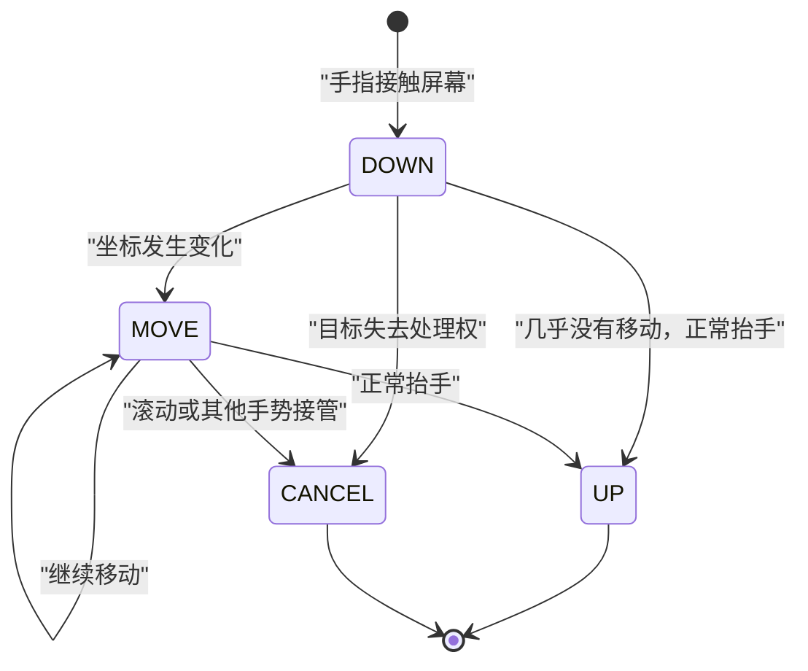
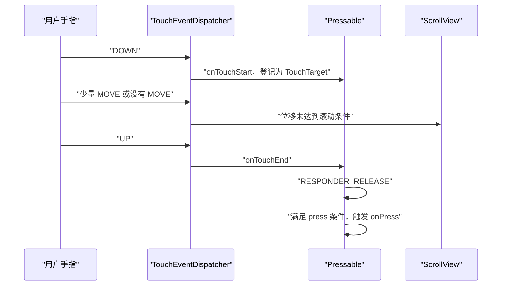
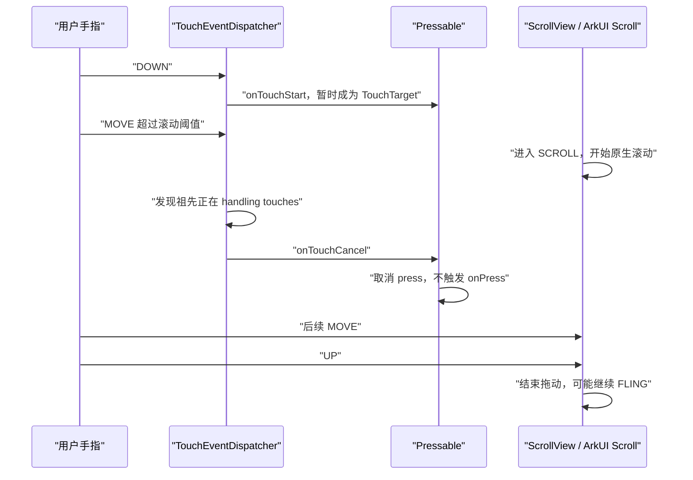
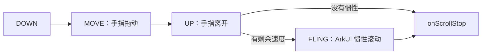

# 触摸序列与点击、滚动的关系

[返回《RN 0.72 鸿蒙 ScrollView 完整控制流程》](./rn72滚动组件逻辑.md)

> 本文专门解释 DOWN、MOVE、UP、CANCEL 的含义，以及一次触摸怎样被识别为点击或 ScrollView 滚动。内容基于当前 `D:\rn72_0610\r` 工作树源码。

## 1. 最重要的结论

一次触摸的严格配对不是：

```text
DOWN -> UP
```

而是：

```text
DOWN -> 0~N 个 MOVE -> UP 或 CANCEL
```

`UP` 和 `CANCEL` 都是触摸序列的终点：

- `UP`：手指正常离开屏幕；
- `CANCEL`：原目标失去这次触摸的处理权。

因此不能假设“每一个 DOWN 后面一定是 UP”，应该把完整性判断写成：

> 每个正常开始的触摸序列，最终应以 UP 或 CANCEL 结束。



---

## 2. 四种 action 分别表示什么

### 2.1 DOWN：一根手指开始接触屏幕

DOWN 到来时，框架通常会：

1. 取得 touch/pointer id；
2. 根据坐标执行 hit test；
3. 找到最初的触摸目标；
4. 保存 `pointerId -> TouchTarget`；
5. 启动点击、长按、滚动等手势识别；
6. 但此时还不能确定用户最终想点击还是滚动。

当前 RNOH 的实际入口在：

```text
D:\rn72_0610\r\tester\harmony\react_native_openharmony\src\main\cpp\
RNOH\arkui\TouchEventDispatcher.cpp
```

DOWN 时调用 `findTargetForTouchPoint()`，然后由 `registerTargetForTouch()` 保存目标。

这意味着目标不是每个 MOVE 都重新 hit test。正常情况下，后续事件会继续根据同一个 touch id 找回 DOWN 时登记的目标。

### 2.2 MOVE：手指仍按着，位置发生变化

MOVE 可以出现零次、一次或很多次。

```text
DOWN -> UP
```

通常是几乎没有位移的点击候选。

```text
DOWN -> MOVE -> MOVE -> MOVE -> UP
```

既可能是轻微晃动后的点击，也可能是滚动。关键在于：

- 位移是否超过 touch slop；
- ScrollView 的滚动识别器是否开始处理；
- 子组件或 ScrollView 谁取得 responder；
- 是否存在 RNGH 等其他手势竞争。

### 2.3 UP：手指正常离开屏幕

UP 只说明：

> 这根手指已经正常离开屏幕。

UP 不等于：

- 一定产生 `onPress`；
- ScrollView 已经停止移动；
- 一定没有后续 fling；
- 所有组件都会收到同一个 UP 回调。

当前 `TouchEventDispatcher` 在 UP 后会从 `m_touchTargetByTouchId` 中删除该 touch id，结束目标跟踪。

### 2.4 CANCEL：这次触摸被取消

CANCEL 表示触摸序列没有走到正常点击释放，而是原目标被终止。

常见情况包括：

- 父 ScrollView 开始滚动；
- 其他手势识别器获胜；
- JS Responder 转移；
- 系统中断触摸；
- 页面或组件被销毁；
- 原 TouchTarget 失效；
- 框架主动调用 `cancelActiveTouches()`。

CANCEL 后，这次触摸不能继续产生正常点击。

---

## 3. DOWN 和 UP 成对出现，为什么仍不一定是点击

DOWN、MOVE、UP 是原始触摸层的事件；`onPress` 是 Pressability/Responder 层识别出来的高级语义。

一次 `onPress` 通常还要求：

- DOWN 命中该组件；
- 组件成功成为 responder；
- 没有收到 CANCEL；
- 没有被 ScrollView 或其他手势接管；
- 抬手时仍处于有效 PressRect；
- 长按策略没有取消普通 press；
- 组件在序列结束前没有卸载或禁用。

RN `Pressability` 只有在：

```text
当前仍是有效 press-in 状态
+
收到 RESPONDER_RELEASE
```

时才调用 `onPress`。

因此：

```text
DOWN + UP
不一定产生 onPress
```

反过来，一个正常产生的 `onPress` 通常表示相应 press 手势走到了有效 release，但这不代表任意一个自行安装的 touch listener 都一定观察到了完整的 DOWN/UP。

---

## 4. ScrollView 内点击子组件时的两条分支

假设 ScrollView 中有一个 Pressable。

### 4.1 用户真的想点击



对应过程：

```text
DOWN 命中按钮
-> 没有超过滚动阈值
-> ScrollView 没有接管
-> UP 正常结束
-> Pressability 触发 onPress
```

### 4.2 用户从按钮位置开始滚动



当前 RNOH 在处理非 DOWN 事件时，会检查目标的祖先是否已经开始 handling touches：

```text
isAncestorHandlingTouches(...)
```

如果父 ScrollView 已处于 `SCROLL` 或 `FLING`：

```text
cancelPreviousTouchEvent()
-> 给原子组件发送 touchCancel
-> 删除原 touch target
```

这是“按在按钮上开始滑动列表时，不应误触按钮”的关键机制。

---

## 5. 某个组件一定能看到 DOWN 和终止事件吗

框架会尽量保证一个 touch id 从 DOWN 到 UP/CANCEL 都跟随同一个初始目标，但对某一个具体监听器仍不能做绝对假设。

可能只观察到 DOWN、看不到 UP 的原因包括：

- 实际收到的是 CANCEL，但日志没有记录 CANCEL；
- TouchTarget 在序列中途被删除；
- 组件被卸载；
- listener 中途解绑；
- 父组件接管后，事件改走取消路径；
- 应用或页面生命周期发生中断；
- 代码分别在不同组件上记录 DOWN 和 UP。

当前 `TouchEventDispatcher` 的几个关键保护是：

```text
DOWN
-> 保存 m_touchTargetByTouchId

MOVE / UP / CANCEL
-> 按 touch id 查找原目标

UP / CANCEL
-> 删除目标映射

cancelActiveTouches()
-> 对仍然活跃的 touches 主动发送 CANCEL
```

所以日志排查时必须同时打印：

```text
action
pointerId
target tag
DOWN / MOVE / UP / CANCEL
```

只打印 DOWN 和 UP，无法判断触摸是丢失了，还是正常进入了 CANCEL 分支。

---

## 6. 多指触摸时怎样理解“成对”

成对关系应以 `pointerId/touchId` 为单位，而不是只看全局 action 名字。

例如两根手指：

```text
touchId=1 DOWN
touchId=2 DOWN
touchId=1 MOVE
touchId=2 MOVE
touchId=1 UP
touchId=2 UP
```

也可能是：

```text
touchId=1 DOWN
touchId=2 DOWN
系统或手势竞争发生变化
touchId=1 CANCEL
touchId=2 CANCEL
```

RN 事件中的几个集合含义：

| 字段 | 含义 |
| --- | --- |
| `touches` | 当前仍在屏幕上的所有 touch |
| `changedTouches` | 本次 action 发生变化的 touch |
| `targetTouches` | 当前仍属于同一目标的 touch |

UP 时，当前 touch 会从 `touches` 中删除；CANCEL 时也会清理对应的 target 映射。

---

## 7. ScrollView 收到 UP，为什么内容还会继续移动

触摸生命周期和滚动动画生命周期不是一回事。



UP 之后可能继续发生：

```text
scrollEndDrag
-> momentumScrollBegin
-> 多个 onScroll
-> momentumScrollEnd
```

所以：

```text
UP = 手指结束
onScrollStop = 内容运动结束
```

二者不能互换。

---

## 8. 当前 ScrollView 为什么只观察 UP

当前代码位于：

```text
D:\rn72_0610\r\tester\harmony\react_native_openharmony\src\main\cpp\
RNOHCorePackage\ComponentInstances\ScrollViewComponentInstance.cpp
```

核心逻辑：

```cpp
void onTouchEvent(ArkUI_UIInputEvent* event) override {
  auto action = OH_ArkUI_UIInputEvent_GetAction(event);
  if (action == UI_TOUCH_EVENT_ACTION_UP) {
    m_scrollViewComponentInstance->onTouchEventActionUp();
  }
}
```

UP 最终只设置：

```cpp
m_isPointerLikelyUp = true;
```

其用途不是驱动 offset，而是帮助区分：

```text
手指仍按着时的 SCROLL
和
手指已经抬起后的 fling / overscroll bounce
```

ArkUI 在部分回弹阶段可能仍把 frame state 报成 `SCROLL`。RNOH 根据：

```text
m_isPointerLikelyUp
+ isOutOfBound(offset)
+ arkUIScrollState == SCROLL
```

把这一帧按 `FLING` 处理，以符合 RN momentum 事件语义。

因此当前 ScrollView 局部 touch handler 的职责是：

| action | 当前处理 |
| --- | --- |
| DOWN | 不处理 |
| MOVE | 不处理，不用它计算滚动 offset |
| UP | 标记手指大概率已抬起 |
| CANCEL | 当前局部 handler 未处理 |

真正的手指拖动、速度、惯性和回弹仍由 `ARKUI_NODE_SCROLL` 完成。

---

## 9. 三个概念不要混淆

### 原始触摸结束

```text
UP 或 CANCEL
```

### 点击手势成功

```text
有效 DOWN
-> 没有被取消
-> 有效 RESPONDER_RELEASE
-> onPress
```

### ScrollView 内容停止运动

```text
ArkUI ON_SCROLL_STOP
-> RNOH onScrollStop()
-> scrollEndDrag 或 momentumScrollEnd
```

它们可能发生在不同时间。

---

## 10. 最终记忆图

```text
普通点击：
DOWN -> 少量 MOVE -> UP -> 可能 onPress

开始滚动：
DOWN -> MOVE 超过阈值
     -> 子组件 CANCEL
     -> ScrollView SCROLL
     -> UP
     -> 可能继续 FLING
     -> onScrollStop

其他中断：
DOWN -> CANCEL
```

最简洁的判断方式是：

> DOWN 只表示“触摸开始”；UP 表示“手指正常离开”；CANCEL 表示“原目标失去处理权”；`onPress` 表示“点击识别成功”；`onScrollStop` 才表示“内容停止运动”。

---

## 11. 关键源码索引

- `D:\rn72_0610\r\tester\harmony\react_native_openharmony\src\main\cpp\RNOH\arkui\TouchEvent.h`
  - ArkTS touch action 转换为 DOWN / UP / MOVE / CANCEL：63-73
- `D:\rn72_0610\r\tester\harmony\react_native_openharmony\src\main\cpp\RNOH\arkui\TouchEventDispatcher.cpp`
  - DOWN hit test 和目标登记：157-170
  - 祖先开始处理后取消原目标：171-181
  - UP 更新 active touches：234-247
  - UP / CANCEL 清除 target 映射：325-351
  - action 到 RN touch event：384-403
  - 主动取消全部 active touches：407-410
- `D:\rn72_0610\r\react-native-harmony\Libraries\Components\ScrollView\ScrollView.harmony.js`
  - `onTouchEnd`：1614-1637
  - `onTouchCancel`：1644-1647
  - `onTouchStart`：1660-1663
- `D:\rn72_0610\r\tester\node_modules\react-native\Libraries\Pressability\Pressability.js`
  - responder release / terminate：530-536
  - `onPress` 的 release 条件：748-765
- `D:\rn72_0610\r\tester\harmony\react_native_openharmony\src\main\cpp\RNOHCorePackage\ComponentInstances\ScrollViewComponentInstance.cpp`
  - ScrollView 局部 touch handler：20-45
  - scroll frame 状态转换：473-520

[返回《RN 0.72 鸿蒙 ScrollView 完整控制流程》](./rn72滚动组件逻辑.md)
