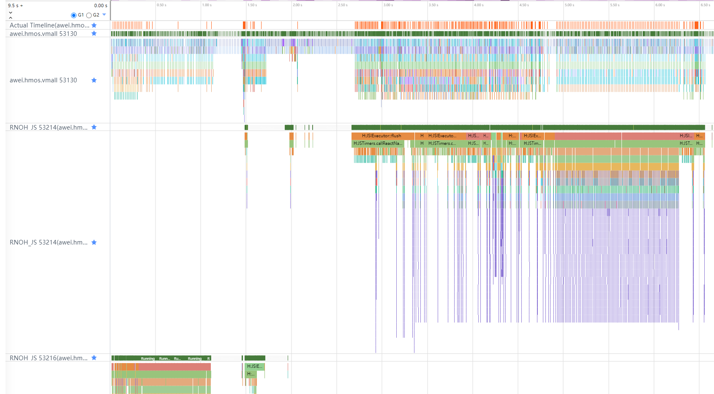
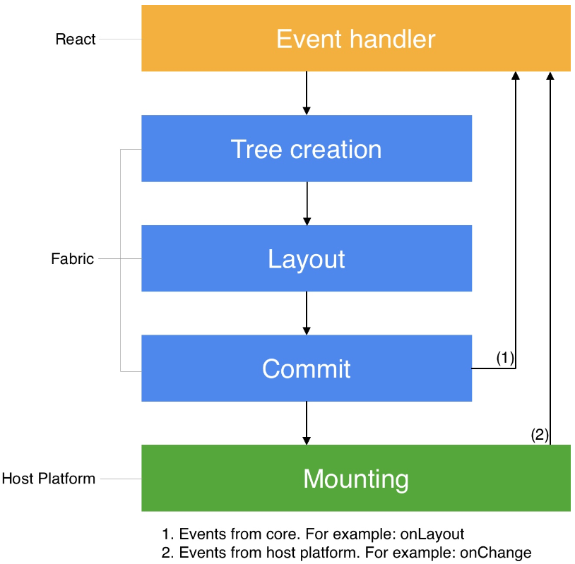
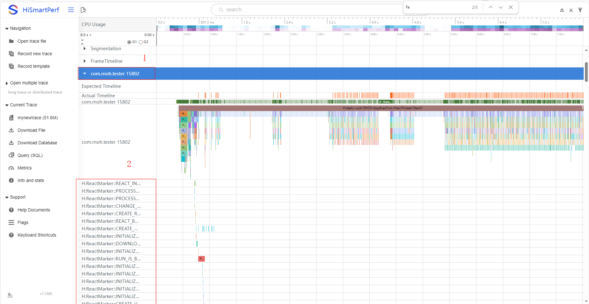
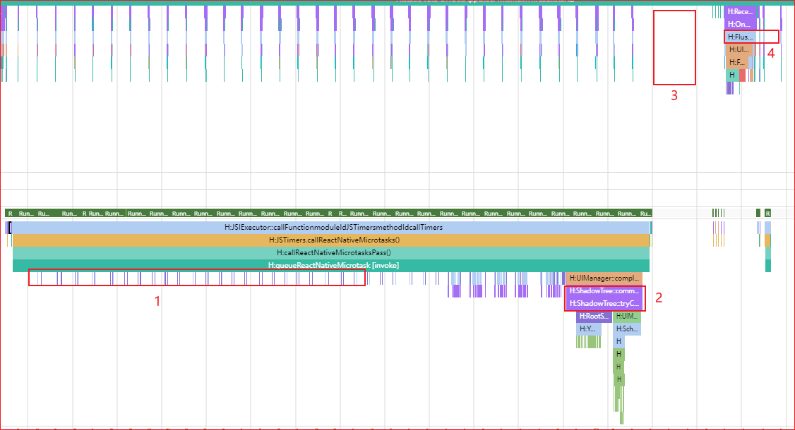

# RNOH 性能问题定位指导（基础篇）：工具、Trace 与证据链

## 1. 分析前先固定环境

### 1.1 性能结论必须基于生产形态

RNOH 公开文档要求使用 Release HAP 和生产模式 Bundle 进行性能调优：

```bash
npm run codegen && react-native bundle-harmony --dev=false --minify=true
```

同时在 DevEco Studio 中将 Build Mode 切换为 `release`。如工程配置了 `LOG_VERBOSITY_LEVEL`，性能测试时可按公开文档将其设置为 `0` 或关闭不必要的日志。

可通过以下现象辅助排查是否误用了开发环境：

- 断开 Metro 后应用无法正常展示，说明应用仍依赖 Metro 加载。
- Bundle 内容仍具有明显可读性，可能没有使用 `dev=false` 的生产打包方式。
- 运行时输出大量调试日志，可能使用了 Debug/Default 构建或未关闭详细日志。

> 说明：Debug 构建可用于获取额外调用栈或调试信息，但不能直接替代 Release 构建的最终性能结论。若在 Debug 环境中发现可疑函数，应回到相同场景的 Release 构建中复核问题是否仍然存在。

### 1.2 每次采集至少记录以下信息

| 类别 | 必填信息 |
|---|---|
| RNOH | 版本号、分支或制品版本 |
| 系统 | HarmonyOS/OpenHarmony 版本、API Level |
| 工具 | DevEco Studio、Profiler 或 SmartPerf 版本 |
| 设备 | 型号、刷新率、是否真机 |
| 构建 | Release/Debug、Bundle 的 `dev` 与 `minify` 配置、JS 引擎 |
| 场景 | 页面、入口、操作步骤、数据量、是否首次进入 |
| 采集 | 起止时刻、是否冷启动、是否预热、Trace 文件名 |

没有这些信息的 Trace 难以复现，也无法与其他样本进行可靠比较。

### 1.3 固定复现脚本

1. 明确问题开始和结束的用户动作，例如“点击列表第 3 项，到详情页首屏内容出现”。
2. 冷启动问题在应用启动前开始采集；页面内问题在操作前留出一段上下文。
3. 使用相同数据、相同入口和相同操作节奏重复采集。
4. 同时保留问题样本和正常样本。跨设备或跨构建模式的数据不能直接作为唯一对照。
5. 若采集结果波动明显，先检查场景和环境是否稳定，再讨论框架阶段耗时。

---

## 2. 心智模型：先认线程，再认阶段

### 2.1 RNOH 公开线程模型

RNOH 架构文档定义了四类任务线程：

| 线程 | 公开职责 | 定位时的主要关注点 |
|---|---|---|
| MAIN/UI | ArkUI 组件 CREATE、UPDATE、INSERT、REMOVE、DELETE；组件树管理；TurboModule 业务；交互事件和消息处理 | 原生组件创建/更新是否集中；TurboModule 是否占用主线程；UI 刷新前是否存在长任务 |
| JS | 加载并执行 Bundle；执行 React 业务；创建和更新 ShadowTree；Yoga 布局和文本测量；比较新旧 ShadowTree 并生成 mutations | JS 业务是否阻塞；布局/文本测量是否集中；Commit/Diff 是否异常放大 |
| BACKGROUND | 实验性地承接部分布局和 ShadowTree 比较任务 | 公开文档明确商用版本不建议开启，不应把它作为默认线程模型 |
| WORKER | 按配置承载部分 TurboModule 任务 | 仅在工程确实配置 Worker 时分析；需要同时关注线程切换和通信开销 |

补充规则：

- MAIN/UI 线程在应用中唯一。
- JS 线程与 `RNInstance` 绑定。多个 `RNInstance` 会对应多个 JS 线程，分析前必须确认问题 Surface 属于哪一个实例。
- Trace 中还可能出现系统线程、渲染线程、调度线程和线程池。它们不等同于 RNOH 上述四类任务线程。
- FFRT 可作为系统任务调度的观察线索，但不应替代 RNOH 的公开线程模型。没有调用栈、关联 Slice 或上下游事件时，不应仅凭 FFRT 线程上的忙碌片段归因到 RNOH。



图 1 典型 RNOH 线程 Trace。示例中包含一个 MAIN 线程和两个 RNOH JS 线程。图片来源：[RNOH 公开文档《架构介绍》](https://gitcode.com/CPF-RN/ohos_react_native/blob/master/docs/zh-cn/%E6%9E%B6%E6%9E%84%E4%BB%8B%E7%BB%8D.md)。

### 2.2 Fabric 渲染流水线

React Native 渲染流水线分为 Render、Commit 和 Mount 三个阶段。



图 2 React Native 渲染流水线的 Render、Commit 和 Mount 三个阶段。图片来源：[RNOH 公开文档《渲染三阶段》](https://gitcode.com/CPF-RN/ohos_react_native/blob/master/docs/zh-cn/%E6%B8%B2%E6%9F%93%E4%B8%89%E9%98%B6%E6%AE%B5.md)。

#### Render

- React 在 JavaScript 中执行业务逻辑并创建 React 元素树。
- React 元素通过 JSI 与 RN Common 交互，在 C++ 中创建 React Shadow Tree。
- 在 RNOH 中，这部分主要从 JS 线程观察。

#### Commit

- ShadowTree 构建完成后进入提交。
- Yoga 负责 UI 组件布局。
- 文本布局通过 `TextMeasurer::measure()` 回调到原生侧完成，结果再返回 Yoga。
- 新旧 ShadowTree 通过 `calculateShadowViewMutationsV2()` 计算差异并生成 mutations。
- 差异结果被提交到 MAIN/UI 线程。

#### Mount

- MAIN/UI 线程处理 mutations。
- `MountingManagerCAPI::handleMutation()` 处理 `CREATE`、`DELETE`、`UPDATE`、`INSERT`、`REMOVE` 等操作。
- `CREATE` 创建 ArkUI Node；`INSERT` 将 Node 挂到组件树；`UPDATE` 更新 Node 属性；`REMOVE` 将 Node 从组件树移除；`DELETE` 删除 Node。
- Mount 完成不等于屏幕像素已经展示。还应继续观察 ArkUI/系统刷新链路。

### 2.3 从线程与阶段建立最小映射

| 观察位置 | 可支持的判断 | 不能单独支持的判断 |
|---|---|---|
| RNOH_JS 长时间连续执行 | JS 线程在该时间窗内有较重任务 | 不能仅凭线程忙判断具体是业务 JS、布局、文本测量还是 Diff |
| `TextMeasurer::measure()` 大量或累计耗时上升 | 文本测量是 Commit 时间窗中的重要组成 | 不能仅凭一次调用认定文本组件存在缺陷 |
| `calculateShadowViewMutationsV2()` 耗时或 mutations 规模增长 | 新旧 ShadowTree 差异计算和变更规模需要关注 | 不能直接等同于 ArkUI 绘制慢 |
| MAIN/UI 上集中处理 mutations | 原生组件创建、更新或树操作占用主线程 | 不能仅凭 Mount 片段认定最终绘制阶段是根因 |
| `FlushVsync` 晚于预期出现 | 最终刷新时机被推迟，需要向前回溯关键路径 | 不能只看 `FlushVsync` 名称确定延迟来自 RNOH 还是系统其他任务 |
| Trace 时间轴存在空白 | 当前启用的 Trace 类别没有记录到 Slice | 空白不等于线程空闲；公开首帧示例明确存在未打点的 `ComponentInstance` 创建阶段 |

---

## 3. 基础工具箱

### 3.1 工具选择表

| 问题 | 首选工具 | 主要证据 |
|---|---|---|
| 首帧、页面跳转、响应延迟、丢帧 | DevEco Studio Profiler / SmartPerf Trace | 线程运行、调度、RNOH Slice、ArkUI/系统刷新时间窗 |
| React/Fabric 生命周期分段 | React Marker | Bundle、Context、Instance、Fabric Commit/Layout/Diff/Update UI 等成对标记 |
| 业务代码缺少边界 | JS/ArkTS/C++ 自定义 Trace | 用户动作、业务任务、跨层调用的开始与结束 |
| 错误和告警与卡顿同时发生 | DevEco Studio HiLog | 应用日志、时间戳、Warn/Error |
| 组件属性或组件树异常 | ArkUI Inspector | 组件树、属性、布局信息 |
| 组件级候选定位 | React DevTools（开发环境辅助） | 组件和调试信息；最终性能结论仍需 Release Trace 复核 |

> 工具界面和采集能力会随 DevEco Studio、SDK 和设备版本变化。本文只固定分析方法，不固定所有菜单名称和命令参数。

### 3.2 DevEco Studio Profiler

RNOH 公开性能文档推荐使用 DevEco Studio Profiler 分析应用性能。建议按以下顺序使用：

1. 连接与目标版本匹配的真机。
2. 选择目标应用和目标进程。
3. 根据问题类型选择当前版本 Profiler 提供的分析任务。
4. 在复现动作前开始记录，在问题结束后停止记录。
5. 先定位问题时间窗，再展开对应线程、Slice 和调用栈。
6. 导出原始会话或 Trace，并与环境信息一并保存。

不要一开始就放大到单个函数。先确认问题发生在哪个进程、线程和阶段。

### 3.3 SmartPerf

RNOH 公开文档使用 SmartPerf 打开 Trace，并通过搜索 Slice 名称定位 RNOH 线程和关键阶段。典型操作包括：

1. 打开采集到的 Trace。
2. 定位应用进程。
3. 展开 MAIN/UI 和 `RNOH_JS` 线程。
4. 使用 `loadBundle`、`ShadowTree::commit` 或 React Marker 名称搜索目标时间窗。
5. 结合 ArkUI/系统刷新事件检查端到端关键路径。

命令行采集参数可能随系统版本变化。对外文档不固化一组未经版本匹配验证的 `hitrace` 参数；使用命令行采集时，应以目标设备的 `hitrace --help` 和对应 HarmonyOS 官方文档为准。

### 3.4 HiLog

DevEco Studio 中可在 Log/HiLog 窗口选择设备、应用和日志级别。性能分析时建议：

- 使用应用包名或进程过滤，避免无关日志淹没时间窗。
- 保留 Warn/Error 以及与复现动作有关的业务日志。
- 记录日志时间戳，并与 Trace 的问题时间窗对齐。
- Release 性能复核中避免为了“看得更多”长期打开大量详细日志。

日志可以解释事件和异常，但日志行之间的时间差不能替代 Trace 的线程执行证据。

### 3.5 ArkUI Inspector

当性能问题伴随组件数量异常、属性异常或布局异常时，可使用 ArkUI Inspector 检查组件树和属性。它适合回答“页面实际创建了哪些节点”和“节点属性是否符合预期”，但不直接替代 Trace 的耗时分析。

### 3.6 React DevTools 的使用边界

RNOH 公开文档说明，可在开发过程中使用 React DevTools 辅助调试。对性能问题，可将组件级调试结果作为候选线索，但应遵守：

- 不将 Dev 环境中的组件耗时直接当作 Release 性能数据。
- 不因组件发生 Render 就认定该 Render 是卡顿根因。
- 将候选组件或用户动作通过自定义 Trace 标记后，在 Release Trace 中复核。

本文不把 RN 内置 Perf Monitor、Hermes CPU Sampling 或 Chrome Memory 面板作为 RNOH 的必选流程。使用此类工具时，应以目标 RNOH 版本、JS 引擎及其公开文档为准，并在目标设备上验证工具的可用性。

---

## 4. 如何添加可关联的 Trace

当系统 Trace 无法区分业务步骤时，应优先补充边界清晰、名称稳定的自定义 Trace。

### 4.1 JS 侧

RNOH 公开调试文档支持使用 React Native 的 `Systrace`：

```javascript
import {Systrace} from 'react-native';

function onPress() {
  Systrace.beginEvent('ProductList:onPressOpenDetail');
  try {
    openDetail();
  } finally {
    Systrace.endEvent();
  }
}
```

异步任务应使用成对的异步 Trace，并确保开始与结束使用同一个标识。名称建议包含“模块:动作”，不要写入用户隐私、账号、URL 参数等动态数据。

### 4.2 ArkTS 侧

使用 RNOH Logger 封装：

```typescript
const stopTracing = this.logger
  .clone("ProductDetail:prepareNativeData")
  .startTracing();
try {
  // do something
} finally {
  stopTracing();
}
```

也可使用系统 `@ohos.hiTraceMeter`：

```typescript
import hiTrace from '@ohos.hiTraceMeter';

hiTrace.startTrace('ProductDetail:prepareNativeData', 0);
try {
  // do something
} finally {
  hiTrace.finishTrace('ProductDetail:prepareNativeData', 0);
}
```

### 4.3 C++ 侧

使用 `facebook::react::SystraceSection`，Trace 范围与对象作用域一致：

```cpp
#include <react/renderer/debug/SystraceSection.h>

void prepareData() {
  facebook::react::SystraceSection trace("ProductDetail:prepareData");
  // do something
}
```

### 4.4 自定义 Trace 的命名规则

- 使用稳定、可搜索的名称，例如 `Module:Action`。
- 同步 Trace 必须保证异常路径也能结束。
- 异步 Trace 必须保证标识唯一并成对结束。
- 不在高频循环中无条件添加大量细粒度 Trace，以免增加采集开销和阅读噪声。
- 记录代码版本，避免同名 Trace 在不同版本中表达不同含义。

---

## 5. React Marker：使用公开的生命周期边界

### 5.1 开启方式

RNOH 公开文档说明，React Marker 默认不记录到 Trace。开启方式是在应用 CMake 配置中、`add_subdirectory` 之前添加：

```cmake
add_compile_definitions(WITH_HITRACE_REACT_MARKER=ON)
```

启动场景应在应用启动前开始采集。打开 Trace 后，在目标应用进程中查看 React Marker。

### 5.2 与性能定位最相关的 Marker

| Marker 对 | 含义 |
|---|---|
| `RUN_JS_BUNDLE_START/STOP` | JS Bundle 运行开始/结束 |
| `CREATE_REACT_CONTEXT_START/STOP` | React Context 创建开始/结束 |
| `REACT_INSTANCE_INIT_START/STOP` | React 实例初始化开始/结束 |
| `NATIVE_MODULE_SETUP_START/STOP` | 原生模块初始化开始/结束 |
| `CONTENT_APPEARED` | 内容已经渲染并展示 |
| `FABRIC_COMMIT_START/END` | Fabric Commit 开始/结束 |
| `FABRIC_LAYOUT_START/END` | Fabric Layout 开始/结束 |
| `FABRIC_DIFF_START/END` | Fabric Diff 开始/结束 |
| `FABRIC_FINISH_TRANSACTION_START/END` | Fabric 完成事务开始/结束 |
| `FABRIC_BATCH_EXECUTION_START/END` | Fabric 批处理执行开始/结束 |
| `FABRIC_UPDATE_UI_MAIN_THREAD_START/END` | Fabric 在主线程更新 UI 开始/结束 |

Trace 上的显示名称可能合并 START/STOP，例如公开文档示例将 `RUN_JS_BUNDLE_START/STOP` 显示为 `H:ReactMarker::RUN_JS_BUNDLE::tag::<message>` 的时间段。应以目标版本实际 Trace 为准，不要只按字符串机械匹配。



图 3 React Marker Trace 示例。图片来源：[RNOH 公开文档《性能调优》](https://gitcode.com/CPF-RN/ohos_react_native/blob/master/docs/zh-cn/%E6%80%A7%E8%83%BD%E8%B0%83%E4%BC%98.md)。

### 5.3 如何用 Marker 缩小范围

1. 先找到端到端问题时间窗。
2. 使用成对 Marker 将时间窗切分为 Bundle、Context/Instance、Commit、Layout、Diff、Update UI 等阶段。
3. 找出相较正常样本明显增长的阶段。
4. 在该阶段内继续使用函数 Slice、调用栈、自定义 Trace 或业务日志缩小范围。
5. 若 Marker 之间存在空白，不直接判定线程空闲；检查调度状态、调用栈和是否存在未打点工作。

Marker 用于分段，不等同于根因。

---

## 6. RNOH 关键 Trace 点解读

### 6.1 Bundle 与实例初始化

| Trace/Marker | 线程或位置 | 可以回答的问题 |
|---|---|---|
| `loadBundle` | `RNOH_JS` | Bundle 加载和执行所在时间窗 |
| `RUN_JS_BUNDLE_START/STOP` | React Marker | JS Bundle 运行边界 |
| `CREATE_REACT_CONTEXT_START/STOP` | React Marker | React Context 创建边界 |
| `REACT_INSTANCE_INIT_START/STOP` | React Marker | React 实例初始化边界 |
| `NATIVE_MODULE_SETUP_START/STOP` | React Marker | 原生模块初始化边界 |

若页面问题发生在 `loadBundle` 结束之后，不应继续把全部页面耗时归为 Bundle 加载；需要进入 Render/Commit/Mount 分析。

### 6.2 Render 阶段

关注用户动作后的 JS 业务执行、React 元素创建和 ShadowTree 构建。公开首帧示例中可看到 `cloneNode` 等构造节点树相关操作。

判断方法：

- JS 线程长时间连续运行时，先确定业务自定义 Trace 与 Fabric Marker 的相对位置。
- 如果长耗时位于 Fabric Marker 之前，更可能需要检查业务 JS 或 React 元素创建。
- 如果缺少足够的函数 Slice，增加业务级 Trace 后复现，不依赖猜测。

### 6.3 Commit、Layout 与 Diff

| Trace/Marker | 含义 | 进一步检查 |
|---|---|---|
| `ShadowTree::commit` | ShadowTree 提交时间窗 | 与用户动作和首帧/刷新时机的关系 |
| `TextMeasurer::measure()` | 文本布局测量 | 调用次数、累计耗时、文本节点规模 |
| `calculateShadowViewMutationsV2()` | 新旧 ShadowTree Diff | mutations 规模、是否由一次状态更新引发大量变更 |
| `FABRIC_COMMIT_*` | Commit 边界 | Commit 相对正常样本是否增长 |
| `FABRIC_LAYOUT_*` | Layout 边界 | 布局是否为主要增长阶段 |
| `FABRIC_DIFF_*` | Diff 边界 | Diff 是否为主要增长阶段 |

不要只看单次函数耗时。调用次数增加、单次耗时增加和上游组件规模增加对应不同的定位方向。

### 6.4 Mount 阶段

`MountingManagerCAPI::handleMutation()` 处理：

- `CREATE`
- `DELETE`
- `UPDATE`
- `INSERT`
- `REMOVE`

定位时同时观察：

- mutations 的数量和类型。
- MAIN/UI 线程是否集中创建或更新大量组件。
- `FABRIC_UPDATE_UI_MAIN_THREAD_START/END` 和 `FABRIC_BATCH_EXECUTION_START/END` 的时间窗。
- Mount 前后是否还有其他主线程长任务。
- ArkUI/系统刷新是否及时跟上。

Mount 慢与最终绘制慢是两个不同层次。只有在证据表明耗时集中于 Mount，且下游刷新没有更大异常时，才能把主要问题归到 RNOH 原生挂载阶段。

### 6.5 TurboModule 与跨线程调用

公开架构文档指出，默认情况下 ArkTS TurboModule 业务会使用 MAIN/UI 线程；配置 Worker 后，部分 TurboModule 可运行在 Worker。

定位原则：

- MAIN/UI 上的 TurboModule 长任务会与 UI 工作竞争主线程时间。
- JS 发起同步调用后出现等待时，等待片段只是现象。应继续找到被调用线程实际执行的任务和返回时刻。
- 不能仅凭“同步”二字直接建议改为异步。接口语义、调用顺序和线程安全必须先满足。
- 只有工程实际配置了 Worker，才能按 Worker 场景分析；不要假设所有 TurboModule 都在子线程。

### 6.6 ArkUI 与最终刷新

公开首帧示例使用主线程上的 `FlushVsync` 观察最终刷新操作。它可作为端到端时间窗的重要锚点，但不代表其自身一定是根因。

如果 `FlushVsync` 晚：

1. 向前检查 MAIN/UI 是否被 mutations、TurboModule 或其他任务占用。
2. 检查 RNOH_JS 是否延迟提交了 mutations。
3. 检查 ArkUI/系统相关 Slice 和调度状态。
4. 使用正常样本确认延迟首先从哪个阶段开始出现。

---

## 7. 一次完整的首帧 Trace 解读

RNOH 公开性能文档给出了以下首帧观察顺序：

1. `loadBundle` 在 `RNOH_JS` 线程上完成。
2. `RNOH_JS` 上出现 `cloneNode` 等节点树构造操作。
3. 出现 `ShadowTree::commit`，完成渲染流程中的提交。
4. 随后存在 `ComponentInstance` 创建阶段。公开示例特别说明：该时间段即使没有 Trace Slice，也不代表线程空闲。
5. MAIN/UI 线程出现 `FlushVsync`，系统执行最终刷新相关操作。



图 4 RNOH 首帧 Trace 示例。图片来源：[RNOH 公开文档《性能调优》](https://gitcode.com/CPF-RN/ohos_react_native/blob/master/docs/zh-cn/%E6%80%A7%E8%83%BD%E8%B0%83%E4%BC%98.md)。

### 7.1 建议的逐层分析法

#### 第一层：端到端

明确起点和终点：

- 起点可以是应用启动、点击事件或自定义业务 Trace。
- 终点可以是 `CONTENT_APPEARED`、业务定义的内容完成标记，或经场景验证的最终刷新时机。

不同口径不能混用。`mount`、`onLayout`、`CONTENT_APPEARED` 和真正可见内容表达的业务含义不完全相同。

#### 第二层：分线程

- JS 线程何时开始工作、何时提交。
- MAIN/UI 线程何时收到并处理 mutations。
- 最终刷新何时发生。
- 是否有其他线程上的工作位于关键路径。

#### 第三层：分阶段

使用 React Marker、公开函数 Slice 和自定义 Trace切分：

`Bundle/初始化 -> Render -> Commit/Layout/Diff -> Mount/Update UI -> ArkUI/系统刷新`

#### 第四层：找首个异常点

与同环境正常样本比较，找出最早开始偏离的阶段。下游变慢可能只是上游延迟的结果。

#### 第五层：验证归因

围绕候选原因做单变量实验，例如减少一次提交的节点数量、移除一个已确认的长任务或调整调用时机。重新采集后，只有候选 Slice 和端到端指标同时按预期变化，归因才得到增强。

---

## 8. 时间预算与基线

### 8.1 不使用统一的阶段“正常范围”

不建议使用以下形式的固定表格：

| 不推荐做法 | 原因 |
|---|---|
| “JS Commit 正常为 2-8 ms” | 页面复杂度、设备、版本和场景不同，无法作为通用 RNOH 标准 |
| “文本测量超过 3 ms 就异常” | 应同时看调用次数、文本规模、缓存和端到端影响 |
| “Mount 超过 6 ms 就是框架问题” | mutations 数量和类型由上游页面更新决定，且下游系统刷新也可能耗时 |

### 8.2 推荐的判断方式

1. **同环境对照**：问题样本与正常样本使用相同设备、版本、构建和数据。
2. **端到端优先**：先确认用户可感知指标是否异常，再分析阶段占比。
3. **刷新率换算仅作参考**：理论帧周期为 `1000 / 刷新率` 毫秒，例如 60 Hz 约为 16.7 ms、120 Hz 约为 8.3 ms。该周期不是任意单个 RNOH Slice 的统一上限。
4. **关注累计值**：高频短调用的累计耗时可能比一次长调用更重要。
5. **关注首个偏离点**：从正常样本开始对齐，找出关键路径中最早扩大的阶段。
6. **多次采集**：报告中说明样本数量、波动和选取依据，不只展示最好或最差的一次。

---

## 9. 常见误读与避坑

### 9.1 Trace 空白等于线程空闲

错误。Trace 只能展示已启用类别和已打点的工作。RNOH 公开首帧示例已明确说明，`ComponentInstance` 创建可能发生在没有对应 Slice 的时间段。

### 9.2 看到 JS 等待就认定 JS 逻辑慢

错误。等待可能表示 JS 正在等待其他线程返回。应找到被调用线程的实际执行片段和返回时刻，再判断根因。

### 9.3 看到 MAIN/UI 忙就认定 ArkUI 绘制慢

错误。MAIN/UI 同时承载 RNOH Mount、ArkUI 组件树操作、默认 TurboModule 业务和交互事件。必须先区分具体 Slice。

### 9.4 看到 `handleMutation` 就认定 RNOH 框架慢

错误。大量 mutations 可能由上游一次提交大量节点或属性变化触发。应同时检查 mutations 规模、Render/Commit/Diff 和页面更新原因。

### 9.5 看到系统线程池忙就认定业务卡顿

错误。线程池忙碌只有位于目标时间窗关键路径、且能与业务调用建立关联时，才是有效证据。

### 9.6 用 Debug 结果替代 Release 结论

错误。Debug、Metro、详细日志和开发 Bundle 会改变性能表现。Debug 可用于补充调用栈，最终结论需要 Release 复核。

### 9.7 只凭一次 Trace 下结论

错误。一次采集可能受温度、系统任务、数据状态和操作节奏影响。必须保留可重复样本和对照样本。

### 9.8 把相关性写成因果

“卡顿时出现了某 Slice”只能说明时间相关。更强的因果证据应包括：

- Slice 位于端到端关键路径。
- 相较正常样本明显增长。
- 上下游时序符合预期。
- 单变量实验后，Slice 和用户指标同时改善或退化。

---

## 10. 标准定位流程

### 步骤 1：定义问题和指标

写清楚用户动作、期望、实际现象、起点和终点。不要只写“页面卡”。

### 步骤 2：确认构建与环境

确认 Release HAP、生产模式 Bundle、日志配置、设备和版本。环境不符合要求时先修正环境。

### 步骤 3：稳定复现并采集

按固定脚本复现，保留问题样本、正常样本和原始 Trace。启动问题在应用启动前开始采集。

### 步骤 4：找到端到端时间窗

优先使用用户动作、自定义 Trace、React Marker、`loadBundle`、`CONTENT_APPEARED` 或经过验证的刷新事件建立边界。

### 步骤 5：先分线程

确认 RNOH_JS、MAIN/UI、可选 Worker 以及相关系统线程。多实例场景先找到正确的 JS 线程。

### 步骤 6：再分阶段

按 `Bundle/初始化 -> Render -> Commit/Layout/Diff -> Mount -> 刷新` 切分，找出最早偏离正常样本的阶段。

### 步骤 7：缩小到任务或组件

使用调用栈、函数 Slice、自定义 Trace、HiLog、ArkUI Inspector 或开发环境中的 React DevTools 查找候选。

### 步骤 8：进行单变量验证

只改变一个候选因素并重新采集。记录端到端结果和关键 Slice 是否同时变化。

### 步骤 9：输出证据化结论

区分“已确认”“高概率”“待确认”和“已排除”。不隐藏不确定性。

---

## 11. 定位记录模板

```text
【问题】
用户操作：
期望结果：
实际结果：
发生频率：

【环境】
RNOH 版本：
系统/API Level：
设备/刷新率：
DevEco Studio/Profiler/SmartPerf 版本：
构建模式：
Bundle 配置：
JS 引擎：

【采集】
复现步骤：
Trace 文件：
问题时间窗：
正常对照：

【证据】
端到端耗时或帧表现：
RNOH_JS：
MAIN/UI：
Render：
Commit/Layout/Diff：
Mount：
ArkUI/系统刷新：
日志/调用栈：

【结论】
已确认：
高概率：
待确认：
已排除：

【验证】
单变量改动：
关键 Slice 变化：
端到端指标变化：

【后续】
建议动作：
需要补充的材料：
```

---

## 12. 对外问题单最小材料集

提交 RNOH 性能问题时，建议至少提供：

- 可复现的最小工程或明确的复现步骤。
- RNOH、系统、设备、工具和构建信息。
- Release 构建的原始 Trace。
- 问题时间窗及起止标记。
- 同环境正常对照。
- 关键线程和关键 Slice 截图。
- 若使用自定义 Trace，提供对应代码位置和名称含义。
- 已完成的单变量实验及结果。
- 不包含用户隐私、账号、鉴权信息和业务敏感数据的日志。

只有截图而没有原始 Trace，通常不足以继续展开和核对调用关系。

---

## 13. 参考资料

### 13.1 RNOH 公开文档

1. [RNOH 架构介绍](https://gitcode.com/CPF-RN/ohos_react_native/blob/master/docs/zh-cn/%E6%9E%B6%E6%9E%84%E4%BB%8B%E7%BB%8D.md)
2. [React Native 渲染流程分析](https://gitcode.com/CPF-RN/ohos_react_native/blob/master/docs/zh-cn/%E6%B8%B2%E6%9F%93%E4%B8%89%E9%98%B6%E6%AE%B5.md)
3. [RNOH 性能调优](https://gitcode.com/CPF-RN/ohos_react_native/blob/master/docs/zh-cn/%E6%80%A7%E8%83%BD%E8%B0%83%E4%BC%98.md)
4. [RNOH 调试调测](https://gitcode.com/CPF-RN/ohos_react_native/blob/master/docs/zh-cn/%E8%B0%83%E8%AF%95%E8%B0%83%E6%B5%8B.md)
5. [RNOH 定位定界指导类 FAQ](https://gitcode.com/CPF-RN/ohos_react_native/blob/master/docs/zh-cn/faqs/%E5%AE%9A%E4%BD%8D%E5%AE%9A%E7%95%8C%E6%8C%87%E5%AF%BC%E7%B1%BBFAQ.md)

### 13.2 HarmonyOS 官方文档

1. [性能分析简介](https://developer.huawei.com/consumer/cn/doc/best-practices-V5/bpta-optimization-overview-V5)
2. [使用 DevEco Profiler 进行性能调优](https://developer.huawei.com/consumer/cn/doc/harmonyos-guides-V5/ide-profiler-introduction-V5)
3. [ArkUI Inspector 布局分析](https://developer.huawei.com/consumer/cn/doc/harmonyos-guides-V5/ide-arkui-inspector-V5)

> 版本提示：部分 HarmonyOS 官方文档按 HarmonyOS/API 版本归档。使用时应选择与目标 SDK 匹配的官方文档，不应跨版本照搬工具参数。

---

## 结语

RNOH 性能定位的核心不是记住一组函数名或毫秒阈值，而是建立可复核的证据链：

`固定环境 -> 稳定复现 -> 确定时间窗 -> 识别线程 -> 映射阶段 -> 找到首个异常点 -> 单变量验证 -> 输出结论与未确认项`

先认线程，再认阶段；先看端到端，再看局部；先建立对照，再讨论归因。
