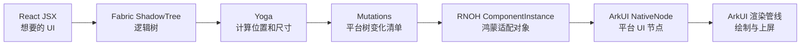
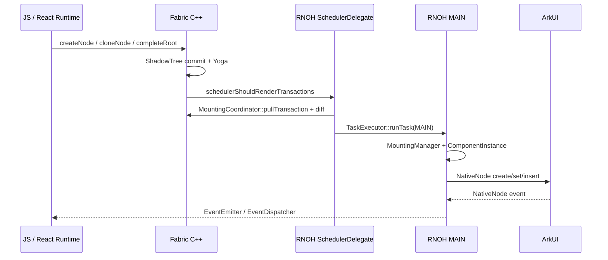
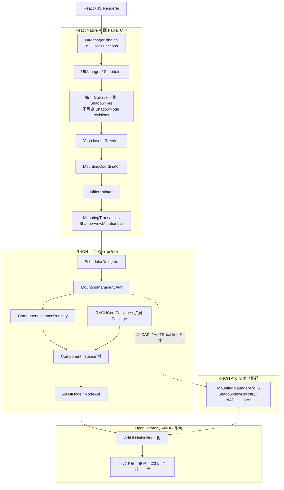
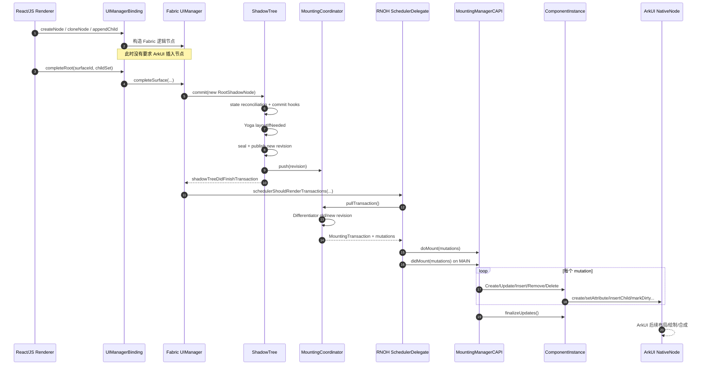

# RN 鸿蒙 C++ 整体架构与运行渲染链路

> 本文以当前工程 `D:\rn82_0731\r` 中的 `@rnoh/react-native-openharmony 0.82.33` 源码为基线，讲解 React Native OpenHarmony（下文简称 RNOH）从 React/Fabric 已经开始工作之后，到 ArkUI 节点被创建、挂载和更新的 C++ 执行逻辑。
>
> 本文不展开 Metro、Bundle 生成、Hermes 字节码等前端打包过程；重点是 Fabric、RNOH C++、ArkTS 适配层与 ArkUI 的职责边界。文中的结论来自当前检出源码的静态核对，不等同于已经完成真机 Trace、编译或性能验证。

> **与官方文档的关系**：官方文档（`r/docs/zh-cn/`）按使用场景组织，覆盖 ArkTS 侧启动流程（`架构介绍.md`）、渲染三阶段 Trace 实例（`渲染三阶段.md`）、自定义组件开发（`自定义组件.md`）、ArkTS↔CPP 通信（`ArkTS与CPP之间通信.md`）、性能调优与 React Marker（`性能调优.md`）等。本文档聚焦 C++ 渲染链路的内部机制，是官方文档的深度补充；涉及 ArkTS 侧操作和开发指南时，会交叉引用对应官方文档。

---

# 第一部分：概念与心智模型

> 本部分建立 RNOH 的核心概念框架，包括三棵树、RNInstance/Surface/ShadowTree 的关系。第一次阅读只需读完本部分即可建立主线认知。

## 0. 初学者前置引导：先用 15 分钟建立主线

> 如果你第一次接触 RN 鸿蒙源码，请先完整读本章。这里会故意省略并行化、LayoutAnimation、ArkTS 兼容组件等细节，只讲一条最普通的 `View` 渲染路径。读完后再进入后面的详细源码手册。

### 0.1 本文从哪里开始

先假设下面这些事情已经完成（本文不展开，但简述如下以便读者建立起点认知）：

- **RN Bundle 已经生成并被加载。** RN 的 JS 代码经 Metro 打包后生成一个 Bundle 文件（开发期为 JS 文本，生产期可进一步编译为 Hermes 字节码 HBC 以加速启动）。ArkTS 侧通过 `RNApp.ets` 配置 `jsBundleProvider` 指定 Bundle 路径，随后经 `RNOHAppNapiBridge.cpp` 的 `loadScript` NAPI 回调进入 C++，最终由 `RNInstanceInternal` 将 Bundle 加载到 JS runtime 中执行。Bundle 打包与 HBC 字节码详见官方文档 `RN-JS打包.md` 和 `性能调优.md` §字节码（HBC）。
- **JS runtime 已经能够执行 React 代码。** RNOH 使用 Hermes（或 JSVM）作为 JS 引擎，在 `RNInstanceInternal::initialize()` 中创建（`ReactInstance`）。runtime 创建后，RN 框架会安装 JSI 绑定（包括 `UIManagerBinding`、TurboModule 代理等），使 JS 侧能够通过 JSI Host Function 调用 C++ 代码。到本文的起点时，runtime 已就绪、JSI 通道已接通、TurboModule 已注册，JS 可以开始执行业务代码了。
- **React renderer 开始处理 JSX。** React 的 reconciler 开始遍历组件树，对每个组件调用 Fabric renderer 暴露的 JSI 接口（如 `createNode`、`cloneNode`、`completeRoot`）来构造 C++ 侧的 ShadowTree。本文正是从这里开始跟踪：这些 JSI 调用进入 C++ 后发生了什么。

本文关心的是这之后发生的事情：

```jsx
<View style={{width: 100, height: 50, backgroundColor: 'red'}} />
```

这段 JSX 最终怎样变成鸿蒙屏幕上的一个红色区域？

初学阶段只需先记住一句话：

> React 描述“我想要什么 UI”；Fabric 在内存中构造逻辑树并计算布局；Fabric 再算出平台树需要发生哪些变化；RNOH 把这些变化翻译成 ArkUI 节点操作；ArkUI 负责真正渲染和上屏。



这张图就是全文主线。后面的所有类和函数，都可以放回这七个方框中的某一个。

### 0.2 先记住 8 个核心概念

| 概念 | 初学者可以先这样理解 | 它和页面是什么关系 |
|---|---|---|
| `RNInstance` | 一套完整 RN 运行环境 | 包含 JS runtime、Scheduler、TurboModule、组件工厂等；不是单个页面 |
| `Surface` | 一棵 React UI 的渲染根 | 一个 RNInstance 可以运行多个 Surface |
| `ShadowNode / ShadowTree` | React UI 在 Fabric C++ 内存中的逻辑节点/树 | 保存 props、state、children、layout 等，不持有 ArkUI node handle |
| `revision` | ShadowTree 某一时刻的不可变版本 | React 每次有效更新会产生新的树版本 |
| `Yoga / LayoutMetrics` | RN 的跨平台布局计算与结果 | 决定节点的 x、y、width、height 等 |
| `MountingTransaction / mutation` | 从旧 revision 变到新 revision 所需的平台变化清单 | 包含 Create、Insert、Update、Remove、Delete |
| `ComponentInstance` | RNOH 中一个已挂载 RN 组件的平台适配对象 | 接收 Fabric 数据，并调用具体 ArkUI API |
| `ArkUINode / NativeNode` | RNOH 对真实 ArkUI 节点句柄的封装/平台节点 | ArkUI 渲染管线最终消费的对象 |

源码中还会频繁遇到 `ShadowView`。可以先把它理解成：

> 从某个 ShadowNode 提取出的“平台挂载快照”，里面有 tag、componentName、props、state、eventEmitter 和 layoutMetrics。mutation 携带的是 ShadowView，而不是把整棵 ShadowTree 交给 RNOH。

### 0.3 RNInstance、Surface 和页面的关系

这三个概念最容易混淆：

```text
一个 ArkUI 应用页面
  ├─ 可以接入 RNInstance A 的 Surface 11
  ├─ 可以接入 RNInstance A 的 Surface 21
  └─ 也可以接入另一个 RNInstance B 的 Surface 31
```

可以先使用下面的类比：

- `RNInstance` 像一台已经启动的 RN 引擎。
- `Surface` 像这台引擎管理的一块独立画布。
- `ShadowTree` 是这块画布对应的逻辑 UI 树。
- `ArkUISurface` 是这块画布接入鸿蒙 `NodeContent` 的平台宿主。

关键关系是：

```text
1 个 RNInstance
  → 可以有多个 Surface

1 个 Surface
  → 对应 1 个 SurfaceHandler
  → 对应 1 棵 ShadowTree
  → 对应 1 个 Root ComponentInstance
  → 对应 1 个接入 NodeContent 的 Root ArkUI node
```

### 0.4 一个普通 View 是怎样走到 ArkUI 的

下面使用 tag 42 代表示例 View。tag 是 Fabric 给原生节点分配的身份标识；后面可以用它贯穿逻辑树、mutation 和 ComponentInstance。

#### 第一步：Fabric 创建逻辑 View

React renderer 调用名为 `createNode` 的 JSI Host Function。它在 C++ 中真正进入：

```text
UIManagerBinding::get(...)
  └─ methodName == "createNode"
      → UIManager::createNode(tag=42, name="View", surfaceId, rawProps, ...)
```

`UIManager::createNode(...)` 的关键工作如下。这里是保留关键调用的阅读骨架，不是可以直接编译的完整代码：

```cpp
componentDescriptor.createFamily(...);       // 创建节点身份/家族
componentDescriptor.cloneProps(...);         // 把 JS props 解析成 C++ Props
componentDescriptor.createInitialState(...); // 创建初始 State
componentDescriptor.createShadowNode(...);   // 创建逻辑 ShadowNode
```

这一步结束时：

```text
已经有：ViewShadowNode(tag=42)
还没有：ViewComponentInstance(tag=42)
还没有：对应的 ArkUI NativeNode 被挂到平台树
```

#### 第二步：把本轮 React 结果提交给 ShadowTree

React renderer 完成本轮 root children 后，调用 JSI Host Function `completeRoot`：

```text
UIManagerBinding::get(...) 中的 "completeRoot"
  → UIManager::completeSurface(surfaceId, rootChildren, commitOptions)
  → ShadowTree::commit(...)
  → ShadowTree::tryCommit(...)
```

`ShadowTree::tryCommit(...)` 做的核心事情是：

```text
oldRoot
  → 应用本次 transaction，得到 newRoot
  → 合并 native state
  → 执行 commit hooks
  → newRoot->layoutIfNeeded(...)   // Yoga 布局
  → 发布新的 currentRevision
  → emitLayoutEvents(...)
  → mount(newRevision, ...)
```

此时 Yoga 已经算出了 View 42 的 `LayoutMetrics`，例如：

```text
origin = {x: 0, y: 0}
size   = {width: 100, height: 50}
```

但“新的 ShadowTree revision 已经存在”仍不等于 ArkUI 已经更新。

#### 第三步：比较旧、新 revision，生成变化清单

`ShadowTree::mount(...)` 先把 revision 推给协调器：

```text
ShadowTree::mount(...)
  → MountingCoordinator::push(newRevision)
```

稍后 RNOH 调度器拉取 transaction：

```text
MountingCoordinator::pullTransaction(...)
  → calculateShadowViewMutations(oldRoot, newRoot)
```

第一次渲染 View 42 时，变化清单的核心语义通常是：

```text
Create(View, tag=42)
Insert(parentTag=SurfaceRoot, childTag=42, index=0)
```

可以先这样理解：

- `Create`：平台侧需要有一个 tag 42 的实例。
- `Insert`：把 tag 42 挂到 Surface Root 的第 0 个位置。

只有 Create 没有 Insert，组件虽然可能已经被创建，但还没有接入可见的平台父子树。

#### 第四步：RNOH 把 transaction 安排到正确线程

社区 Scheduler 与 RNOH 的交界是：

```text
Scheduler::uiManagerDidFinishTransaction(...)
  → RuntimeScheduler::scheduleRenderingUpdate(...)
  → SchedulerDelegate::schedulerShouldRenderTransactions(...)
  → SchedulerDelegate::performTransaction(...)
```

`SchedulerDelegate::performTransaction(...)` 拉取 mutations 后，通过：

```cpp
performOnMainThread(operation)
  → TaskExecutor::runTask(TaskThread::MAIN, ...)
```

把正常平台挂载操作安排到鸿蒙 MAIN 线程。

初学阶段可以先记：

```text
JS/Fabric 负责“算出要变什么”
MAIN 上的 RNOH 负责“真的修改平台组件和节点”
```

当前源码还有预分配、FFRT 并行 Create 和跨帧拆分，先不要在第一次阅读时展开；它们改变执行策略，不改变 Create/Insert/Update 等基本语义。

#### 第五步：MountingManager 消费每一条 mutation

正常概念路径是：

```text
MountingManagerCAPI::doMount(mutations)
  → 为 ArkTS 兼容路径准备 ShadowView 数据

MountingManagerCAPI::didMount(mutations)
  → for each mutation
      → MountingManagerCAPI::handleMutation(mutation)
  → finalizeMutationUpdates(mutations)
```

处理 View 42 的 Create：

```text
handleMutation(Create)
  → ComponentInstanceProvider::getComponentInstance(42, ViewHandle, "View")
      ├─ 命中预分配缓存：复用已有 instance42
      └─ 未命中：ComponentInstanceFactory::create(...)
          → RNOHCorePackage::createComponentInstance(...)
          → new ViewComponentInstance(...)
  → ComponentInstanceRegistry::insert(instance42)
  → updateComponentWithShadowView(instance42, shadowView42)
```

`updateComponentWithShadowView(...)` 会把 Fabric 快照写入实例（此处为入门简化，省略了 `updateTagById` 和 `setShadowView`，完整顺序见 §11.4）：

```text
setLayout(layoutMetrics)
setEventEmitter(eventEmitter)
setState(state)
setProps(props)
```

处理 View 42 的 Insert：

```text
handleMutation(Insert)
  → registry.findByTag(parentTag)
  → registry.findByTag(42)
  → parent->insertChild(instance42, 0)
```

#### 第六步：ComponentInstance 调用 ArkUI

以普通 View 为例，插入链继续向下：

```text
ComponentInstance::insertChild(...)
  → ViewComponentInstance::onChildInserted(...)
  → CustomNode::insertChild(...)
  → NodeApi::insertChildAt(...)
  → NativeNodeApi::getInstance()->insertChildAt(...)
```

布局链则是：

```text
CppComponentInstance::setLayout(...)
  → CppComponentInstance::onLayoutChanged(...)
  → ArkUINode::setLayoutRect(...)
  → NodeApi::setAttribute(NODE_LAYOUT_RECT, ...)
```

背景色链大致是：

```text
CppComponentInstance::setProps(...)
  → CppComponentInstance::onPropsChanged(...)
  → ArkUINode::setBackgroundColor(...)
  → NodeApi::setAttribute(...)
```

走到 `NodeApi/NativeNodeApi`，就到达了 RNOH 与 ArkUI 的边界。之后 ArkUI 把节点变化纳入自己的布局、绘制、合成和上屏管线。

### 0.5 同一个 View 在三棵树中分别是什么

为了帮助理解，可以把 tag 42 的简化形态画成：

```text
Fabric ShadowTree
RootShadowNode(surfaceId=11)
  └─ ViewShadowNode(tag=42, props, layoutMetrics)

RNOH ComponentInstance 树
RootViewComponentInstance(tag=11)
  └─ ViewComponentInstance(tag=42, eventEmitter, props, layout)

ArkUI NativeNode 树
Root ArkUI node handle
  └─ ARKUI_NODE_CUSTOM handle（由 ViewComponentInstance 持有）
```

这只是最简单的教学示例，不能反推所有组件都严格一一对应：

- Fabric flattening 可能让某些 ShadowNode 不产生平台实例。
- 一个 ComponentInstance 可能组合多个 ArkUI nodes。
- 某些 ArkTS-backed 组件走兼容路径。
- Text、ScrollView、Modal 等组件的内部平台节点结构比普通 View 复杂。

### 0.6 源码中有三个不同层次的 create

看到 `create` 时必须先判断它属于哪一层：

| 名字 | 创建的是什么 | 是否已经接入 ArkUI 父子树 |
|---|---|---:|
| JSI Host Function `createNode` → `UIManager::createNode(...)` | Fabric `ShadowNode` | 否 |
| `ShadowViewMutation::Create` | 一条“平台实例应该存在”的 mutation 语义 | 否，仍需 Insert |
| `ComponentInstanceFactory::create(...)` / `NodeApi::createNode(...)` | RNOH ComponentInstance / ArkUI node handle | 只创建；父子挂接仍由 Insert 完成 |

同理也有两个不同层次的 insert/append：

- `UIManager::appendChild(...)`：修改 Fabric 逻辑 children。
- `ComponentInstance::insertChild(...)` / `NodeApi::insertChildAt(...)`：修改 RNOH/ArkUI 平台父子树。

如果不先分层，仅根据函数名判断，就会误以为 JS `createNode` 后 ArkUI 立即出现了节点。

### 0.7 线程先使用这个简化模型

下面是普通、未展开并行优化时的教学模型：



| 位置 | 初学阶段先认为它做什么 |
|---|---|
| JS/runtime 路径 | React render、JSI、ShadowNode、commit、Yoga、生成 transaction |
| `TaskThread::MAIN` | 正常的 ComponentInstance 挂载、属性设置、父子变化、命令处理 |
| FFRT worker | 当前版本可选的部分 Create 预创建；第一次阅读先跳过 |
| ArkUI 内部管线 | 平台测量、绘制、合成；不等于 RNOH MAIN 本身 |

线程判断最可靠的方式不是猜函数名，而是看调用者是否经过：

```cpp
m_taskExecutor->runTask(TaskThread::MAIN, ...)
m_taskExecutor->runTask(TaskThread::JS, ...)
m_taskExecutor->runSyncTask(...)
```

### 0.8 mutation、command、event 是三条不同路径

初学者经常把所有 native 交互都称为“指令”。实际至少要分三类：

| 路径 | 例子 | 是否 commit/diff | 方向 | 关键入口 |
|---|---|---:|---|---|
| mutation | 新建 View、宽度变化、children 重排 | 是 | Fabric → RNOH → ArkUI | `MountingManagerCAPI::handleMutation(...)` |
| command | `scrollTo`、`focus`、`blur` | 否 | JS/Fabric → 已存在的 ComponentInstance | `MountingManagerCAPI::dispatchCommand(...)` |
| event | `onPress`、`onScroll`、文本 change | 否 | ArkUI → ComponentInstance → Fabric → JS | `ArkUINode.cpp` 中的 `receiveEvent(...)` / EventEmitter |

例如修改 View 宽度：

```text
clone ShadowNode
  → ShadowTree commit + Yoga
  → Update mutation
  → ComponentInstance::setLayout/setProps
  → ArkUI attribute 更新
```

调用 `scrollTo`：

```text
UIManager::dispatchCommand
  → SchedulerDelegate::schedulerDidDispatchCommand
  → MountingManagerCAPI::dispatchCommand
  → ScrollViewComponentInstance::onCommandReceived
  → ScrollNode::scrollTo
```

ArkUI 上报滚动：

```text
ScrollNode::onNodeEvent
  → ScrollViewComponentInstance::onScroll
  → emitScrollEvent
  → EventEmitter
  → JS onScroll
```

### 0.9 每一层知道什么、不知道什么

| 层 | 它知道什么 | 它不知道或不负责什么 |
|---|---|---|
| React/JS | 组件、state、props、期望 UI | ArkUI node handle |
| Fabric ShadowTree | component descriptor、props、state、layout、children | 具体鸿蒙 View 类和 ArkUI 绘制 |
| MountingTransaction | 平台挂载树从旧状态变成新状态所需的变化 | 每种 ArkUI 组件怎样实现属性 |
| RNOH ComponentInstance | Fabric tag、快照、父子实例、ArkUI node 封装 | React reconciliation/Fiber |
| ArkUI NativeNode | 平台节点、属性、事件、父子句柄 | ShadowTree、revision、React state |

这张表体现了框架的核心分工：社区 Fabric 不需要认识 ArkUI；ArkUI 也不需要认识 React；RNOH 是中间的平台适配层。

### 0.10 初学者推荐阅读路线

不要第一次就从第 1 行顺序读到最后。建议分三遍：

第一遍，只建立主线：

1. 完整阅读本章。
2. 阅读第 1 节最开始的总图；暂时跳过 1.1～1.3 的大型函数索引。
3. 阅读第 2 节“三棵树”和第 3 节“RNInstance/Surface”。
4. 阅读第 6～12 节，理解 Surface、Fabric、diff、Scheduler、MountingManager 和 ArkUI。
5. 阅读第 13 节时序图和第 14 节普通 View 示例。
6. 到这里先停下，尝试用自己的话复述一次完整路径。

第二遍，把概念对应到源码：

1. 回到 1.1～1.3 的函数地图和文件速查。
2. 按第 26 节顺序打开源码。
3. 使用第 1.2 节最小断点集跟一次具体 tag。
4. 再读第 15、16、19、20 节，理解预分配、ArkTS、命令和事件。

第三遍，再看优化和问题诊断：

1. 第 17 节并行 mutation/跨帧拆分。
2. 第 18 节 LayoutAnimation。
3. 第 23 节所有权与线程边界。
4. 第 25 节按问题类型定位源码。

### 0.11 打开一个函数时固定问五个问题

面对陌生源码，不要试图一次理解整个文件。对每个关键函数固定问：

1. **谁调用它？** 是 JS Host Function、社区 Scheduler，还是 RNOH MAIN 任务？
2. **输入是什么？** ShadowNode、revision、mutation、ShadowView，还是 ArkUI event？
3. **它改变了什么？** 逻辑树、registry、ComponentInstance 关系，还是 NativeNode 属性？
4. **它在哪个线程？** 当前线程还是经过 `TaskExecutor` 切换？
5. **下一跳是谁？** 它最后调用哪个跨层函数？

例如阅读 `MountingManagerCAPI::handleMutation(...)`：

```text
调用者：didMount(...) 或并行 Create 分支
输入：一条 ShadowViewMutation
改变：ComponentInstanceRegistry / ComponentInstance 树
线程：普通路径主要为 MAIN；受控 Create 可能在 FFRT
下一跳：Provider、Registry、ComponentInstance hook
```

用这种方式读函数，会比单纯记住一条很长的调用链更容易建立稳定认知。

### 0.12 读完本章应能判断这些说法

| 说法 | 对错 | 原因 |
|---|---:|---|
| JS `createNode` 会立刻把 ArkUI node 插到页面 | 错 | 它先创建 Fabric ShadowNode；平台挂接要等 Create + Insert mutation |
| Yoga 负责生成 Create/Insert mutations | 错 | Yoga 计算 LayoutMetrics；Differentiator 负责 old/new revision diff |
| Create mutation 已经包含父子挂接 | 错 | Create 保证实例存在，Insert 才改变父子树 |
| mutation 被直接发送给 ArkUI | 不准确 | RNOH MountingManager/ComponentInstance 先消费并翻译它 |
| 所有渲染逻辑都在 ArkUI MAIN 上运行 | 错 | React/Fabric commit/diff 与平台挂载属于不同阶段；还有可选 FFRT 优化 |
| `didMount` 返回就代表像素已经上屏 | 错 | 它只表示 RNOH 完成节点 API 调用，ArkUI 后续还有平台帧管线 |
| `scrollTo` 也要先生成 Update mutation | 错 | 它走独立的 command 路径 |
| ArkUI `onScroll` 会经过 EventEmitter 回到 JS | 对 | 这是与渲染相反的 event 路径 |

如果这些判断已经清楚，就可以进入下面的详细架构和函数级源码说明。

---

## 1. 先给出一张正确的总图

你原先的理解可以修正成下面这条主链：

```text
React 渲染器
  → 通过 JSI 调用 Fabric UIManager
  → 创建/克隆不可变 ShadowNode，提交某个 Surface 的新 ShadowTree revision
  → Yoga 在 ShadowTree commit 中计算 RN 布局
  → MountingCoordinator 比较“已挂载 revision”和“最新 revision”
  → Differentiator 生成 Create/Delete/Insert/Remove/Update mutations
  → RNOH SchedulerDelegate 拉取 MountingTransaction 并安排执行线程
  → MountingManagerCAPI 把 mutations 落成 ComponentInstance 的创建、更新和父子关系变化
  → 具体 ComponentInstance 调用 ArkUINode / NodeApi / NativeNodeApi
  → ArkUI 原生节点树发生变化
  → ArkUI/系统负责后续测量、布局管线、绘制、合成与上屏
```

对应的分层图如下：



最重要的结论是：**Fabric mutation 并不是直接交给 ArkUI 的最终绘制命令。** mutation 是 React Native 社区层描述“平台视图树应该怎样变化”的中间数据；RNOH 先消费它，维护自己的 `ComponentInstance`，再通过 ArkUI NativeNode C API 改变真正的 ArkUI 节点。

### 1.1 函数级主链：从入口一路跳到 ArkUI

为了后文路径更短，先约定两个源码目录别名：

```text
RN_RENDERER = packages/react-native/packages/react-native/ReactCommon/react/renderer
RNOH_CPP    = packages/tester/harmony/react_native_openharmony/src/main/cpp
```

下面这张表可以当作整篇文档的“函数地图”。第一次读源码时，可以严格按表中顺序逐个跳转。

| 阶段 | 建议直接搜索的真实 C++ 函数 | 这个函数负责什么 | 执行完留下什么 |
|---|---|---|---|
| 创建实例 | 文件内静态函数 `onCreateRNInstance(...)` | NAPI 入口；解析 ArkTS 参数，创建 `TaskExecutor` 并调用工厂 | 一个待启动的 `RNInstanceCAPI` |
| 组装实例 | 自由函数 `rnoh::createRNInstance(...)` | 收集 Package，创建 descriptors、registries、两个 MountingManager 和组件工厂 | 完整的 RNInstance 依赖图 |
| 启动实例 | `RNInstanceInternal::start()` | 依次初始化 runtime、TurboModule、Fabric Scheduler 和 JSI binder | 可执行 JS、可创建 Surface 的 RN 环境 |
| 创建 Surface | `RNInstanceCAPI::createSurface(...)` | new `ArkUISurface` 并放进 `m_surfaceById` | Surface 宿主对象和 Root ComponentInstance |
| 接入 ArkUI 根 | `RNInstanceCAPI::attachRootView(...)` | 根据 surfaceId 找 `ArkUISurface` | 转入 `ArkUISurface::attachToNodeContent(...)` |
| 加入 NodeContent | `NodeContentHandle::addNode(...)` | 调 `OH_ArkUI_NodeContent_AddNode(...)` | Surface Root ArkUI node 接入页面 |
| 启动 Surface | `RNInstanceCAPI::startSurface(...)` | 转发 constraints、density、initialProps | 进入 `ArkUISurface::start(...)` |
| 建立 ShadowTree | `SurfaceHandler::start()` | 创建 `ShadowTree` 并交给 `UIManager::startSurface(...)` | 每个 Surface 独立的 ShadowTree |
| 启动 React 应用 | `UIManager::startSurface(...)` | 注册 ShadowTree，并通过 runtime 调 `AppRegistryBinding::startSurface(...)` | JS 开始渲染该 Surface |
| 创建逻辑节点 | `UIManager::createNode(...)` | 用 ComponentDescriptor 创建 family、props、state、ShadowNode | 逻辑 ShadowNode；还没有平台挂载 |
| 克隆逻辑节点 | `UIManager::cloneNode(...)` | 把新 props/children 合并为不可变节点的新版本 | 新 ShadowNode revision 的组成部分 |
| 提交根 children | `UIManager::completeSurface(...)` | 用新的 root children 调 `ShadowTree::commit(...)` | 开始一次 Fabric commit |
| commit 主体 | `ShadowTree::tryCommit(...)` | state reconciliation、commit hooks、Yoga、seal、发布 revision | 新 `ShadowTreeRevision` |
| 发 onLayout | `ShadowTree::emitLayoutEvents(...)` | 对声明 `onLayout` 的受影响节点派发 Fabric layout event | 基于 Yoga LayoutMetrics 的事件 |
| 发布待挂载 revision | `ShadowTree::mount(...)` | 调 `MountingCoordinator::push(...)` 并通知 Scheduler | coordinator 中的最新 revision |
| 安排一次渲染更新 | `Scheduler::uiManagerDidFinishTransaction(...)` | 普通路径调用 `scheduleRenderingUpdate(...)` | 稍后触发 RNOH delegate |
| RNOH flush 入口 | `SchedulerDelegate::schedulerShouldRenderTransactions(...)` | 控制 transactionInFlight 和 follow-up transaction | 进入 `performTransaction(...)` |
| 拉取 transaction | `SchedulerDelegate::performTransaction(...)` | 调 `TelemetryController::pullTransaction(...)`，安排 doMount/didMount | mutation 执行任务 |
| old/new diff | `MountingCoordinator::pullTransaction(...)` | 调 `calculateShadowViewMutations(...)` 比较 base/latest revision | `MountingTransaction` |
| ArkTS 数据准备 | `MountingManagerCAPI::doMount(...)` | 让 `MountingManagerArkTS::doMount(...)` 更新 ShadowViewRegistry | ArkTS 路径可查询本批 ShadowView |
| 执行挂载批次 | `MountingManagerCAPI::didMount(...)` | 转发 ArkTS mutations、遍历 C++ mutations、最终 finalize | 平台组件树完成本批更新 |
| 分派单条 mutation | `MountingManagerCAPI::handleMutation(...)` | 根据五种 type 进入 Create/Delete/Insert/Remove/Update 分支 | ComponentInstance 实例或关系变化 |
| 写入 Fabric 快照 | `MountingManagerCAPI::updateComponentWithShadowView(...)` | 依次设置 layout、eventEmitter、state、props | ComponentInstance 持有最新平台快照 |
| 修改实例父子树 | `ComponentInstance::insertChild/removeChild(...)` | 更新 RNOH children/parent，并调用组件 hook | RNOH ComponentInstance 树变化 |
| 修改 View 平台树 | `ViewComponentInstance::onChildInserted/onChildRemoved(...)` | 取 child 的 local root ArkUINode | 调 `CustomNode::insertChild/removeChild` |
| 修改布局/属性 | `CppComponentInstance::onLayoutChanged/onPropsChanged(...)` | 把 LayoutMetrics/ViewProps 翻译成节点属性 | layout rect、颜色、transform 等 ArkUI 属性 |
| ArkUI 封装层 | `ArkUINode::setLayoutRect(...)`、`NodeApi::setAttribute(...)`、`NodeApi::insertChildAt(...)` | 把 RNOH 语义落到 NativeNode C API | ArkUI NativeNode 树和属性变化 |
| 取得平台 API | `NativeNodeApi::getInstance()` | 通过 `OH_ArkUI_GetModuleInterface(...)` 取得 NativeNode API | 实际 ArkUI C API 函数表 |

这条主链中有两类名字需要特别区分：

- `createNode`、`cloneNodeWithNewProps`、`completeRoot`、`dispatchCommand` 是暴露给 React renderer 的 **JSI Host Function 名字**。在 `UIManagerBinding.cpp` 中应搜索 `UIManagerBinding::get(...)` 以及 `if (methodName == "...")`，而不是寻找并不存在的 `UIManagerBinding::createNode()` 成员函数。
- `UIManager::createNode(...)`、`UIManager::completeSurface(...)`、`UIManager::dispatchCommand(...)` 才是 Host Function lambda 随后调用的真实 C++ 成员函数。

### 1.2 最少断点集：先亲眼看见一次完整路径

第一次调试不建议在所有函数都打断点，否则首屏会命中几百次。可以先使用下面这组最小断点：

```text
1. UIManager::completeSurface
   看 surfaceId 和本次 rootChildren，确认 React 已提交逻辑树。

2. ShadowTree::tryCommit
   看 oldRevision.number、新 revision，以及 layoutIfNeeded 前后。

3. MountingCoordinator::pullTransaction
   看 baseRevision、lastRevision、transaction number 和 mutation 数量。

4. SchedulerDelegate::performTransaction
   看当前线程、surfaceId，以及 transaction 如何被投递到 MAIN。

5. MountingManagerCAPI::handleMutation
   按 surfaceId/tag 过滤，逐条看 Create/Insert/Update 等。

6. CppComponentInstance::onLayoutChanged
   看 LayoutMetrics 是否正确进入具体平台实例。

7. ArkUINode::setLayoutRect 或 NodeApi::insertChildAt
   确认数据最终到达 ArkUI API 边界。
```

观察某一个具体 View 时，记录它的 Fabric `tag`，然后在 `handleMutation(...)`、`ComponentInstanceRegistry::findByTag(...)` 和具体组件 hook 中始终按这个 tag 追踪。`Create` 的 `newChildShadowView.tag`、`Insert` 的 `parentTag/child tag`、`Update` 的 old/new ShadowView 会把同一个对象的完整生命周期串起来。

### 1.3 函数名与源码文件速查

| 函数 | 所在文件 |
|---|---|
| `onCreateRNInstance(...)` | `RNOH_CPP/RNOHAppNapiBridge.cpp` |
| `rnoh::createRNInstance(...)` | `RNOH_CPP/RNInstanceFactory.h` |
| `RNInstanceInternal::start/initialize/initializeScheduler` | `RNOH_CPP/RNOH/RNInstanceInternal.cpp` |
| `RNInstanceCAPI::createSurface/attachRootView/startSurface` | `RNOH_CPP/RNOH/RNInstanceCAPI.cpp` |
| `ArkUISurface::attachToNodeContent/updateConstraints/start` | `RNOH_CPP/RNOH/arkui/ArkUISurface.cpp` |
| `SurfaceHandler::start/constraintLayout` | `RN_RENDERER/scheduler/SurfaceHandler.cpp` |
| `UIManagerBinding::get` | `RN_RENDERER/uimanager/UIManagerBinding.cpp` |
| `UIManager::createNode/cloneNode/completeSurface/startSurface` | `RN_RENDERER/uimanager/UIManager.cpp` |
| `ShadowTree::commit/tryCommit/emitLayoutEvents/mount` | `RN_RENDERER/mounting/ShadowTree.cpp` |
| `MountingCoordinator::push/pullTransaction` | `RN_RENDERER/mounting/MountingCoordinator.cpp` |
| `calculateShadowViewMutations(...)` | `RN_RENDERER/mounting/Differentiator.cpp` |
| `ShadowViewMutation::*Mutation(...)` | `RN_RENDERER/mounting/ShadowViewMutation.cpp` |
| `Scheduler::uiManagerDidFinishTransaction/uiManagerDidDispatchCommand` | `RN_RENDERER/scheduler/Scheduler.cpp` |
| `SchedulerDelegate::schedulerShouldRenderTransactions/performTransaction` | `RNOH_CPP/RNOH/SchedulerDelegate.cpp` |
| `SchedulerDelegate::performOnMainThread` | `RNOH_CPP/RNOH/SchedulerDelegate.h` |
| `MountingManagerCAPI::doMount/didMount/handleMutation` | `RNOH_CPP/RNOH/MountingManagerCAPI.cpp` |
| `ComponentInstanceProvider::getComponentInstance` | `RNOH_CPP/RNOH/ComponentInstanceProvider.cpp` |
| `ComponentInstanceRegistry::findByTag/insert/deleteByTag` | `RNOH_CPP/RNOH/ComponentInstanceRegistry.h` |
| `ComponentInstance::insertChild/removeChild` | `RNOH_CPP/RNOH/ComponentInstance.cpp` |
| `ComponentInstance::handleCommand/finalizeUpdates` | `RNOH_CPP/RNOH/ComponentInstance.h` |
| `CppComponentInstance::setLayout/setProps/onLayoutChanged/onPropsChanged` | `RNOH_CPP/RNOH/CppComponentInstance.h` |
| `ViewComponentInstance::onChildInserted/onChildRemoved` | `RNOH_CPP/RNOHCorePackage/ComponentInstances/ViewComponentInstance.cpp` |
| `ArkUINode::setLayoutRect`、文件内 `receiveEvent` | `RNOH_CPP/RNOH/arkui/ArkUINode.cpp` |
| `NodeApi::createNode/setAttribute/insertChildAt` | `RNOH_CPP/RNOH/arkui/NodeApi.cpp` |
| `NativeNodeApi::getInstance` | `RNOH_CPP/RNOH/arkui/NativeNodeApi.cpp` |
| `ScrollViewComponentInstance::onCommandReceived/onScroll/emitScrollEvent` | `RNOH_CPP/RNOHCorePackage/ComponentInstances/ScrollViewComponentInstance.cpp` |
| `ScrollNode::scrollTo/onNodeEvent` | `RNOH_CPP/RNOH/arkui/ScrollNode.cpp` |

---

## 2. 必须先分清的三棵树

理解 RNOH 最容易卡住的地方，是把几种“树”混成同一棵。实际至少要区分下面三层。

### 2.1 Fabric ShadowTree：声明式逻辑树

所有权：React Native 社区 Fabric C++。

核心类型：

- `ShadowTree`
- `RootShadowNode`
- 各组件的 `ShadowNode`
- `ShadowTreeRevision`
- `ShadowView`

它的特点是：

- 一般以不可变、持久化数据结构的方式更新；更新通常是 clone 出新节点/新路径，而不是原地修改整棵树。
- 保存 React 组件在原生侧需要的 props、state、eventEmitter、layoutMetrics、children 等信息。
- 每个 `Surface` 拥有自己的一棵 `ShadowTree`。
- Yoga 布局发生在这层的 commit 中。
- 这里没有 ArkUI 节点句柄，也不负责真正绘制。

所谓“社区影子树”就是这一层。它不是鸿蒙自己维护的一棵 ArkUI 影子树，而是 React Native Fabric 的跨平台核心模型。

### 2.2 RNOH ComponentInstance 树：平台适配对象树

所有权：RNOH C++。

核心类型：

- `ComponentInstance`
- `CppComponentInstance<...>`
- `ViewComponentInstance`
- `ScrollViewComponentInstance`
- `TextComponentInstance`（承载 Fabric `Paragraph`）
- `ComponentInstanceRegistry`
- `ComponentInstanceProvider`

它的作用是：

- 以 Fabric tag 为主要索引，保存已经分配的平台组件实例。
- 接收 `ShadowView` 中的 props、state、eventEmitter、layoutMetrics。
- 维护 RNOH 侧的父子关系。
- 把通用 Fabric 数据翻译成具体 ArkUI 节点属性和方法调用。
- 处理命令、事件、手势 responder、无障碍等平台行为。

这棵树是 Fabric 与 ArkUI 之间真正的“适配器对象树”。

### 2.3 ArkUI NativeNode 树：平台 UI 树

所有权：ArkUI/系统；RNOH 持有并操作节点句柄。

核心抽象：

- `ArkUINode`
- `CustomNode`
- `ScrollNode`
- `RefreshNode`
- `TextInputNode`
- `NodeApi`
- `NativeNodeApi`
- `ArkUI_NodeHandle`

这一层才是实际交给 ArkUI 管线的节点结构。RNOH 会调用诸如创建节点、设置属性、插入子节点、移除子节点、标脏等 ArkUI NativeNode API。ArkUI 在此之后负责平台渲染管线；RNOH 不会再调用一个名为“draw React Native page”的统一接口。

### 2.4 三棵树不是严格一一对应

不要假设：

```text
1 个 ShadowNode = 1 个 ComponentInstance = 1 个 ArkUI 节点
```

原因包括：

- Fabric 的 flattening 会让不需要独立平台视图的节点不进入最终挂载树。
- 某个 `ComponentInstance` 可能持有多个 ArkUI 节点，用内部节点组合实现一个 RN 组件。
- 某些逻辑节点不需要平台节点。
- ArkTS-backed 自定义组件可能通过 ArkTS 兼容路径落地。
- Root、Modal、文本、滚动容器等组件各自的本地节点组织方式不同。

`ShadowView` 也不是“第四棵树”。它更像一个可以传给挂载层的、轻量且稳定的平台视图快照，包含 tag、componentName、props、state、eventEmitter、layoutMetrics 等。

`ShadowViewRegistry` 同样不应理解成另一套渲染器。当前 RNOH 用它给 ArkTS 挂载兼容路径提供本次 mutation 相关的 `ShadowView` 数据。

---

## 3. RNInstance、Surface、ShadowTree 分别是什么

### 3.1 RNInstance 是一套 RN 运行环境

一个 `RNInstance` 里主要包括：

- JS runtime / ReactInstance
- `TaskExecutor`
- Fabric `Scheduler` 与 `UIManager`
- TurboModule 系统
- `ComponentDescriptorProviderRegistry`
- `ComponentInstanceRegistry`
- `ComponentInstanceFactory` / `ComponentInstanceProvider`
- `MountingManagerCAPI` 与 `MountingManagerArkTS`
- RNOH `SchedulerDelegate`
- 多个 Surface

因此，`RNInstance` 比“一个页面”大。一个 RNInstance 可以创建多个 Surface，这些 Surface 共享该实例的 JS runtime、Scheduler、组件工厂和注册表，但每个 Surface 有独立的 root 和 `ShadowTree`。

### 3.2 Surface 是 Fabric 的一个渲染根

可以把 Surface 理解成“一棵独立 React UI 树的原生宿主”。它至少由两部分衔接起来：

- 社区侧 `SurfaceHandler`：管理 surfaceId、props、layoutConstraints、layoutContext、ShadowTree 生命周期。
- RNOH 侧 `ArkUISurface`：管理真实的 RootView `ComponentInstance`、Root ArkUI 节点、NodeContent 挂载和输入处理。

### 3.3 一个 Surface 对应一棵 ShadowTree

`SurfaceHandler::start()` 创建 `ShadowTree`，然后通过 `UIManager::startSurface()` 注册到 Fabric，并触发对应的 JS 应用入口。

Surface 的尺寸、最小/最大约束、viewport offset、point scale factor 等进入 RootShadowNode 的 layout constraints/context，再影响 Yoga 布局。窗口尺寸或 density 变化时，不是简单调用 ArkUI `setWidth` 就结束；约束需要进入 Fabric，产生新的 ShadowTree commit 和 layoutMetrics。

### 3.4 多 RNInstance 并不共享一棵 ShadowTree

本项目之前的多实例问题正好说明这个边界：一个页面可以有宿主 RNInstance，又嵌入另一个独立 RNInstance 的 Surface。两者可以在 ArkUI 视觉层级中嵌套，但仍然拥有各自的：

- JS 线程/runtime
- Fabric Scheduler
- Surface/ShadowTree
- ComponentInstanceRegistry
- 事件与手势状态

因此，跨 RNInstance 的滚动/手势冲突不能只在某一棵 ShadowTree 内解释；它已经跨过两个 RN 渲染域，交集发生在 ArkUI 命中测试、NativeNode 层级、输入分发与 responder 协调处。

---

# 第二部分：启动与初始化

> 本部分覆盖 RNInstance 从 ArkTS 进入 C++ 的启动流程、鸿蒙侧线程模型、Surface 创建与接入 ArkUI NodeContent 的过程。

## 4. RNInstance 是怎样在鸿蒙侧启动的

以下从 ArkTS 已经请求创建 RNInstance 开始。

### 4.0 ArkTS 侧如何进入 C++

在进入 C++ 的 `onCreateRNInstance` 之前，ArkTS 侧已经完成了一系列准备工作（详见官方文档 `架构介绍.md` §RHOH启动流程）。简要链路如下：

```text
EntryAbility（App 启动入口）
  → Index.ets（页面入口）
  → RNApp.ets
      ├─ 配置 appKey、initialProps、jsBundleProvider
      ├─ 配置 wrappedCustomRNComponentBuilder（ArkTS 混合组件）
      ├─ 配置 rnInstanceConfig（自定义 Package、字体、BG 线程开关）
      └─ 持有 RNSurface 作为 RN 页面容器
  → RNSurface.ets
      └─ ContentSlot(rootViewNodeContent)  将 C-API 节点接入 ArkUI 声明式树
```

其中 Worker 线程在 `EntryAbility` 创建时启动：`RNInstancesCoordinator` 构造时获取 `RNOHWorker.ets` 路径，通过 `worker.ThreadWorker` 启动，用于运行需要后台执行的 TurboModule。Worker 线程脚本路径由继承 `RNAbility` 后重写 `getRNOHWorkerScriptUrl` 方法配置。

ArkTS 侧通过 `RNOHAppNapiBridge.cpp` 中的 `Init` 静态方法注册了全部 NAPI 回调（包括 `onCreateRNInstance`、`createSurface`、`attachRootView`、`startSurface` 等），`NapiBridge.ts` 是 ArkTS 侧调用 C++ 的桥梁。这些 NAPI 回调构成 ArkTS 与 C++ 的接口边界，此后进入下文 §4.1 的 C++ 启动流程。

### 4.1 ArkTS 通过 NAPI 进入 C++

入口：

```text
packages/tester/harmony/react_native_openharmony/src/main/cpp/
  RNOHAppNapiBridge.cpp
```

关键函数：

```cpp
static napi_value onCreateRNInstance(...)
```

它是 `RNOHAppNapiBridge.cpp` 内的文件级静态 NAPI 回调，不是 `RNOHAppNapiBridge` 类的成员函数。ArkTS 侧调用导出的 `onCreateRNInstance` 后进入这里。函数内部值得按下面几个点阅读：

```text
onCreateRNInstance(...)
  → arkJS.getCallbackArgs(...)              解析 17 个 ArkTS 参数
  → 创建 TaskExecutor / ArkTSChannel 等     建立线程和 ArkTS 通道
  → rnoh::createRNInstance(...)             组装 C++ 对象依赖
  → RN_INSTANCE_BY_ID.emplace(...)          按 rnInstanceId 保存实例
  → it->second->start()                     真正启动 runtime 与 Fabric
```

因此，在这个函数返回前，RNInstance 已经被登记并执行了 `start()`；但具体业务 Surface 还要随后通过 `RNInstanceCAPI::createSurface/startSurface` 创建和启动。

### 4.2 RNInstanceFactory 组装整套依赖

入口：

```text
packages/tester/harmony/react_native_openharmony/src/main/cpp/
  RNInstanceFactory.h
```

自由函数 `rnoh::createRNInstance(...)` 不是只 new 一个对象，而是在装配整套平台实现，包括：

- `ContextContainer`
- 字体和文本测量能力
- `ComponentDescriptorProviderRegistry`
- `ShadowViewRegistry`
- `ComponentInstanceFactory`
- `ComponentInstanceRegistry`
- `ComponentInstanceProvider`
- `MountingManagerArkTS`
- `MountingManagerCAPI`
- Packages 提供的组件描述、JSI binder、TurboModule 等

`RNOHCorePackage` 注册 RN 核心组件在鸿蒙上的对应实现；业务或三方 Package 可以继续扩展组件和模块。

阅读这个较长的工厂函数时，可以用下面几组真实函数/构造调用分段：

| 代码位置/函数 | 作用 |
|---|---|
| `packageProvider.getPackages(...)` | 取得业务和三方 Package 列表 |
| `packages.insert(... RNOHCorePackage ...)` | 把核心组件 Package 放在列表前部 |
| `package->createComponentDescriptorProviders()` | 注册 Fabric 认识的组件描述器 |
| `package->createComponentInstanceFactoryDelegate()` | 注册平台实例的自定义创建 delegate |
| `PackageToComponentInstanceFactoryDelegateAdapter::create(...)` | 把 `Package::createComponentInstance(...)` 适配给统一工厂 |
| `std::make_shared<MountingManagerArkTS>(...)` | 建立 mutations 到 ArkTS/NAPI 的兼容通道 |
| `std::make_shared<ComponentInstanceFactory>(...)` | 建立 componentName/handle 到平台实例的工厂 |
| `std::make_shared<ComponentInstanceRegistry>()` | 建立 tag/id 到已挂载实例的注册表 |
| `std::make_shared<ComponentInstanceProvider>(...)` | 叠加预分配缓存与真正工厂 |
| `std::make_shared<MountingManagerCAPI>(...)` | 建立 C++ mutation 消费者 |
| `std::make_shared<RNInstanceCAPI>(...)` | 把以上对象的所有权交给最终实例 |

读到函数末尾时，应该形成的认识是：`RNInstanceCAPI` 并不是运行中临时到处查全局对象，而是构造时已经拿到了 Scheduler 后续需要的 registry、factory、mountingManager 和各种 bridge。

### 4.3 start 初始化 JS 与 Fabric

主要入口：

```text
RNOH/RNInstanceInternal.cpp
```

主链是：

```text
RNInstanceInternal::start()
  → initialize()
      → 创建 JS MessageQueueThread / runtime / ReactInstance
      → 创建 EventDispatcher 等基础设施
  → 初始化 RuntimeScheduler
  → 初始化 TurboModules
  → initializeScheduler()
      → 创建 EventBeatFactory
      → 创建 ComponentRegistryFactory
      → 创建 LayoutAnimationDriver
      → 创建 RNOH::SchedulerDelegate
      → 创建 facebook::react::Scheduler
  → 安装 JSI binders
```

此时 Fabric 的跨平台 Scheduler 和 RNOH 的平台 delegate 已经接通。之后社区 Scheduler 需要挂载、执行命令或设置 responder 时，会回调 RNOH `SchedulerDelegate`。

三个函数的职责不要混淆：

- `RNInstanceInternal::initialize()`：创建 `EventDispatcher`、JS `MessageQueueThread`、JS runtime、timer 和 `facebook::react::ReactInstance`；核心结果是 `m_reactInstance`。
- `RNInstanceInternal::initializeScheduler(...)`：创建 `SchedulerToolbox`、`LayoutAnimationDriver`、RNOH `SchedulerDelegate` 和社区 `facebook::react::Scheduler`；核心结果是 `m_scheduler` 与 `m_schedulerDelegate` 互相接通。
- `RNInstanceInternal::start()`：总编排函数，先调用前两者，再安装全局 JSI binder，并把 density/fontScale 传给文本测量器。

---

## 5. 鸿蒙侧线程模型

RNOH 的 `TaskExecutor` 对线程做了明确命名：

| `TaskThread` | 当前实现含义 | 主要工作 |
|---|---|---|
| `MAIN` | ArkTS/eTS 的事件循环线程，由 `NapiTaskRunner` 接入 | 正常的 NativeNode 结构修改、组件 finalize、命令、NodeContent 操作 |
| `JS` | RN JS runtime 所在线程，由 `ThreadTaskRunner` 承载 | 执行 JS、React render、JSI 调用、通常发起 Fabric commit |
| `BACKGROUND` | 当前已废弃/为空（枚举值为 2，`m_taskRunners` 中对应 `nullptr`） | 不应再把它当主要渲染线程 |
| `WORKER` | 可选 worker（枚举值为 3，数组以此为末位） | 部分 TurboModule/后台模块工作 |

源码位置：

```text
RNOH/TaskExecutor/TaskExecutor.h
RNOH/TaskExecutor/TaskExecutor.cpp
```

这里要修正“所有东西最后都扔给主线程”这种过于粗略的说法：

- React render、ShadowNode 构造/clone、ShadowTree commit、Yoga layout、transaction diff 不等于都在 ArkUI 主线程上做。
- 真正修改 ArkUI 节点父子结构和大多数节点属性的挂载阶段，正常路径会被调度到 `TaskThread::MAIN`。
- 当前版本存在 mutation parallelization：满足条件的部分 `Create` 可以在 FFRT worker 上预创建；结构性 `Insert/Remove`、大多数更新及最终收口仍需按设计回到主线程。
- ArkUI 收到节点变化后，内部如何安排测量、绘制和合成是平台管线自己的线程模型，不能简单等同于 RNOH `TaskThread::MAIN`。

`TaskExecutor::runSyncTask` 还会检查潜在死锁。因此排查问题时要明确当前线程和调用方向，不能随意在 MAIN 与 JS 之间同步互等。

---

## 6. Surface 创建、挂到 ArkUI、开始运行

### 6.1 创建 Surface

入口：

```text
RNOH/RNInstanceCAPI.cpp
RNOH/arkui/ArkUISurface.cpp
```

`RNInstanceCAPI::createSurface(surfaceId, moduleName)` 创建 `ArkUISurface` 并保存到 `m_surfaceById`。`ArkUISurface::ArkUISurface(...)` 构造过程中，RNOH 会：

- 准备社区 `SurfaceHandler`。
- 创建一个真实的 RootView `ComponentInstance`。
- 把 RootView 放入 `ComponentInstanceRegistry`。
- 准备 Surface 输入处理能力。

RootView 比普通 Fabric mutation 更早存在，因为后续第一批 `Insert` 必须找到真实的平台根容器。

### 6.2 attachToNodeContent：接入 ArkUI 页面

公开入口先落到 `RNInstanceCAPI::attachRootView(...)`，它按 surfaceId 查找 `m_surfaceById`。随后 `ArkUISurface::attachToNodeContent(...)` 通过 `NodeContentHandle` 把 RootView 的 ArkUI 节点加入 ArkUI `NodeContent`：

```text
RNInstanceCAPI::attachRootView(...)
  → ArkUISurface::attachToNodeContent(...)
  → NodeContentHandle::addNode(...)
      → OH_ArkUI_NodeContent_AddNode(...)
```

相关源码：

```text
RNOH/arkui/NodeContentHandle.cpp
```

至此建立了平台侧的根连接：

```text
ArkUI 页面 / NodeContent
  └─ RNOH Surface Root ArkUI node
       └─ 后续 Fabric 挂载出来的组件节点
```

关于 ContentSlot：RNOH 使用 ArkUI 提供的 `ContentSlot` 占位组件（而非已废弃的 `XComponent` NODE 类型）来接入 C-API 创建的 NativeNode。在 `RNSurface.ets` 中，ArkTS 侧创建一个 `NodeContent` 实例并通过 `ContentSlot(rootViewNodeContent)` 将其挂入声明式 UI 树；随后 C++ 侧通过 `attachRootView` 将 RootView 的 ArkUI 节点 `addNode` 到该 `NodeContent` 上。`ContentSlot` 在内存和性能方面均优于 `XComponent`，且不受 `libraryname` 跨 module 限制。此后所有 Fabric mutation 挂载出的子节点都以 RootView 为根，逐层插入到 ArkUI 节点树中。详见官方文档 `架构介绍.md` §命令式组件。

### 6.3 start：建立 ShadowTree 并运行 JS 应用

公开入口 `RNInstanceCAPI::startSurface(...)` 按 surfaceId 找到 Surface 后，调用 `ArkUISurface::start(...)`。后者先设置 props 和 layout constraints，然后调用社区 `SurfaceHandler::start()`：

```text
RNInstanceCAPI::startSurface(...)
  → ArkUISurface::start(...)
  → SurfaceHandler::setProps(...)
  → ArkUISurface::updateConstraints(...)
      → SurfaceHandler::constraintLayout(...)
  → SurfaceHandler::start()
      → 创建 ShadowTree
      → UIManager::startSurface(...)
          → AppRegistryBinding::startSurface(...)
  → mountingCoordinator->setMountingOverrideDelegate(animationDriver)
      （LayoutAnimation 通过此 mounting override 介入 mutation，详见 §18）
```

函数之间传递的关键数据也很具体：`startSurface` 带入 min/max width/height、viewportOffset、pixelRatio、fontSizeMultiplier、RTL 和 initialProps；`ArkUISurface::updateConstraints(...)` 把它们写成 `LayoutConstraints/LayoutContext`；`SurfaceHandler::start()` 再用这些参数构造 RootShadowNode 所属的 `ShadowTree`。

Surface 的“接到 ArkUI NodeContent”和“启动 React/Fabric 树”是两个不同动作，不应混成一个函数。

---

# 第三部分：渲染链路主线

> 本部分是全文核心，沿着数据流方向完整走通一条路径：从 React render 到 Fabric ShadowTree、commit/Yoga 布局、MountingCoordinator diff、Scheduler 调度、MountingManagerCAPI 消费 mutation、ComponentInstance 翻译为 ArkUI 节点操作。§13-§14 用时序图和具体 View 示例收束整条链路。

## 7. 从 React render 到 Fabric ShadowTree

### 7.1 JSI 进入 UIManagerBinding

React Fabric renderer 通过 `UIManagerBinding` 暴露的 JSI Host Functions 操作原生侧逻辑节点。关键接口包括：

```cpp
createNode(...)
cloneNode(...)
cloneNodeWithNewProps(...)
cloneNodeWithNewChildren(...)
appendChild(...)
completeRoot(...)
dispatchCommand(...)
```

源码：

```text
packages/react-native/packages/react-native/ReactCommon/react/renderer/
  uimanager/UIManagerBinding.cpp
  uimanager/UIManager.cpp
```

这些接口名都位于 `UIManagerBinding::get(jsi::Runtime&, const jsi::PropNameID&)` 的不同 `methodName` 分支。例如搜索：

```cpp
if (methodName == "createNode") { ... }
if (methodName == "appendChild") { ... }
if (methodName == "completeRoot") { ... }
```

每个分支返回一个 `jsi::Function::createFromHostFunction(...)` lambda。真正可继续跳转的社区 C++ 函数是 lambda 内部调用的 `UIManager::createNode/cloneNode/appendChild/completeSurface`。

### 7.2 第一个容易混淆的词：createNode

JSI 暴露名 `createNode` 的真实 C++ 路径是：

```cpp
UIManagerBinding::get(...) 中 methodName == "createNode" 的 Host Function
  → UIManager::createNode
```

创建的是 **Fabric 逻辑 ShadowNode**。此时可能创建 `Props`、`State`、`EventEmitter`、`ShadowNodeFamily`，但它不代表此刻已经创建 ArkUI 节点。

而挂载 transaction 中的：

```cpp
ShadowViewMutation::Create
```

表示“平台挂载树现在需要一个对应的原生组件实例”。两者可能相隔一个或多个 render/commit/scheduling 阶段。

因此全文要始终区分：

```text
createNode（JSI/Fabric 逻辑节点创建）
≠
Create mutation（平台实例分配要求）
```

### 7.3 appendChild 也不是 ArkUI insertChild

`UIManagerBinding::get(...)` 中 `methodName == "appendChild"` 的 Host Function 最终调用 `UIManager::appendChild(...)`。它操作的仍然是 Fabric 逻辑节点/children 数据，并未直接调用 ArkUI。

真正的平台父子插入发生在后面的：

```text
ShadowViewMutation::Insert
  → MountingManagerCAPI::handleMutation
  → parentComponentInstance->insertChild(...)
  → 具体 ComponentInstance::onChildInserted(...)
  → ArkUINode / NodeApi::insertChildAt(...)
```

### 7.4 completeRoot 才把本轮结果提交给 Surface

`UIManagerBinding::get(...)` 中 `methodName == "completeRoot"` 的 Host Function 最终进入 `UIManager::completeSurface(...)`，对该 Surface 的 `ShadowTree` 执行 commit。

它提交的是“新 root revision”，而不是直接遍历整个 React 树逐个调用 ArkUI。

---

## 8. ShadowTree commit：状态合并、Yoga 布局和 revision 发布

核心源码：

```text
packages/react-native/packages/react-native/ReactCommon/react/renderer/
  mounting/ShadowTree.cpp
```

简化调用链：

```text
UIManager::completeSurface(...)
  → ShadowTree::commit(...)
      → ShadowTree::tryCommit(...)
          1. 读取 oldRevision
          2. transaction(oldRoot) 产生 newRoot
          3. 可选 state reconciliation
          4. 执行 commit hooks
          5. newRoot->layoutIfNeeded(...)
          6. 校验 revision 未被并发更新
          7. sealRecursive()，发布新的 currentRevision
          8. emitLayoutEvents(...)
          9. mount(newRevision, mountSynchronously)
```

### 8.1 Yoga 在哪里运行

Yoga 的入口在：

```cpp
newRootShadowNode->layoutIfNeeded(&affectedLayoutableNodes);
```

也就是说，Yoga 是 Fabric ShadowTree commit 的一部分。它为 ShadowNode 计算 `LayoutMetrics`，不是等 mutation 到达 ArkUI 后才由 ArkUI 替 RN 做一遍 Yoga。

文本测量、图片固有尺寸、原生测量接口等可能作为 Yoga 测量过程的输入，但最终 RN 的布局结果仍然写进 ShadowNode/ShadowView 的 `layoutMetrics`。

### 8.2 onLayout 从哪里来

`ShadowTree::emitLayoutEvents(...)` 遍历本次受影响且声明了 `onLayout` 的节点，并通过 `BaseViewEventEmitter::onLayout(...)` 发出事件。

因此 RN `onLayout` 的主要数据源是 Fabric 计算出的 `LayoutMetrics`，不是“等 ArkUI 真正画完之后返回一个 layout 回调”。在当前 `tryCommit` 顺序里，它发生在 revision 发布之后、`mount(...)` 通知之前；事件最终回到 JS 仍会经过事件调度机制。

这也解释了宽度/density 类问题为什么要同时查：

- Surface `layoutConstraints` / `layoutContext`
- `pointScaleFactor`
- Yoga pixel grid rounding
- ShadowView `layoutMetrics`
- RNOH `setLayout(...)`

不能只盯着 ArkUI `setWidth`。

### 8.3 commit 与 mount 是两个概念

`commit` 产生并发布新 ShadowTree revision；`mount` 只把该 revision 推给 `MountingCoordinator`，并通知 delegate 有 transaction 可消费。

发布了逻辑 revision，不代表 ArkUI 节点已经同步更新完毕。

---

## 9. MountingCoordinator 与 Differentiator：mutation 在这里产生

核心源码：

```text
packages/react-native/packages/react-native/ReactCommon/react/renderer/
  mounting/MountingCoordinator.cpp
  mounting/Differentiator.cpp
  mounting/ShadowViewMutation.h
  mounting/ShadowViewMutation.cpp
```

### 9.1 push 只登记最新 revision

`ShadowTree::mount(...)` 调用：

```cpp
mountingCoordinator_->push(std::move(revision));
```

`MountingCoordinator` 保存：

- `baseRevision_`：挂载层当前作为基线的 revision。
- `lastRevision_`：最新待消费的 revision。

如果挂载层尚未 pull，而逻辑层又连续 commit，协调器可以让后续 diff 直接以基线对最新 revision 计算，避免机械地把每个中间 revision 都完整落到平台树。

### 9.2 pullTransaction 时才真正 diff

`MountingCoordinator::pullTransaction(...)` 中：

```cpp
calculateShadowViewMutations(
    *baseRevision_.rootShadowNode,
    *lastRevision_->rootShadowNode);
```

`Differentiator.cpp` 负责比较旧、新两棵已经考虑 flattening 的挂载视图树，生成 `ShadowViewMutationList`，再封装成：

```cpp
MountingTransaction {
  surfaceId,
  transactionNumber,
  mutations,
  telemetry
}
```

所以 mutation 不是 Yoga 生成的。两者的先后关系是：

```text
新 ShadowTree
  → Yoga 计算 layoutMetrics
  → revision 发布
  → old/new revision diff
  → mutations
```

### 9.3 五种 mutation 的准确语义

| 类型 | 语义 | RNOH 典型动作 | 是否必然直接调用 ArkUI |
|---|---|---|---|
| `Create` | 新平台视图身份需要存在 | 创建/复用 `ComponentInstance`，注册 tag，写入完整 `ShadowView` | 不一定；预分配可能已提前创建节点 |
| `Delete` | 旧平台视图身份不再需要 | 从 `ComponentInstanceRegistry` 删除 | 组件析构/句柄释放可能随生命周期发生 |
| `Insert` | 把 child 挂到 parent 的某个 index | `parent->insertChild(child, index)` | 通常会转成 ArkUI 父子插入 |
| `Remove` | 从 parent 脱开 child | `parent->removeChild(child)` | 通常会转成 ArkUI 父子移除 |
| `Update` | 同一平台视图的新快照 | 更新 layout、props、state、eventEmitter | 通常引起一组节点属性更新 |

需要注意：

- `Create` 只保证实例存在，不会自动把它挂到父节点；挂接由 `Insert` 表达。
- `Remove` 与 `Delete` 不等价。移动/重挂一个仍存在的视图时，可以先 Remove 再 Insert，而不一定 Delete/Create。
- 同 tag 的宽高或颜色变化通常是 `Update`，不是重建节点。
- Differentiator 会为 flatten/unflatten、重排和删除安全性组织 mutations。不要把所有 transaction 的固定顺序死记为简单的 `Create → Insert → Update → Remove → Delete`；实际顺序由 diff 算法为了树结构安全和性能编排。

### 9.4 在 Differentiator 里怎样读出五种 mutation

`calculateShadowViewMutations(...)` 是 `Differentiator.cpp` 对外的主入口。文件内部递归比较 old/new children 时，不是直接写结构体字段，而是调用下面五个静态工厂：

```cpp
ShadowViewMutation::CreateMutation(newShadowView)
ShadowViewMutation::DeleteMutation(oldShadowView)
ShadowViewMutation::InsertMutation(parentTag, newShadowView, index)
ShadowViewMutation::RemoveMutation(parentTag, oldShadowView, index)
ShadowViewMutation::UpdateMutation(oldShadowView, newShadowView, parentTag)
```

这些函数定义在 `ShadowViewMutation.cpp`，最终填充同一个 `ShadowViewMutation` 结构。调试时最值得看的字段是：

| 字段 | 主要在哪些 mutation 有效 | 含义 |
|---|---|---|
| `type` | 全部 | Create/Delete/Insert/Remove/Update |
| `parentTag` | Insert/Remove/Update | 平台挂载树中的父实例 tag |
| `oldChildShadowView` | Delete/Remove/Update | 更新前或即将移除的视图快照 |
| `newChildShadowView` | Create/Insert/Update | 新建、插入或更新后的视图快照 |
| `index` | Insert/Remove | child 在 parent 平台 children 中的位置 |

在 `Differentiator.cpp` 里搜索 `CreateMutation(` 或 `UpdateMutation(`，可以看到“哪种 old/new 树关系会生成哪条指令”；在 `MountingManagerCAPI::handleMutation(...)` 看同名 switch 分支，则能看到“这条指令在鸿蒙上怎样落地”。这两个文件应成对阅读。

---

## 10. 社区 Scheduler 怎样交给 RNOH

涉及源码：

```text
packages/react-native/packages/react-native/ReactCommon/react/renderer/
  scheduler/Scheduler.cpp

packages/tester/harmony/react_native_openharmony/src/main/cpp/RNOH/
  SchedulerDelegate.h
  SchedulerDelegate.cpp
  MountingManager.h
```

### 10.1 普通异步渲染通知

社区 `Scheduler::uiManagerDidFinishTransaction(...)` 收到 ShadowTree 完成通知后：

- `mountSynchronously == false` 时，通过 RuntimeScheduler 安排 rendering update，随后调用平台 delegate 的 `schedulerShouldRenderTransactions(...)`。
- 同步挂载场景则直接触发相应 delegate 流程。

RNOH 当前把真正的 transaction flush 放在：

```cpp
RNOH::SchedulerDelegate::schedulerShouldRenderTransactions(...)
```

`schedulerDidFinishTransaction(...)` 在当前实现中是 no-op，源码注释也明确说明 transaction 会从 `schedulerShouldRenderTransactions` flush。分析旧版本或其他平台代码时，不能仅凭方法名猜真正执行点。

### 10.2 拉取 transaction

`SchedulerDelegate::performTransaction(...)` 通过 `MountingCoordinator` 的 `TelemetryController::pullTransaction(...)` 拉取 transaction，并对应 telemetry 生命周期执行 willMount、doMount、didMount 阶段。

正常概念链如下：

```text
Scheduler::uiManagerDidFinishTransaction
  → RuntimeScheduler rendering update
  → SchedulerDelegate::schedulerShouldRenderTransactions
  → SchedulerDelegate::performTransaction
  → TelemetryController::pullTransaction
      → MountingCoordinator::pullTransaction
      → willMount 回调（当前实现为空，no-op）
      → MountingManager::doMount
      → MountingManager::didMount
```

RNOH delegate 还会处理：

- 同一 Surface 是否仍有 pending transaction。
- 一次挂载期间又产生新 revision 时的 follow-up flush。
- LayoutAnimation 强制同步通知。
- transaction telemetry 与 RNOH trace marker。
- mutation 并行化和跨帧拆分的可选分支。

### 10.3 四个最容易看错的 Scheduler 函数

| 函数 | 当前版本中的真实作用 |
|---|---|
| `Scheduler::uiManagerDidFinishTransaction(...)` | 社区层收到 ShadowTree 通知；普通路径调用 `runtimeScheduler_->scheduleRenderingUpdate(...)` |
| `SchedulerDelegate::schedulerDidFinishTransaction(...)` | 当前 RNOH 实现是 no-op；不要在这里等待 mutation 执行 |
| `SchedulerDelegate::schedulerShouldRenderTransactions(...)` | RNOH 真正的 flush 入口；用 `transactionInFlight/followUpTransactionRequired` 防止递归重入并补拉后续 transaction |
| `SchedulerDelegate::performTransaction(...)` | 调 `TelemetryController::pullTransaction(...)`，在回调中安排 `doMount`、并行/切片策略和 `didMount` |

从 `performTransaction(...)` 继续追线程时，应跳到 `SchedulerDelegate.h` 中的模板函数：

```cpp
performOnMainThread(operation)
  → m_taskExecutor->runTask(TaskThread::MAIN, ...)
      → operation(mountingManager)
```

这就是源码中“某段 mutation 逻辑被交给鸿蒙主线程”的具体实现点。下一帧分支则先经过 `NextFrameDispatcher::post(...)`，VSync 到来后再调用 `performOnMainThread(...)`。

---

## 11. MountingManagerCAPI 怎样消费 mutations

核心源码：

```text
packages/tester/harmony/react_native_openharmony/src/main/cpp/RNOH/
  MountingManagerCAPI.h
  MountingManagerCAPI.cpp
  MountingManagerArkTS.h
  MountingManagerArkTS.cpp
```

`MountingManager` 接口明确要求主要挂载操作在 MAIN 线程。RNOH 的 CAPI 实现分为两个阶段。

### 11.1 doMount：为 ArkTS 兼容路径准备数据

当前 `MountingManagerCAPI::doMount(...)` 会转交：

```cpp
m_arkTSMountingManager->doMount(mutations);
```

`MountingManagerArkTS` 在这一阶段维护/填充本批次需要的 `ShadowViewRegistry` 等数据，让 ArkTS-backed 组件能够按 tag 访问对应快照。

### 11.2 didMount：真正执行本批次

串行概念路径中，`MountingManagerCAPI::didMount(...)` 会：

1. 按 feature flag 决定把全部或筛选后的 ArkTS mutations 通过 NAPI callback 交给 ArkTS 挂载路径。
2. 清理未使用的预分配请求。
3. 逐个调用 `handleMutation(...)`。
4. 调用 `finalizeMutationUpdates(...)`，让本批受影响组件集中收口。

### 11.3 handleMutation 的真实行为

当前源码中的核心逻辑可概括为：

```text
Create
  → ComponentInstanceProvider::getComponentInstance(...)
      → 优先取已预分配实例，或由 ComponentInstanceFactory 创建 C++ 实例
  → 如果没有 C++ 实现，尝试 createArkTSComponent(...)
  → ComponentInstanceRegistry::insert(...)
  → updateComponentWithShadowView(...)

Delete
  → ComponentInstanceRegistry::deleteByTag(...)

Insert
  → registry 查 parent/child
  → parentComponentInstance->insertChild(child, index)
  → 若并行开启且 child 组件受支持：对 child 的 ArkUI node 调 markDirty(NODE_NEED_MEASURE)

Remove
  → registry 查 parent/child
  → parentComponentInstance->removeChild(child)

Update
  → registry 查同 tag 的 ComponentInstance
  → updateComponentWithShadowView(...)
```

### 11.4 一个 ShadowView 如何写入 ComponentInstance

`MountingManagerCAPI::updateComponentWithShadowView(...)` 的当前顺序是：

```text
更新 registry 中 tag/nativeId 映射
  → ComponentInstance::setShadowView(...)
  → setLayout(layoutMetrics)
  → setEventEmitter(eventEmitter)
  → setState(state)
  → setProps(props)
```

具体 `CppComponentInstance` 的 hook 再把这些变化拆成 ArkUI 属性操作。`finalizeUpdates()` 用于把一批分散更新做最终提交、标脏、边框/无障碍等收口，避免每个字段都各自完成一遍昂贵工作。

### 11.5 从 handleMutation 的每个分支继续向下跳

| mutation 分支 | 下一跳函数 | 继续阅读时关注什么 |
|---|---|---|
| Create | `ComponentInstanceProvider::getComponentInstance(...)` | 是命中预分配 map，还是调用 `ComponentInstanceFactory::create(...)` |
| Create 工厂 | `ComponentInstanceFactory::create(...)` | 哪个 delegate 返回了实例；返回后会调用 `componentInstance->onCreate()` |
| Create 注册 | `ComponentInstanceRegistry::insert(...)` | tag 到 shared_ptr 的生命周期从这里开始 |
| Insert | `ComponentInstanceRegistry::findByTag(...)` | parent 和 child 是否都存在；缺一个就不会插入 |
| Insert | `ComponentInstance::insertChild(...)` | 先 `setParent`，再执行 `onChildInserted`，最后写入 `m_children` |
| Remove | `ComponentInstance::removeChild(...)` | 从 `m_children` 找 child，然后调用 `onChildRemoved` |
| Update | `updateComponentWithShadowView(...)` | layout/eventEmitter/state/props 中究竟哪个发生变化 |
| Delete | `ComponentInstanceRegistry::deleteByTag(...)` | 从 tag/id map 解除所有权，后续 shared_ptr 归零才真正析构实例 |
| 批次收口 | `finalizeMutationUpdates(...)` | 去重收集受影响实例，每个实例调用一次 `finalizeUpdates()` |

排查“有 mutation 但没有 ArkUI 变化”时，建议在 `handleMutation(...)` 开头记录或观察：

```text
mutation.type
mutation.parentTag
mutation.index
mutation.oldChildShadowView.tag
mutation.newChildShadowView.tag
mutation.newChildShadowView.componentName
```

有了这些值，就能判断问题发生在社区 diff、registry 查找、具体 ComponentInstance，还是最终 NodeApi。

---

## 12. ComponentInstance 最终怎样调用 ArkUI

### 12.1 核心组件映射

入口：

```text
packages/tester/harmony/react_native_openharmony/src/main/cpp/
  RNOHCorePackage/RNOHCorePackage.h
```

这里把 Fabric component name/handle 映射到鸿蒙实现，例如：

- RootView
- View
- Paragraph / Text
- TextInput
- ScrollView
- Image
- ActivityIndicator
- Modal
- Switch
- PullToRefreshView

`ComponentInstanceFactory` 还会向各扩展 Package delegate 询问自定义组件；没有 C++ 组件实现时，可以进入 ArkTS component wrapper/兼容路径。

### 12.2 通用属性更新

核心模板：

```text
RNOH/CppComponentInstance.h
```

`CppComponentInstance` 接收 Fabric 更新后，会调用类似：

```text
setLayout(...)       → onLayoutChanged(...)
setProps(...)        → onPropsChanged(...)
setState(...)        → onStateChanged(...)
setEventEmitter(...)
finalizeUpdates()
```

`onLayoutChanged(...)` 会根据 `LayoutMetrics` 设置本地根 ArkUI 节点的 layout rect、transform、direction、overflow 等。具体组件的 `onPropsChanged` 会把 background color、opacity、scroll 配置、图片参数等翻译成相应 ArkUI 属性。

### 12.3 父子关系更新

以 `ViewComponentInstance` 为例：

```text
ComponentInstance::insertChild(...)
  → 更新 RNOH parent/children 关系
  → ViewComponentInstance::onChildInserted(...)
      → m_customNode.insertChild(
            child.getLocalRootArkUINode(), index)
          → NodeApi / NativeNodeApi insertChildAt
```

移除则沿 `removeChild → onChildRemoved → ArkUINode removeChild` 反向执行。

### 12.4 ArkUINode 与 NodeApi

关键源码：

```text
RNOH/arkui/ArkUINode.cpp
RNOH/arkui/CustomNode.cpp
RNOH/arkui/NodeApi.cpp
RNOH/arkui/NativeNodeApi.cpp
```

职责分工：

- `ArkUINode`：RNOH 对一个 ArkUI node handle 的 C++ RAII 封装，提供属性、事件注册、父子操作和 dirty 标记等能力。
- 具体 Node 类：封装某种 ArkUI node type，例如 `ARKUI_NODE_CUSTOM`、Scroll、Refresh 等。
- `NodeApi`：封装 create、setAttribute、resetAttribute、insertChildAt 等调用，必要时结合 UIContext 执行。
- `NativeNodeApi`：通过 `OH_ArkUI_GetModuleInterface(...)` 取得 ArkUI NativeNode C API；并行化路径可能使用 multi-thread NativeNode 接口。

节点构造时会创建 ArkUI node handle，析构时注销事件接收并释放节点。到这一层，Fabric 的抽象已经被翻译成真正的平台节点操作。

### 12.5 三条可以直接跟进 ArkUI 的函数链

布局更新链：

```text
MountingManagerCAPI::updateComponentWithShadowView(...)
  → ComponentInstance::setLayout(...)（虚函数）
  → CppComponentInstance::setLayout(...)
  → CppComponentInstance::onLayoutChanged(...)
  → ArkUINode::setLayoutRect(position, size, pointScaleFactor)
  → NodeApi::setAttribute(node, NODE_LAYOUT_RECT, ...)
  → ArkUI NativeNode API
```

普通 View 插入链：

```text
MountingManagerCAPI::handleMutation(Insert)
  → ComponentInstanceRegistry::findByTag(parent/child)
  → ComponentInstance::insertChild(child, index)
  → ViewComponentInstance::onChildInserted(child, index)
  → CustomNode::insertChild(child.getLocalRootArkUINode(), index)
  → NodeApi::insertChildAt(parentHandle, childHandle, index)
  → NativeNodeApi::getInstance()->insertChildAt(...)
```

背景色等 View props 更新链：

```text
MountingManagerCAPI::updateComponentWithShadowView(...)
  → CppComponentInstance::setProps(...)
  → CppComponentInstance::onPropsChanged(...)
  → localRoot.setBackgroundColor(...)
  → NodeApi::setAttribute(...)
  → ArkUI NativeNode API
```

具体组件通常会 override `onPropsChanged/onStateChanged/onCommandReceived/onChildInserted`。因此看某个组件时，先搜这几个 hook，通常比从文件头逐行阅读更快。

### 12.6 自定义 CAPI 组件的结构模式

开发者在新增 CAPI 组件时，标准结构是"三件套"（详见官方文档 `自定义组件.md` §如何创建CAPI自定义组件）：

```text
ButtonViewComponentInstance（继承 CppComponentInstance + XxxNodeDelegate）
  ├─ 持有 ButtonViewNode 成员（继承 ArkUINode）
  │    ├─ 构造时创建 ArkUI node handle 并 registerNodeEvent
  │    ├─ 重写 onNodeEvent → 调 delegate 的事件方法
  │    └─ 提供属性设置方法（setLabel 等）→ 调 NodeApi::setAttribute
  ├─ 重写 getLocalRootArkUINode() → 返回 m_buttonViewNode
  ├─ 重写 onPropsChanged → diff 后调 node 的属性设置方法
  ├─ 重写 onChildInserted/onChildRemoved → 调 node 的 insertChild/removeChild
  └─ 重写 delegate 事件方法（如 onButtonClick）→ m_eventEmitter->onXxx(...)
```

辅助的胶水代码还包括：`Props`（继承 `ViewProps`，定义组件属性）、`EventEmitter`（继承 `ViewEventEmitter`，定义事件方法）、`ComponentDescriptor.h`（将 Props/Emitter/ComponentName 绑定为 ShadowNode）、`JSIBinder`（JSI 层属性和事件声明）、`Package`（注册以上组件到 RNOH）。这些胶水代码可由 Codegen 自动生成，也可手动实现。

---

## 13. 一次首屏渲染的完整时序



从这张图可以看到，`Create/Insert` 并不是从 JS 直接穿透到 ArkUI。中间至少经过：

```text
ShadowTree revision
→ Differentiator
→ MountingTransaction
→ SchedulerDelegate
→ MountingManagerCAPI
→ ComponentInstance
```

---

## 14. 以一个 View 为例看 create、insert、update

假设 React 首次渲染：

```jsx
<View style={{width: 100, height: 50, backgroundColor: 'red'}} />
```

### 14.1 逻辑创建阶段

React renderer 调用 Fabric `createNode`，生成带 tag、props、family、eventEmitter 等的 `ViewShadowNode`。这只是逻辑对象。

### 14.2 commit 与布局阶段

当 root 被 complete/commit 后，Yoga 根据 Surface constraints 和样式计算出 `LayoutMetrics`，例如 origin、width、height、display type、layout direction 等。

### 14.3 diff 阶段

旧挂载树没有该 View，新挂载树有它，通常会得到与下列语义相当的 mutation：

```text
Create(View, tag=42)
Insert(parentTag=surfaceRoot, childTag=42, index=0)
```

完整 props/layout 已经包含在 `Create` 的 `newChildShadowView` 中。实际 mutation 序列由 Differentiator 决定，不应依赖上面示意的机械排列。

### 14.4 RNOH 实例创建阶段

`MountingManagerCAPI` 通过 `ComponentInstanceProvider` 获得 `ViewComponentInstance`：

- 如果之前收到 preliminary allocation 请求并已预创建，直接取缓存实例。
- 否则由 `ComponentInstanceFactory` 创建。
- 实例构造过程中通常已经创建其本地根 `CustomNode`/ArkUI node handle。

随后写入 layout、eventEmitter、state 和 props，并以 tag 注册。

### 14.5 平台插入阶段

处理 `Insert` 时，RNOH 找到 parent 和 child `ComponentInstance`，更新自己的对象树，然后由 parent 把 child 的本地根 ArkUI 节点插入自己的 ArkUI 节点。

### 14.6 后续只改宽度

如果样式变成 `width: 200`，tag 和组件类型未变：

```text
React clone ShadowNode / props
  → ShadowTree commit
  → Yoga 得到新 LayoutMetrics
  → Differentiator 生成 Update(tag=42)
  → ComponentInstance::setLayout / setProps
  → ArkUINode layout rect / attributes 更新
```

通常不会再生成 `Create`，也不需要从 ArkUI 树 Remove/Insert。

### 14.7 删除 View

从 React 树移除后，平台语义通常包含：

```text
Remove(parent, child)
Delete(child)
```

先脱离父树，再结束平台实例生命周期。具体顺序仍由 Differentiator 保证安全。

### 14.8 用真实函数名跟一次 `width: 100 → 200`

下面假设 View 的 tag 始终是 42。React 更新 style 后，函数级路径通常是：

```text
UIManagerBinding::get(...)
  └─ methodName == "cloneNodeWithNewProps" 等 clone Host Function
      → UIManager::cloneNode(oldShadowNode, children, rawProps)
          → componentDescriptor.cloneProps(...)
          → componentDescriptor.cloneShadowNode(...)

UIManagerBinding::get(...)
  └─ methodName == "completeRoot" 的 Host Function
      → UIManager::completeSurface(surfaceId, rootChildren, commitOptions)
          → ShadowTree::commit(...)
              → ShadowTree::tryCommit(...)
                  → newRootShadowNode->layoutIfNeeded(...)
                  → ShadowTree::emitLayoutEvents(...)
                  → ShadowTree::mount(newRevision, ...)

MountingCoordinator::pullTransaction(...)
  → calculateShadowViewMutations(oldRoot, newRoot)
  → ShadowViewMutation::UpdateMutation(oldView42, newView42, parentTag)

SchedulerDelegate::performTransaction(...)
  → MountingManagerCAPI::didMount(mutations) on MAIN
      → MountingManagerCAPI::handleMutation(Update)
          → ComponentInstanceRegistry::findByTag(42)
          → MountingManagerCAPI::updateComponentWithShadowView(...)
              → CppComponentInstance::setLayout(newLayoutMetrics)
                  → CppComponentInstance::onLayoutChanged(...)
                      → ArkUINode::setLayoutRect(...)
                          → NodeApi::setAttribute(NODE_LAYOUT_RECT, ...)
              → CppComponentInstance::setProps(newProps)
                  → CppComponentInstance::onPropsChanged(...)
```

建议在这条链上观察四组数据：

| 函数 | 应观察的数据 | 可以回答的问题 |
|---|---|---|
| `UIManager::cloneNode(...)` | old props、rawProps、新 props | JS 的 width 是否已经进入 Fabric props |
| `ShadowTree::tryCommit(...)` | layout 前后的 `LayoutMetrics` | Yoga 是否算出了 200 |
| `ShadowViewMutation::UpdateMutation(...)` 或 `handleMutation(Update)` | old/new `layoutMetrics.frame.size` | diff 是否携带了正确的新宽度 |
| `ArkUINode::setLayoutRect(...)` | position、size、pointScaleFactor | RNOH 是否把新宽度传到了 ArkUI |

如果前三处是 200、最后一处不是，问题在 RNOH ComponentInstance 翻译；如果最后一处也是 200 但屏幕不是，则继续查 `NodeApi/NativeNodeApi` 返回值、dirty 状态和 ArkUI 帧管线。

---

# 第四部分：高级主题

> 本部分覆盖主链路之外的优化策略和特殊路径：预分配、ArkTS 兼容路径、并行 mutation 与跨帧拆分、LayoutAnimation、命令路径、事件反向链路、ArkUI 渲染边界。理解了第三部分的主线后再读本部分，可以掌握 RNOH 在性能和兼容性方面的完整设计。

## 15. 预分配：为什么 Create mutation 不一定现场创建节点

Fabric `UIManager::createNode(...)` 可以通过 delegate 发出 preliminary view allocation 请求。RNOH 的：

```cpp
SchedulerDelegate::schedulerDidRequestPreliminaryViewAllocation(...)
```

把 tag、componentHandle、componentName 推入预分配队列。`ComponentInstanceProvider` 可以借助 UI ticker 在 MAIN 线程空档提前创建组件。

等真正的 `Create` mutation 到来时：

```text
ComponentInstanceProvider::getComponentInstance(...)
  → 命中预分配缓存：复用
  → 未命中：现场创建
```

所以性能 Trace 中“逻辑 createNode 时间”“预分配时间”“Create mutation 处理时间”“ArkUI node 构造时间”可能并不重合。排查首屏性能时应分别观察，不能把所有 create 都算成同一阶段。

---

## 16. C++ CAPI 路径与 ArkTS 挂载路径并存

当前 RNOH 不是所有组件都只走一种实现。

### 16.1 CAPI 组件

核心组件通常由 C++ `ComponentInstance` 直接持有 ArkUI node，通过 NativeNode C API 更新。这是本文主要描述的快速路径。

### 16.2 ArkTS-backed 组件

对于未由 CAPI 完整承载、由 ArkTS 实现或需要兼容桥接的组件，`MountingManagerArkTS` 会把筛选后的 mutation 经 NAPI callback 交给 ArkTS 侧。

`MountingManagerCAPI::getArkTSMutations(...)` 会根据 parent/child 是否属于 CAPI 组件决定哪些 mutation 需要同步给 ArkTS。混合父子关系也会影响 `Insert/Remove` 是否必须出现在 ArkTS mutation 列表里。

因此“鸿蒙 C++ 收到 mutation 后全都直接调 ArkUI C API”也不完全准确。更准确的说法是：

```text
MountingManagerCAPI 是主协调者
  ├─ C++ ComponentInstance / ArkUI NativeNode C API
  └─ 必要时把 ArkTS-backed mutation 同步给 MountingManagerArkTS
```

### 16.3 ArkTS 与 C++ 之间的通用消息机制

除了 mutation 路径，ArkTS 与 C++ 之间还有一套通用的双向消息机制（详见官方文档 `ArkTS与CPP之间通信.md`）：

- **ArkTS → C++**：ArkTS 侧调用 `rnInstance.postMessageToCpp(name, payload)`，C++ 侧通过两种方式接收：
  1. `ComponentInstance` 继承 `ArkTSMessageHub::Observer`，实现 `onMessageReceived(message)`，按 `message.name` 区分处理。
  2. 在 `Package` 中创建 `ArkTSMessageHandler`，实现 `handleArkTSMessage(ctx)`，由 `Package::createArkTSMessageHandlers()` 注册。

- **C++ → ArkTS**：C++ 侧调用 `rnInstance.lock()->postMessageToArkTS(name, payload)`，ArkTS 侧通过 `rnInstance.cppEventEmitter.subscribe(name, callback)` 订阅。

这套机制与 mutation 路径相互独立，主要用于业务层自定义消息（如 ArkTS 混合组件的状态同步、三方库的参数传递等），不参与 Fabric 渲染链路。

---

## 17. 并行 mutation 与跨帧拆分

当前 `SchedulerDelegate.cpp` 包含 RNOH 自己的 mutation parallelization 优化分支。理解主架构时先掌握串行语义，再把它看成执行策略优化。

### 17.1 哪些工作可能并行

当 `IsParallelizationEnabled()` 且 Surface 未被强制串行时：

- 可移动且组件类型受支持的部分 `Create` mutation 可提交给 FFRT worker。
- worker 只做适合多线程 NativeNode API 的实例/节点创建。
- 等并行创建完成后，再把 finalize 和后续操作投递回 MAIN。
- 当存在 Modal/Fold 时（`g_activeModalCount > 0`），并行会被整体禁用，退回串行。

即使没有进入 FFRT 并行分支，当前代码也会先用 `bucketizeCreateMutations(...)` 提取可移动的 Create，并按最多 70 个一组切片后投递到 MAIN，再处理其余 mutation。这是“MAIN 任务切片”，不等于多线程并行创建；分析 Trace 时应把两种优化分开。源码注释说明 70 的由来：每个 Create 平均约 60µs，70×60µs≈4.2ms，约为半帧时长。

### 17.2 哪些工作仍必须保持顺序

至少需要谨慎保持：

- parent/child registry 已经存在后再 Insert。
- ArkUI 树的结构性修改顺序。
- Update、Remove、Delete 与同一 tag 的依赖关系。
- `finalizeMutationUpdates(...)` 的批次收口。
- 同一 Surface 的 transaction 前后关系。

此外，源码中 `shouldForceSerialForSurface(...)` 会对包含 FlashList 专用组件（`"AutoLayoutView"`、`"CellContainer"`）的 Surface 强制串行，并在后续 10 分钟（TTL）内持续对该 Surface 保持串行。排查"某些页面并行失效"时，应检查是否命中此规则。

### 17.3 跨帧拆分的代价

源码还存在按编译开关 `SPLIT_MUTATION_ON` 把非 Create mutation 拆到本帧/下一帧执行的路径，并针对加载窗口、配置变化窗口等条件决定是否强制同帧。具体地，`inLoadWindow` 的取值为 `(deviceType() != "phone") || (!splitMutation) || inConfigChangeWindow`——即非 phone 设备不拆帧；phone 设备在未开启 `SPLIT_MUTATION_ON` 或处于配置变化窗口（3 秒内）时也不拆帧。

当满足拆分条件时，`splitNonCreateMutationsIntoTwoBatches(...)` 会按启发式阈值（mutation 数 < 60 且总成本 < 120 时不拆）将非 Create mutation 分成两批：第一批当帧执行，第二批经 `NextFrameDispatcher` 在下一 VSync 执行。拆分时还会保护 Remove+Insert（移动）链和 Insert+Update 链不被跨帧切断。

它优化的是单帧 MAIN 线程压力，但会带来一个关键风险：**一份逻辑上原子的 MountingTransaction，在平台树上可能分阶段可见。** 如果 Create、Remove、Insert、Update 被不恰当地分到不同帧，用户可能观察到短暂空白、旧节点残留、刷新头闪烁或父子树中间态。

因此排查“只闪一帧”的问题时要记录：

- surfaceId / transaction number
- mutation 总数和类型顺序
- 每段被分到哪一帧
- doMount / didMount / finalize 的时间点
- 配置变化或加载窗口标记

不要仅凭 JS render 次数判断。

---

## 18. LayoutAnimation 为什么会影响挂载时序

LayoutAnimation 不只是给 ArkUI 属性加一个动画参数。社区层的 mounting override 可以重写某次 pull 出来的 mutations，并在动画 tick 时持续产生后续挂载更新。

关键点：

- `ShadowTree::notifyDelegatesOfUpdates()` 会以同步挂载标记通知 delegate。
- `Scheduler::uiManagerDidFinishTransaction(..., mountSynchronously=true)` 会直接要求渲染 transaction，而不是等待普通异步 rendering update。
- RNOH `SchedulerDelegate` 仍需把具体 MountingManager 操作安全地安排到 MAIN。
- 动画 mutation 与普通 transaction 的顺序必须保持，否则可能出现旧帧覆盖新状态。

所以源码里的“同步”通常表示“调度通知不再等下一次普通 rendering update”，不应误解成“在 JS 线程直接同步调用 ArkUI 绘制完成”。

---

## 19. 命令路径与 mutation 路径不是一回事

典型命令包括：

- ScrollView `scrollTo`
- TextInput `focus` / `blur`
- imperative native command
- accessibility event
- JS responder 设置

以 `dispatchCommand` 为例：

```text
JS / Fabric dispatchCommand
  → UIManagerBinding::get(...) 中 methodName == "dispatchCommand" 的 Host Function
  → UIManager::dispatchCommand
  → Scheduler::uiManagerDidDispatchCommand
  → RNOH SchedulerDelegate::schedulerDidDispatchCommand
  → performOnMainThread(...)
  → MountingManagerCAPI::dispatchCommand
  → 按 tag 找 ComponentInstance
  → ComponentInstance::handleCommand
  → 具体 ArkUI node 方法
```

命令直接针对一个已存在的平台组件，不需要先制造一份 old/new ShadowTree diff。它可能导致滚动位置、焦点等原生状态变化，但不等于生成 `Update` mutation。

同理，`setIsJSResponder`、发送无障碍事件等也通过 SchedulerDelegate 的专门回调进入 MAIN，不属于五种结构 mutation。

### 19.1 `ScrollView.scrollTo` 的真实函数链

`scrollTo` 是理解命令路径最直观的例子。当前实现可以按下面顺序阅读：

```text
UIManagerBinding::get(...) 的 "dispatchCommand" Host Function
  → UIManager::dispatchCommand(shadowNode, "scrollTo", args)
  → Scheduler::uiManagerDidDispatchCommand(...)
      → runtimeScheduler_->scheduleRenderingUpdate(...)
      → SchedulerDelegate::schedulerDidDispatchCommand(shadowView, "scrollTo", args)
          → SchedulerDelegate::performOnMainThread(...)
          → MountingManagerCAPI::dispatchCommand(...)
              → ComponentInstanceRegistry::findByTag(shadowView.tag)
              → ComponentInstance::handleCommand("scrollTo", args)
                  → ScrollViewComponentInstance::onCommandReceived(...)
                      → m_scrollNode.scrollTo(x, y, animated, overflowEnabled)
                          → ScrollNode::scrollTo(...)
                              → NodeApi::setAttribute(
                                    nodeHandle, NODE_SCROLL_OFFSET, ...)
```

每个函数的关键职责如下：

- `Scheduler::uiManagerDidDispatchCommand(...)`：把 `ShadowNode` 转成平台更容易保存的 `ShadowView`，并把命令安排到一次 rendering update。
- `SchedulerDelegate::schedulerDidDispatchCommand(...)`：用 `performOnMainThread(...)` 完成 JS/runtime 到 MAIN 的线程切换。
- `MountingManagerCAPI::dispatchCommand(...)`：既处理可能存在的 ArkTS 组件路径，也按 tag 查 C++ ComponentInstance。
- `ComponentInstance::handleCommand(...)`：通用入口，仅转调组件 override 的 `onCommandReceived(...)`。
- `ScrollViewComponentInstance::onCommandReceived(...)`：解析 `x/y/animated`，识别 `scrollTo/scrollToEnd`。
- `ScrollNode::scrollTo(...)`：把参数编码为 `ArkUI_AttributeItem`，设置 `NODE_SCROLL_OFFSET`。

这条链中没有 `ShadowTree::commit`、`MountingCoordinator::pullTransaction` 或 `handleMutation(Update)`。如果 `scrollTo` 不生效，优先沿命令链查 commandName、tag、args 和 MAIN 投递，不要先去找 Differentiator。

---

## 20. 事件与触摸是反向链路

渲染链路方向是：

```text
React/Fabric → RNOH → ArkUI
```

事件链路大体相反：

```text
ArkUI node/input event
  → ArkUINode 注册的 event receiver / UIInputEventHandler
  → 具体 ComponentInstance 或 TouchEventDispatcher
  → Fabric EventEmitter
  → EventDispatcher / EventBeat
  → JS 回调
```

### 20.1 普通组件事件

`ArkUINode` 创建后会注册需要的 ArkUI node event。`ArkUINode.cpp` 中的文件级静态函数 `receiveEvent(ArkUI_NodeEvent*)` 是普通 NativeNode event 的统一入口：它先用 node handle 在 `NODE_BY_HANDLE` 中找到 `ArkUINode*`，再按事件载荷类型调用对应重载的 `target->onNodeEvent(...)`。具体 Node 类 override 这个函数，再转给 ComponentInstance delegate。

### 20.2 Touch 与手势

Surface 还建立输入处理器。ArkUI 输入进入 RNOH 后，`TouchEventDispatcher` 会结合 ComponentInstance 层级、命中目标、pointerEvents、JS responder/native responder 等状态生成 RN touch 事件。

ScrollView 的实际滚动物理由 ArkUI Scroll 节点消费；RNOH 负责属性设置、事件上报、命令与 responder 协调。不能套用 Android `MotionEvent` 被 RN 手势处理后再“重新注入原生 ScrollView”的模型。

### 20.3 为什么 ComponentInstance 必须保存 EventEmitter

mutation 的 Create/Update 会把当前 `eventEmitter` 写入 ComponentInstance。这样平台事件发生时，组件不需要回头遍历 ShadowTree，而是可以从已挂载实例直接拿到正确的 Fabric EventEmitter，把事件送回对应 React 节点。

### 20.4 `ScrollView onScroll` 的真实回传函数链

与上一节 `scrollTo` 下行命令相反，用户手指或 ArkUI 动画产生滚动后，事件上行链是：

```text
ArkUI 触发 NODE_SCROLL_EVENT_ON_DID_SCROLL
  → ArkUINode.cpp 的 receiveEvent(ArkUI_NodeEvent*)
  → ScrollNode::onNodeEvent(eventType, eventArgs)
  → ScrollNodeDelegate::onScroll()
  → ScrollViewComponentInstance::onScroll()
  → 当前 ScrollViewInternalState::onScroll()
  → ScrollViewComponentInstance::onEmitOnScrollEvent()
      → getScrollViewMetrics()
      → emitScrollEvent("scroll", metrics)
          → m_eventEmitter->dispatchUniqueEvent(...)
          → Fabric EventDispatcher / EventBeat
          → JS onScroll 回调
```

可以按下面的方式理解各层：

- `ScrollNode::onNodeEvent(...)`：只负责把 ArkUI 的事件类型翻译成 `ScrollNodeDelegate` 方法。
- `ScrollViewComponentInstance::onScroll()`：进入 RNOH ScrollView 状态机，区分 Idle、Dragging、Settling 等状态。
- `onEmitOnScrollEvent()`：读取 offset/contentSize/containerSize，执行节流、嵌套滚动和 state 更新判断。
- `emitScrollEvent(...)`：真正使用挂载阶段保存的 `m_eventEmitter` 进入 Fabric 事件系统。

如果 ArkUI 已滚动但 JS 没收到 `onScroll`，从 `ScrollNode::onNodeEvent` 往上查；如果这个函数根本没进，则向下检查 `ScrollNode` 构造函数是否执行了 `registerNodeEvent(NODE_SCROLL_EVENT_ON_DID_SCROLL)` 以及 ArkUI 节点事件注册。

---

## 21. ArkUI 到底在哪一步“渲染”

RNOH 能直接观察和控制的末端主要是：

```text
创建 ArkUI node handle
设置/重置 node attribute
插入/移除 child
设置 layout rect
注册事件
markDirty(需要 measure/layout/render)
```

调用这些 API 之后，ArkUI 将变化纳入自己的 UI pipeline。平台可能在后续帧完成：

- 节点测量
- 布局处理
- 绘制命令生成
- 图层/渲染树处理
- 合成与上屏

所以从 `MountingManagerCAPI::didMount` 返回，只能说明 RNOH 已经把这批平台树更新调用完成，不能单凭它断言像素已经显示在屏幕上。

如果问题是：

- “mutation 已执行但仍然晚一帧”
- “节点属性正确但画面没更新”
- “主线程没有很忙但合成卡顿”

就要继续使用 ArkUI/系统 Trace、DevEco Profiler 或 SmartPerf 看平台渲染阶段，而不是只在 Fabric commit 上打日志。

---

# 第五部分：参考与附录

> 本部分是查阅型材料，包括四条路径对照表、所有权与线程边界、常见疑问速答、按问题类型定位源码的索引、建议的源码阅读顺序、关键源码文件索引和最终心智模型。日常排障时可直接跳到 §25 按问题类型定位。

## 22. 首屏、普通更新、命令、事件四条路径对照

| 场景 | 是否经过 ShadowTree commit | 是否经过 Differentiator | 是否有 mutation | 主要平台入口 |
|---|---:|---:|---:|---|
| 首次渲染组件 | 是 | 是 | 通常 Create + Insert | `MountingManagerCAPI::handleMutation` |
| 修改 style/props | 是 | 是 | 通常 Update | `ComponentInstance::setLayout/setProps` |
| 改变 children 顺序 | 是 | 是 | Insert/Remove，必要时 Create/Delete | `ComponentInstance::insertChild/removeChild` |
| `scrollTo` / `focus` | 否 | 否 | 否 | `dispatchCommand → handleCommand` |
| ArkUI 点击/滚动事件回 JS | 否 | 否 | 否 | ArkUI event → EventEmitter |
| Surface 尺寸变化 | 是 | 是 | 对受影响节点产生 Update 等 | `constraintLayout → ShadowTree commit` |
| LayoutAnimation tick | 使用 mounting override/同步通知 | 可重写/追加挂载变化 | 是 | Scheduler + MountingManager |

---

## 23. 所有权和线程边界表

| 对象/阶段 | 主要所有者 | 典型线程 | 它不负责什么 |
|---|---|---|---|
| JS React element/fiber | React/JS | JS | 不直接持有 ArkUI node handle |
| `ShadowNode` / `ShadowTree` | RN 社区 Fabric | 通常为 JS/React runtime 发起的 commit 路径 | 不调用 ArkUI 绘制 |
| Yoga `layoutIfNeeded` | RN 社区 Fabric/Yoga | commit 所在线程 | 不维护 ArkUI 父子树 |
| `Differentiator` | RN 社区 Fabric | pull transaction 的执行上下文 | 不创建 ComponentInstance |
| `Scheduler` | RN 社区 Fabric | JS/runtime 调度与平台 delegate 边界 | 不知道具体 ArkUI 组件实现 |
| `SchedulerDelegate` | RNOH | 跨 JS、MAIN，另有可选 FFRT worker | 不承担具体 View 属性翻译 |
| `MountingManagerCAPI` | RNOH | 正常挂载主要在 MAIN | 不做 React reconciliation/Yoga |
| `ComponentInstance` | RNOH | 正常更新主要在 MAIN | 不是 ShadowNode 本身 |
| `ArkUINode` / `NodeApi` | RNOH 对 ArkUI C API 的封装 | 通常 MAIN；受控并行 Create 是例外 | 不做 React diff |
| ArkUI pipeline | OpenHarmony/ArkUI | 平台内部线程模型 | 不理解 React Fiber/ShadowTree |

---

## 24. 用一句话回答常见疑问

### “影子树是在鸿蒙侧吗？”

代码运行在集成进鸿蒙应用的 native 进程中，但实现和抽象属于 RN 社区 Fabric；它本身与 ArkUI 解耦。

### “Yoga 是不是生成 create/insert 指令？”

不是。Yoga 计算布局；`Differentiator` 比较旧、新 revision 生成 mutations。

### “createNode 时 ArkUI 节点是不是已经创建？”

不一定。JSI `createNode` 只创建逻辑 ShadowNode；ArkUI 节点通常在预分配或 `Create` mutation 被 RNOH 消费时创建。

### “Create 为什么还要 Insert？”

Create 负责让 child 实例存在，Insert 负责把它接入 parent 的平台树。

### “mutation 是发给 ArkUI 的指令吗？”

它是发给平台挂载实现的跨平台中间描述。RNOH 消费后才调用 ArkUI API。

### “所有 mutation 都在主线程执行吗？”

正常结构挂载和属性收口主要在 MAIN；当前版本允许部分 Create 预分配/FFRT 并行。ShadowTree commit、Yoga、diff 也不能一概归到 ArkUI MAIN。

### “didMount 返回是不是已经上屏？”

不是。它表示 RNOH 已完成本批节点 API 调用；ArkUI 的后续渲染与上屏还有自己的帧管线。

### “RN onLayout 是 ArkUI 返回的吗？”

主要不是。Fabric 在 ShadowTree commit 中基于 Yoga 的 `LayoutMetrics` 发出 `onLayout`。

### “一个页面只能有一棵 ShadowTree 吗？”

一个 Surface 一棵；一个 RNInstance 可以有多个 Surface；一个 ArkUI 页面也可以嵌入多个相互独立的 RNInstance/Surface。

---

## 25. 按问题类型定位源码

### 25.1 RNInstance 起不来、JS runtime/Scheduler 未初始化

从这里开始：

```text
RNOHAppNapiBridge.cpp
RNInstanceFactory.h
RNOH/RNInstanceInternal.cpp
RNOH/RNInstanceCAPI.cpp
RNOH/TaskExecutor/TaskExecutor.cpp
```

重点看：`onCreateRNInstance`、`createRNInstance`、`start`、`initialize`、`initializeScheduler`。

### 25.2 Surface 空白、Root 未接入 ArkUI

看：

```text
RNOH/arkui/ArkUISurface.cpp
RNOH/arkui/NodeContentHandle.cpp
ReactCommon/.../renderer/scheduler/SurfaceHandler.cpp
```

核对：Surface 是否 create/start、Root ComponentInstance 是否注册、Root ArkUI node 是否 add 到 NodeContent、constraints 是否有效。

### 25.3 React 更新了但没有 mutation

看社区 Fabric：

```text
ReactCommon/react/renderer/uimanager/UIManagerBinding.cpp
ReactCommon/react/renderer/uimanager/UIManager.cpp
ReactCommon/react/renderer/mounting/ShadowTree.cpp
ReactCommon/react/renderer/mounting/MountingCoordinator.cpp
ReactCommon/react/renderer/mounting/Differentiator.cpp
```

核对：是否 complete/commit、revision 是否成功、是否被后续 revision 合并、pull 时 old/new 树是否真的不同、flattening 是否消除了平台视图。

### 25.4 mutation 有了但 ComponentInstance 不对

看：

```text
RNOH/SchedulerDelegate.cpp
RNOH/MountingManagerCAPI.cpp
RNOH/ComponentInstanceFactory.h
RNOH/ComponentInstanceProvider.cpp
RNOH/ComponentInstanceRegistry.h
RNOHCorePackage/RNOHCorePackage.h
```

核对：transaction 是否被 pull、mutation 是否被分帧、组件 handle/name 是否注册、预分配缓存是否命中、tag 是否被正确注册/删除。

### 25.5 ComponentInstance 正确但 ArkUI 没变化

看：

```text
RNOH/CppComponentInstance.h
RNOH/ComponentInstance.cpp
RNOHCorePackage/ComponentInstances/<具体组件>.cpp
RNOH/arkui/<具体 Node>.cpp
RNOH/arkui/ArkUINode.cpp
RNOH/arkui/NodeApi.cpp
RNOH/arkui/NativeNodeApi.cpp
```

核对：layout/props/state hook 是否触发、属性单位换算、child 插入 index、node handle、dirty flag、组件是否拥有内部多节点结构。

### 25.6 宽高、density、onLayout 不对

按顺序查：

```text
窗口/ArkTS DisplayMetrics
  → ArkUISurface constraints / layoutContext / pointScaleFactor
  → RootShadowNode / Yoga
  → ShadowView.layoutMetrics
  → MountingManagerCAPI::updateComponentWithShadowView
  → CppComponentInstance::onLayoutChanged
  → ArkUINode layout rect
```

同时区分：RN/Yoga 逻辑尺寸、物理像素、ArkUI vp/px 单位以及 pixel-grid rounding。

### 25.7 点击、滚动或手势不回 JS

看：

```text
RNOH/arkui/ArkUISurface.cpp
RNOH/arkui/UIInputEventHandler.*
RNOH/arkui/TouchEventDispatcher.*
RNOH/arkui/ArkUINode.cpp
RNOH/ComponentInstance.cpp
具体组件的 EventEmitter 调用
```

核对：ArkUI 命中目标、pointerEvents、ComponentInstance parent 链、JS responder/native responder、多个 RNInstance 的输入边界。

### 25.8 白屏一帧、闪烁、transaction 被拆开

重点看：

```text
RNOH/SchedulerDelegate.cpp
RNOH/SchedulerDelegate.cpp（文件内的 NextFrameDispatcher）
RNOH/ParallelCheck.*
RNOH/MountingManagerCAPI.cpp
```

建议日志至少带上：surfaceId、transaction number、mutation index/type/tag/parentTag、投递帧、MAIN/FFRT 线程、finalize 时间。

### 25.9 React Marker 与 Trace 打点

RNOH 在关键阶段内置了 React Marker 打点（详见官方文档 `性能调优.md` §React Marker），常用的有：

| MarkerId | 含义 |
|---|---|
| `APP_STARTUP_START` | 应用启动开始 |
| `INIT_JS_RUNTIME_START/STOP` | JS runtime 初始化 |
| `CREATE_REACT_CONTEXT_START/STOP` | React 上下文创建 |
| `RUN_JS_BUNDLE_START/STOP` | Bundle 执行 |
| `FABRIC_COMMIT_START/STOP` | Fabric commit |
| `FABRIC_DIFF_START/STOP` | old/new revision diff |
| `FABRIC_LAYOUT_START/STOP` | Yoga 布局 |
| `FABRIC_FINISH_TRANSACTION_START/STOP` | transaction 完成 |
| `FABRIC_BATCH_EXECUTION_START/STOP` | 批次 mutation 执行 |
| `FABRIC_UPDATE_UI_MAIN_THREAD_START/STOP` | MAIN 线程 UI 更新 |
| `CONTENT_APPEARED` | Surface 内容已渲染并显示 |

默认不在 Trace 中记录 React Marker。开启方式：在 `harmony/entry/src/main/cpp/CMakeLists.txt` 中 `add_subdirectory` 之前添加：

```cmake
add_compile_definitions(WITH_HITRACE_REACT_MARKER=ON)
```

开启后通过 SmartPerf-Host 打开 Trace，搜索对应 marker 名称即可定位各阶段时间点。排查首屏性能时，应重点对比 `FABRIC_COMMIT_START`→`FABRIC_BATCH_EXECUTION_END`→`CONTENT_APPEARED` 的时间跨度。

---

## 26. 建议的源码阅读顺序

如果目标是形成完整心智模型，建议按下面顺序读，而不是先扎进某个 ScrollView 组件：

1. `RNOHAppNapiBridge.cpp`：先看静态 `onCreateRNInstance(...)`，理解 ArkTS 如何进入 C++。
2. `RNInstanceFactory.h`：看自由函数 `createRNInstance(...)`，理解一个 RNInstance 到底装配了什么。
3. `RNInstanceInternal.cpp`：依次看 `start → initialize → initializeScheduler`。
4. `RNInstanceCAPI.cpp` + `ArkUISurface.cpp`：跟 `createSurface → attachRootView → startSurface`。
5. 社区 `UIManagerBinding.cpp` + `UIManager.cpp`：从 `UIManagerBinding::get` 的 Host Function 分支跳到 `UIManager::createNode/cloneNode/completeSurface`。
6. 社区 `ShadowTree.cpp`：跟 `commit → tryCommit → emitLayoutEvents → mount`。
7. 社区 `MountingCoordinator.cpp` + `Differentiator.cpp`：跟 `push → pullTransaction → calculateShadowViewMutations`。
8. RNOH `SchedulerDelegate.cpp/.h`：跟 `schedulerShouldRenderTransactions → performTransaction → performOnMainThread`。
9. `MountingManagerCAPI.cpp`：跟 `doMount → didMount → handleMutation → finalizeMutationUpdates`。
10. `ComponentInstance.cpp/.h` + `CppComponentInstance.h`：看 `insertChild/removeChild` 与 `setLayout/setProps` hook。
11. `ViewComponentInstance.cpp`：看 `onChildInserted/onChildRemoved` 这组最简单的平台父子节点样例。
12. `ArkUINode.cpp` + `NodeApi.cpp` + `NativeNodeApi.cpp`：跟 `setLayoutRect/setAttribute/insertChildAt` 到最终 ArkUI C API 边界。
13. 再读 `ScrollViewComponentInstance::onCommandReceived/onScroll`、`ScrollNode::scrollTo/onNodeEvent` 和 `TouchEventDispatcher` 等复杂路径。

这样读完后，再看任何具体组件，都会自然地把代码归到“ShadowTree 数据、mutation、ComponentInstance 翻译、ArkUI 节点、事件回传”中的某一层。

---

## 27. 当前工程关键源码索引

以下路径均相对于 `D:\rn82_0731\r`。

### RN 社区 Fabric

```text
packages/react-native/packages/react-native/ReactCommon/react/renderer/
  uimanager/UIManagerBinding.cpp
  uimanager/UIManager.cpp
  scheduler/Scheduler.cpp
  mounting/ShadowTree.cpp
  mounting/MountingCoordinator.cpp
  mounting/Differentiator.cpp
  mounting/ShadowViewMutation.h
  mounting/ShadowViewMutation.cpp
  mounting/TelemetryController.cpp
  scheduler/SurfaceHandler.cpp
```

### RNOH 实例与调度

```text
packages/tester/harmony/react_native_openharmony/src/main/cpp/
  RNOHAppNapiBridge.cpp
  RNInstanceFactory.h
  RNOH/RNInstanceInternal.cpp
  RNOH/RNInstanceCAPI.cpp
  RNOH/SchedulerDelegate.h
  RNOH/SchedulerDelegate.cpp
  RNOH/TaskExecutor/TaskExecutor.h
  RNOH/TaskExecutor/TaskExecutor.cpp
```

### RNOH 挂载与实例树

```text
packages/tester/harmony/react_native_openharmony/src/main/cpp/RNOH/
  MountingManager.h
  MountingManagerCAPI.cpp
  MountingManagerArkTS.cpp
  ComponentInstance.h
  ComponentInstance.cpp
  ComponentInstanceFactory.h
  ComponentInstanceProvider.cpp
  ComponentInstanceRegistry.h
  CppComponentInstance.h
```

### Surface 与 ArkUI API

```text
packages/tester/harmony/react_native_openharmony/src/main/cpp/RNOH/arkui/
  ArkUISurface.cpp
  NodeContentHandle.cpp
  ArkUINode.cpp
  CustomNode.cpp
  NodeApi.cpp
  NativeNodeApi.cpp
  ScrollNode.cpp
  UIInputEventHandler.cpp
  TouchEventDispatcher.cpp
```

### 核心组件实现

```text
packages/tester/harmony/react_native_openharmony/src/main/cpp/RNOHCorePackage/
  RNOHCorePackage.h
  ComponentInstances/ViewComponentInstance.cpp
  ComponentInstances/ScrollViewComponentInstance.cpp
  ComponentInstances/PullToRefreshViewComponentInstance.cpp
  ComponentInstances/TextInputComponentInstance.cpp
  ComponentInstances/TextComponentInstance.cpp
```

---

## 28. 最终心智模型

以后看到一个 RN 鸿蒙渲染问题，可以先问五个问题：

1. **逻辑树变了吗？** React/Fabric 是否产生了正确的新 ShadowTree revision？
2. **布局对吗？** Surface constraints、density、Yoga、LayoutMetrics 是否正确？
3. **diff 对吗？** MountingCoordinator/Differentiator 是否生成了正确 mutations？
4. **平台适配对吗？** SchedulerDelegate/MountingManager/ComponentInstance 是否按正确线程和顺序消费？
5. **ArkUI 对吗？** NativeNode 属性、父子结构、dirty 和平台帧管线是否真正生效？

用一句最精确的话概括整个过程：

> React Native 社区 Fabric 在每个 Surface 内维护不可变 ShadowTree，commit 时完成状态协调与 Yoga 布局；挂载协调器再把已挂载 revision 与最新 revision 的差异变成 mutations。RNOH 负责调度这些 mutations，维护 ComponentInstance 树，并把它们翻译成 ArkUI NativeNode 的创建、属性更新和父子操作；ArkUI 最终负责平台渲染与上屏，事件再经 RNOH/Fabric 反向回到 JS。
